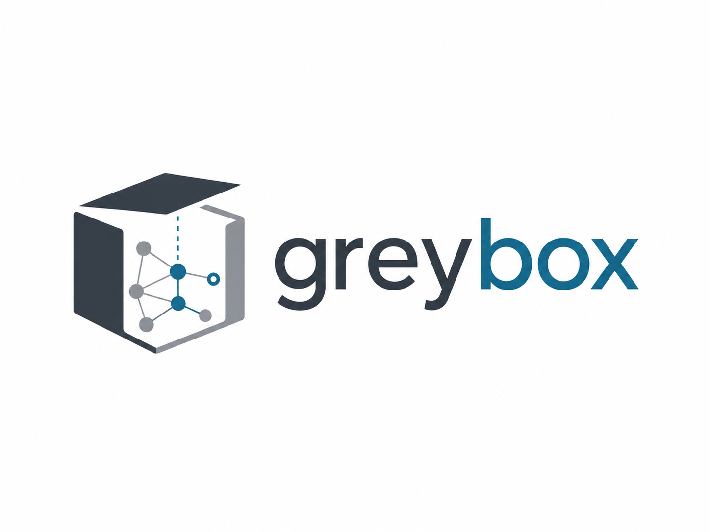

<p align="center"></p>

**Point it at an undocumented codebase. Get a plain-English assessment
of what it does, a real dependency graph, and an honest confidence
score per module — before you spend $150K+ on a modernization
consultant to tell you the same thing.**

Legacy modernization projects spend 10-15% of their total budget just
figuring out what the existing system actually does, before any real
work starts. That phase is currently only sold bundled inside large
consulting engagements. `greybox` is the fast, cheap, self-serve first
look — not a replacement for a full migration, a way to walk into one
informed.

## What it does today (real, working)

- Parses a Python codebase and builds a **real cross-file dependency
  graph** from actual imports — not a guess from one pasted-in file.
- Flags **undocumented magic numbers**, **bare exception handlers**
  (silent failure risk), and any **TODO / DO NOT / FIXME comments** —
  these are usually the only human trace of real risk in old code.
- Computes a **deterministic confidence score per module**, before any
  AI is involved, from real structural signals (branch complexity,
  undocumented constants, error handling). This score is not a vibe —
  it's arithmetic over real facts.
- Passes those facts to Claude to generate a **plain-English
  explanation**, explicitly instructed to cite evidence and say
  "uncertain" rather than guess.
- Gives a **direct, rule-based suggested next step per finding** — not
  a roadmap, not effort estimates, just a concrete answer to "what do
  I actually do about this," e.g. "extract this magic number and
  confirm its meaning with whoever owns this logic," not "modernize
  this system in 6 phases over 18 months."

## What it doesn't do (on purpose)

No code rewriting. No migration execution. No full roadmap generation.
Those are real, valuable, and better done by people and firms who
specialize in execution. `greybox` is the assessment layer only.

## Your code never leaves your network

This runs entirely on your own machine, CI, or cloud environment.
There's no hosted service, no upload step, and no third party in the
loop — the AI explanation step is the only part that calls an
external API, and only if you set your own `ANTHROPIC_API_KEY`. Skip
that and you still get the full dependency graph and confidence
scoring with zero data leaving your infrastructure. Built with
regulated industries (banking, healthcare) in mind, where sending
code to any external SaaS is a non-starter.

## Portfolio mode - scan multiple repos at once

If you've got a folder containing multiple repos (e.g. everything
cloned from a GitHub org), point `--portfolio` at the parent folder:

```bash
greybox /path/to/org-repos --portfolio --output portfolio_report.md
```

Every immediate subdirectory is scanned as its own repo. Real full
scan of every file, no sampling — this is the difference between this
and the web demo's org-scan feature, which samples a few files per
repo to stay within GitHub API rate limits. Locally, there's no rate
limit, so you get the real thing across your whole portfolio, ranked
into Quick Wins / Bigger Efforts / Lower Priority.

## Quickstart

```bash
pip install -e .
export ANTHROPIC_API_KEY="sk-ant-..."   # optional - runs with an honest mock without it
greybox path/to/codebase --output report.md
```

Try it on the included synthetic example (deliberately undocumented,
to prove the tool works on real ambiguity):

```bash
greybox samples/legacy_sample --output demo_report.md
```

## Running tests

```bash
pip install -e ".[dev]"
pytest tests/ -v
```

All tests run with zero API calls and zero network access — the
deterministic layer is fully tested independently of the AI layer.

## Architecture

```
codebase directory
        │
        ▼
 analyzer.py       (AST parsing, dependency graph, structural facts —
        │           no AI, fully deterministic, fully tested)
        ▼
 confidence_score  (arithmetic over real signals, computed BEFORE
        │           any AI runs)
        ▼
 explainer.py       (Claude explains ONLY the evidence found above —
        │           never invents behavior; honestly mocked if no
        │           API key is present)
        ▼
 report.py          (Markdown report: dependency graph + per-module
                      findings + confidence + AI explanation)
```

## Status

Early proof of concept. Supports Python and Java (auto-detected from
the folder contents). .NET/C# is a possible future target, held off
deliberately until Python + Java are validated with real users —
see `docs/BACKLOG.md`.

A static demo page (no backend, deployable to Vercel in ~2 minutes)
showing a real run's output lives in `/demo` — see `demo/README.md`.

## License

Apache 2.0 — see `LICENSE`.

## Documentation

- [Setup](docs/SETUP.md) · [Architecture](docs/ARCHITECTURE.md) · [Troubleshooting](docs/TROUBLESHOOTING.md)
- [Backlog](docs/BACKLOG.md) · [Feature checklist](docs/FEATURE_CHECKLIST.md) · [Launch checklist](docs/LAUNCH_CHECKLIST.md)
- [Contributing](CONTRIBUTING.md) · [Security](SECURITY.md) · [Claude/AI context](docs/CLAUDE.md)
