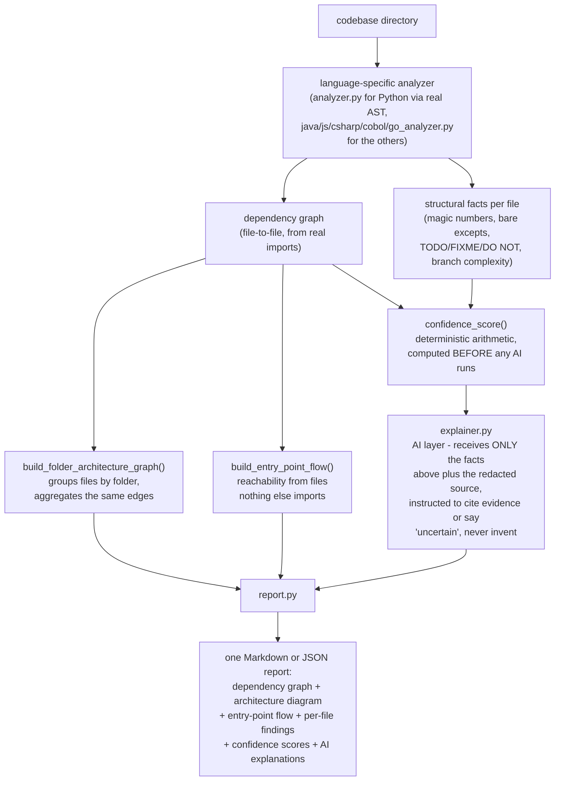

# Architecture

## Table of contents

- [Design principle](#design-principle)
- [Pipeline](#pipeline)
- [The three report artifacts, and what each one honestly proves](#the-three-report-artifacts-and-what-each-one-honestly-proves)
- [Why this beats pasting a file into Claude/ChatGPT directly](#why-this-beats-pasting-a-file-into-claudechatgpt-directly)
- [Language support](#language-support)
- [Data handling / privacy](#data-handling--privacy)

## Design principle

**Deterministic first, AI second — never the reverse.**

The single most important rule in this codebase: the AI layer is only
ever allowed to explain facts that the deterministic layer already
found. It is never allowed to be the first thing that looks at the
code. This is the same discipline the `wherefore` project uses, and
it exists for a concrete reason: if the AI free-associates over raw
code with no structural facts in front of it, you get plausible-
sounding guesses with no way to check them. If it explains facts a
separate deterministic pass already extracted, every claim is
checkable against real evidence.

## Pipeline

Every box left of `explainer.py` runs with zero network calls and zero
AI involvement — the whole deterministic layer works, and is fully
testable, with `ANTHROPIC_API_KEY` unset.

## The three report artifacts, and what each one honestly proves

Every report now ships three different views of the same underlying
import data, each answering a different question - deliberately not
one bigger, harder-to-read diagram:

1. **Dependency graph** (file-to-file) - the base data. Every other
   view is built by aggregating or filtering this one, not by a
   separate analysis pass.
2. **Architecture diagram** (folder-to-folder) - `build_folder_
   architecture_graph()` groups files by folder and shows how those
   groups connect. Answers "how is this codebase organized," not
   "what does file X import."
3. **Entry-point flow** - `build_entry_point_flow()` finds files
   nothing else in the scan imports (a reasonable proxy for an entry
   point - a script or `main` module usually isn't imported by
   anything else), then traces what becomes reachable from there
   through the import graph.

**Stated plainly, because it's easy to overclaim here:** entry-point
flow is *not* a traced runtime call sequence. It cannot know what
actually executes first, in what order, or under what condition -
that would require either running the code or real interprocedural
call-graph analysis, and this tool does neither. What it can honestly
say is narrower and still useful: "here's what's reachable if you
start reading from this file," based purely on static imports. A
module that's neither an entry point nor reachable from one
(`unreached` in the JSON output) is a real, useful signal on its own -
it's either dead code or something the import-matching missed, and
either way it's worth a human looking at it directly.

## Why this beats pasting a file into Claude/ChatGPT directly

This is the question every version of this idea has to answer, and
it's worth stating plainly rather than assuming it:

1. **Scale.** A real legacy system is thousands of files. No one pastes
   thousands of files into a chat window one at a time. The pipeline
   automates traversal and cross-referencing systematically.
2. **Consistency.** Every module gets the same output schema, every
   time — same categories, same confidence formula, same risk-flag
   taxonomy — so results are comparable across hundreds of modules and
   can be handed to a CTO as one coherent report, not 200 separate
   ad-hoc chat answers.
3. **Cross-file reasoning.** Understanding what a system does requires
   knowing that Module A calls Module B which reads a config three
   files away. A single pasted-in file has no visibility into that. A
   dependency graph, built first, gives the AI a map to reason over.
4. **The confidence discipline.** Raw prompting tends to produce
   confident-sounding guesses on ambiguous code. This pipeline computes
   uncertainty from real structural signals before the AI is even
   invoked, so the tool can't be talked into overclaiming.

If a future feature can be done just as well by pasting one file into
Claude, it doesn't belong in this tool. Every feature added here should
require the graph, the aggregation, or the consistency layer to be
worth building at all.

## Language support

Six languages today: Python, Java, and JavaScript use real parsers
(`ast`, `javalang`, `esprima` respectively — exact structural parsing,
not guessing with regex). C#, COBOL, and Go use regex/heuristics
instead — no mature pure-Python parser exists for any of the three, so
those results are labeled in the report itself as a rougher first
pass, not hidden. The separate hosted web demo additionally supports
Vue (`.vue` single-file components), but that's web-demo-only — there
is no `vue_analyzer.py`, and the CLI does not claim Vue support.
Language is auto-detected from folder contents (majority file
extension), or can be forced explicitly.

**Recursion note, since this was a real bug until it was fixed:**
Python's analyzer used to call `os.listdir()`, which only sees files
directly in the given folder and silently misses everything in
subdirectories — nearly every real Python project has subdirectories,
so this was a severe silent under-scan. Every other language analyzer
already used `os.walk()` correctly. Fixed, with a regression test
(`test_dependency_graph_recurses_into_subdirectories`) that fails
loudly if this ever comes back.

## Data handling / privacy

If `ANTHROPIC_API_KEY` is set, `greybox` automatically sends a
redacted snippet of each analyzed file's source to the Claude API —
redaction is real and already implemented
(`explainer.py::redact_secrets`), not a planned feature. See
`SECURITY.md` for exactly what is and isn't redacted, and for the one
real gap that's still open: there is no explicit `--explain` opt-in
flag yet, so setting the API key means every run calls the API
automatically, with no per-run confirmation step. Track that in
`BACKLOG.md`; don't assume it's fixed just because redaction is.
