# greybox Assessment Report

Directory analyzed: `/Users/shannon/Desktop/rides-java-sdk`

## Top Risks — Read This First

_The 5 riskiest modules, ranked lowest-confidence-first. On a real codebase this is the whole point: one ranked list instead of reading every file's answer yourself._

1. `RideRequestParametersTest.java` — 60/100 confidence
2. `RideUpdateParametersTest.java` — 60/100 confidence
3. `ErrorParserTest.java` — 60/100 confidence
4. `RidesServiceTest.java` — 60/100 confidence
5. `OAuth2CredentialsTest.java` — 62/100 confidence

## Dependency Graph (real, extracted from imports)

```mermaid
graph TD
    OAuth2CredentialsTest --> AuthException
    OAuth2CredentialsTest --> Scope
    CredentialsAuthenticator --> SessionConfiguration
    CredentialsAuthenticator --> ApiInterceptor
    OAuth2Credentials --> AuthException
    OAuth2Credentials --> Scope
    OAuth2Credentials --> SessionConfiguration
    OAuth2Credentials --> Preconditions
    CredentialsSession --> CredentialsAuthenticator
    OAuth2CallbackServlet --> OAuth2Credentials
    OAuth2CallbackServlet --> SessionConfiguration
    SampleServlet --> OAuth2Credentials
    SampleServlet --> CredentialsSession
    SampleServlet --> SessionConfiguration
    SampleServlet --> RidesService
    SampleServlet --> UberRidesApi
    SampleServlet --> UserProfile
    Server --> OAuth2Credentials
    Server --> Scope
    Server --> SessionConfiguration
    GetUserProfile --> OAuth2Credentials
    GetUserProfile --> CredentialsSession
    GetUserProfile --> SessionConfiguration
    GetUserProfile --> RidesService
    GetUserProfile --> UberRidesApi
    GetUserProfile --> ApiError
    GetUserProfile --> ClientError
    GetUserProfile --> ErrorParser
    GetUserProfile --> UserProfile
    AccessTokenAuthenticatorTest --> OAuth2Service
    AccessTokenAuthenticatorTest --> SessionConfiguration
    AuthorizationCodeGrantFlowTest --> OAuth2Service
    AuthorizationCodeGrantFlowTest --> TokenRequestFlow
    AuthorizationCodeGrantFlowTest --> SessionConfiguration
    BaseRefreshableAuthenticatorTest --> SessionConfiguration
    OAuth2ServiceTest --> WireMockTest
    OAuth2ServiceTest --> AccessToken
    OAuthScopesAdapterTest --> AccessToken
    OAuthScopesAdapterTest --> Scope
    SessionConfigurationTest --> Scope
    SessionTest --> Authenticator
    ApiInterceptorTest --> Authenticator
    ApiInterceptorTest --> SessionConfiguration
    LoginPushedAuthorizationRequestTest --> LoginPARResponse
    LoginPushedAuthorizationRequestTest --> OAuth2Service
    LoginPushedAuthorizationRequestTest --> ProfileHint
    LoginPushedAuthorizationRequestTest --> SessionConfiguration
    RefreshAuthenticatorTest --> Authenticator
    AccessToken --> OAuthScopes
    AccessTokenAuthenticator --> OAuth2Service
    AccessTokenAuthenticator --> OAuthScopesAdapter
    AccessTokenAuthenticator --> SessionConfiguration
    AccessTokenAuthenticator --> ApiInterceptor
    Authenticator --> SessionConfiguration
    AuthorizationCodeGrantFlow --> OAuth2Service
    AuthorizationCodeGrantFlow --> OAuthScopesAdapter
    AuthorizationCodeGrantFlow --> TokenRequestFlow
    AuthorizationCodeGrantFlow --> SessionConfiguration
    ServerTokenAuthenticator --> SessionConfiguration
    ServerTokenAuthenticator --> ApiInterceptor
    OAuth2Service --> AccessToken
    OAuthScopesAdapter --> Scope
    TokenRequestFlow --> AccessToken
    AccessTokenSession --> AccessTokenAuthenticator
    AccessTokenSession --> AccessTokenStorage
    ServerTokenSession --> ServerTokenAuthenticator
    Session --> Authenticator
    SessionConfiguration --> Scope
    SessionConfiguration --> ProfileHint
    ApiInterceptor --> Authenticator
    LoginPushedAuthorizationRequest --> LoginPARResponse
    LoginPushedAuthorizationRequest --> OAuth2Service
    LoginPushedAuthorizationRequest --> ProfileHint
    LoginPushedAuthorizationRequest --> SessionConfiguration
    RefreshAuthenticator --> Authenticator
    UberRidesApiTest --> Authenticator
    UberRidesApiTest --> Session
    UberRidesApiTest --> SessionConfiguration
    UberRidesApiTest --> ApiInterceptor
    UberRidesApiTest --> RefreshAuthenticator
    UberRidesApiTest --> UberRidesApi
    RidesServiceTest --> BigDecimalAdapter
    RidesServiceTest --> WireMockTest
    RidesServiceTest --> RidesService
    RidesServiceTest --> Product
    RidesServiceTest --> Ride
    RidesServiceTest --> RideEstimate
    RidesServiceTest --> RideRequestParameters
    UberRidesApi --> Session
    UberRidesApi --> ApiInterceptor
    UberRidesApi --> BigDecimalAdapter
    UberRidesApi --> RefreshAuthenticator
    UberRidesApi --> RidesService
    SurgeConfirmation --> RideRequestParameters
    SurgeConfirmation --> RidesService
    RidesService --> SessionConfiguration
    RidesService --> PaymentMethod
    RidesService --> PaymentMethodsResponse
    RidesService --> Place
    RidesService --> PlaceParameters
    RidesService --> PriceEstimatesResponse
    RidesService --> Product
    RidesService --> ProductsResponse
    RidesService --> Promotion
    RidesService --> Ride
    RidesService --> RideEstimate
    RidesService --> RideMap
    RidesService --> RideReceipt
    RidesService --> RideRequestParameters
    RidesService --> RideUpdateParameters
    RidesService --> SandboxProductRequestParameters
    RidesService --> SandboxRideRequestParameters
    RidesService --> TimeEstimatesResponse
    RidesService --> UserActivityPage
    RidesService --> UserProfile
```



## Module-by-Module Findings

### `OAuth2CredentialsTest.java`
- **Confidence this is fully understood: 62/100**
- Functions: setUp, getAuthorizationUrl, getAuthorizationUrl_whenThereAreNoScopes, getAuthorizationUrl_whenThereIsAnEmptyScopeList, getAuthorizationUrl_whenThereAreCustomScopes, getAuthorizationUrl_whenThereAreDuplicateCustomScopes, getAuthorizationUrl_whenThereIsARedirectUri, build_whenClientIdIsNull, build_whenClientSecretIsNull, build_whenClientSecretsAreNull, build_whenThereAreNoClientSecrets, authenticate, authenticate_whenThereAreNoScopes, authenticate_whenCantAuthenticate_shouldThrowException, loadCredential, clearCredential, useCustomDataStore, createDataStore, setHttpStatusCode, setHttpResponseContent, buildRequest, getUrl, execute
- Depends on: com.google.api.client.auth.oauth2.BearerToken, com.google.api.client.auth.oauth2.Credential, com.google.api.client.auth.oauth2.StoredCredential, com.google.api.client.http.GenericUrl, com.google.api.client.http.HttpExecuteInterceptor, com.google.api.client.http.LowLevelHttpRequest, com.google.api.client.http.LowLevelHttpResponse, com.google.api.client.testing.http.MockLowLevelHttpRequest, com.google.api.client.testing.http.MockLowLevelHttpResponse, com.google.api.client.testing.json.MockJsonFactory, com.google.api.client.util.store.AbstractDataStoreFactory, com.google.api.client.util.store.DataStore, com.uber.sdk.core.auth.AuthException, com.uber.sdk.core.auth.Scope, org.junit.Before, org.junit.Rule, org.junit.Test, org.junit.rules.ExpectedException, org.mockito.Mockito, java.io.IOException, java.io.Serializable, java.util.ArrayList, java.util.Arrays, org.hamcrest.Matchers.any, org.hamcrest.Matchers.containsString, org.junit.Assert.assertEquals, org.junit.Assert.assertNotNull, org.junit.Assert.assertNull, org.junit.Assert.assertTrue, org.mockito.Matchers.eq, org.mockito.Mockito.mock, org.mockito.Mockito.when
- Undocumented constants found: [3600, 3600, 403, 3600, 1000, 3600, 1000]

**AI explanation** _(source: live_claude_api)_:
```
SUMMARY: This is a test suite for an `OAuth2Credentials` class that implements OAuth2 authorization code flow for the Uber SDK. It validates URL construction for authorization, token exchange via HTTP POST, credential storage/retrieval/deletion, and custom data store injection. The tests use a custom `MockHttpTransport` to intercept and inspect HTTP requests without making real network calls.

RISKS:
- **Magic number `300L` used as `expires_in` in mock response, but tests assert `<= 3600`** — the gap between the mock value (300) and the upper bound (3600) is unexplained; if the production token server returns values up to 3600, the test doesn't actually verify realistic boundary behavior
- **`expires_in` lower bound is `> 0`** — tests do not verify behavior when `expires_in` is zero or negative; the credential store may not handle expired-on-arrival tokens correctly
- **Scope ordering in `getAuthorizationUrl_whenThereAreCustomScopes` is non-deterministic** — the test explicitly accepts either ordering via `assertTrue(a.equals(...) || b.equals(...))`, indicating the production code's scope ordering is undefined/unstable, which could cause issues if upstream systems expect a canonical scope string
- **`authenticate_whenCantAuthenticate_shouldThrowException` uses HTTP 403** — only one error code is tested; behavior for other 4xx/5xx codes (401, 500, etc.) is not verified and may differ
- **`MockDataStoreFactory.createDataStore` ignores the `id` parameter** — always returns the same mock regardless of store ID; if production code uses multiple named stores, this test would not catch bugs related to store selection
- **`useCustomDataStore` test shows `authenticate` returns tokens from the HTTP mock, not the custom data store** — meaning `authenticate` does not read from the data store before writing; but whether it writes to the custom data store is not directly asserted (only `loadCredential` is verified via the mock store's `get`)
- **Magic number `1000L` for `expiresInSeconds`** in `useCustomDataStore` is undocumented — unclear if this represents seconds or milliseconds in context

UNCERTAIN_ABOUT:
- Whether `loadCredential` returns `null` for an unknown user ID, or throws — only the post-clear case is tested, not a cold-start unknown user
- Whether `clearCredential` physically removes from the data store or just nullifies in-memory state — the test only calls `loadCredential` after clearing, which could pass even with a soft-delete
- The exact exception wrapping contract of `AuthException` — the test checks for an `IOException` cause, but it's unclear what other exception types could be wrapped and whether that's intentional
- Whether `setScopes` and `setCustomScopes` can be called multiple times on the Builder (additive vs. replace semantics)
- Thread-safety of `MockHttpTransport`'s mutable fields (`lastRequestUrl`, `lastRequestContent`) — irrelevant for tests but signals potential issues in the production transport if similarly structured
- The canonical base URL (`https://login.uber.com/oauth/v2/`) is hardcoded in test assertions — whether the production class makes this configurable is not determinable from this test alone
```

### `CredentialsAuthenticator.java`
- **Confidence this is fully understood: 90/100**
- Functions: signRequest, isRefreshable, doRefresh, getSessionConfiguration, getCredential, setBearerToken, createBearerToken, resign, refreshAndSign, signedByOldToken
- Depends on: com.google.api.client.auth.oauth2.Credential, com.uber.sdk.core.client.SessionConfiguration, com.uber.sdk.core.client.internal.ApiInterceptor, java.io.IOException, okhttp3.Request, okhttp3.Response
- Undocumented constants found: none

**AI explanation** _(source: live_claude_api)_:
```
SUMMARY: `CredentialsAuthenticator` wraps a Google OAuth2 `Credential` object to sign outgoing HTTP requests with a Bearer token authorization header. It extends `BaseRefreshableAuthenticator` and implements `Authenticator`, handling both request signing and token refresh logic. When a response triggers re-authentication, it either re-signs with the current token (if the token has already changed) or fetches a new token before re-signing.

RISKS:
- **`isRefreshable()` unconditionally returns `true`**: There is no check on whether the `Credential` actually has a refresh token or is capable of refreshing. This could cause `refreshAndSign` to be called on a `Credential` that cannot refresh, potentially resulting in an unhandled `IOException` or silent failure.
- **`refreshAndSign` calls `credential.refreshToken()` but ignores its boolean return value**: The Google API client's `refreshToken()` returns `false` on failure rather than always throwing. The code proceeds to call `resign` regardless, meaning a failed refresh could result in re-signing with a stale/null token without any error signal.
- **`createBearerToken` calls `credential.getAccessToken()` which can return `null`**: If no token is present, `String.format` would produce the literal string `"Bearer null"`, which would be sent as a valid-looking but invalid authorization header.
- **`signedByOldToken` logic depends on in-memory token state**: The comparison between the request's existing header and the current credential token assumes the credential's in-memory state is authoritative. If the token was changed externally or concurrently, this comparison may behave unexpectedly.
- **No null checks on `response.request()` or its authorization header** beyond the `value != null` guard in `signedByOldToken`; `resign` and `refreshAndSign` call `response.request().newBuilder()` without null guards.

UNCERTAIN_ABOUT:
- The behavior of `BaseRefreshableAuthenticator` is not provided — it is unknown what retry limiting, loop prevention, or threading guarantees (if any) it enforces.
- Whether `ApiInterceptor.setAuthorizationHeader` and `ApiInterceptor.getAuthorizationHeader` normalize or compare header values case-sensitively cannot be determined from this code.
- Whether `credential.refreshToken()` throwing `IOException` is the intended error propagation path, or whether the ignored boolean return is a bug or intentional design, cannot be confirmed without documentation or tests.
- The concurrency model is unknown — it is unclear whether `Credential` access is thread-safe in this context.
```

### `OAuth2Credentials.java`
- **Confidence this is fully understood: 90/100**
- Functions: setSessionConfiguration, setScopes, setCustomScopes, setClientSecrets, setRedirectUri, setHttpTransport, setCredentialDataStoreFactory, setAuthorizationCodeFlow, validate, build, getAuthorizationUrl, getAuthorizationCodeFlow, authenticate, loadCredential, clearCredential, getRedirectUri
- Depends on: com.google.api.client.auth.oauth2.AuthorizationCodeFlow, com.google.api.client.auth.oauth2.AuthorizationCodeTokenRequest, com.google.api.client.auth.oauth2.BearerToken, com.google.api.client.auth.oauth2.ClientParametersAuthentication, com.google.api.client.auth.oauth2.Credential, com.google.api.client.auth.oauth2.TokenResponse, com.google.api.client.http.GenericUrl, com.google.api.client.http.HttpTransport, com.google.api.client.http.javanet.NetHttpTransport, com.google.api.client.json.jackson2.JacksonFactory, com.google.api.client.util.store.AbstractDataStoreFactory, com.google.api.client.util.store.DataStore, com.google.api.client.util.store.MemoryDataStoreFactory, com.uber.sdk.core.auth.AuthException, com.uber.sdk.core.auth.Scope, com.uber.sdk.core.client.SessionConfiguration, com.uber.sdk.core.client.utils.Preconditions, java.io.IOException, java.io.UnsupportedEncodingException, java.net.URLEncoder, java.util.Collection, java.util.HashSet, java.util.Set, java.util.TreeSet, javax.annotation.Nullable
- Undocumented constants found: none

**AI explanation** _(source: live_claude_api)_:
```
SUMMARY: OAuth2Credentials is a builder-pattern utility class that manages the full OAuth 2.0 authorization code flow against Uber's login service. It constructs and holds an AuthorizationCodeFlow, generates authorization URLs, exchanges authorization codes for tokens, and stores/loads/clears credentials per user ID in a configurable DataStore. The class is immutable after construction via its inner Builder.

RISKS:
- `setSessionConfiguration` has an inverted guard bug: it copies `configuration.getScopes()` only if `this.scopes != null` (already set), and `configuration.getCustomScopes()` only if `this.customScopes != null` — meaning a freshly constructed Builder calling only `setSessionConfiguration` will silently drop both scope collections from the configuration object
- `getAuthorizationUrl()` manually appends `redirect_uri` as a raw string concat after calling `.build()`, bypassing the URL builder's parameter encoding/deduplication; if the flow already encodes a redirect_uri elsewhere this could produce a malformed or duplicate-parameter URL
- `scopes` field on `OAuth2Credentials` is `null` if no scopes are provided; `getAuthorizationUrl()` and `authenticate()` both call `.setScopes(scopes)` with a potentially null argument — behavior depends entirely on the Google API client library's null handling, which is not visible here
- Credential storage defaults silently to `MemoryDataStoreFactory` — credentials are lost on JVM restart with no warning to the caller; this is a data-loss risk if callers assume persistence
- `authorizationCodeFlow` set via `Builder.setAuthorizationCodeFlow()` bypasses all scope, transport, and datastore configuration entirely, including the scope injection block; externally provided flows are used as-is with no validation
- The Javadoc for `clearCredential` contains a typo: `(@link DateStore}` — minor but signals low documentation quality/review rigor

UNCERTAIN_ABOUT:
- Whether `Preconditions.checkState` and `checkNotNull` (from the internal `com.uber.sdk.core.client.utils.Preconditions`) throw standard `IllegalStateException`/`NullPointerException` or a custom exception type — failure modes of `validate()` and `authenticate()` cannot be fully characterized
- What `SessionConfiguration.getLoginHost()` returns when not explicitly set — the Builder initializes `loginHost` to `"https://login.uber.com"` but then unconditionally overwrites it from the configuration object in `setSessionConfiguration`, so the default may be silently overwritten with null if the configuration has no login host set
- Whether the Google API client's `AuthorizationCodeFlow.newAuthorizationUrl().setScopes(null)` is safe or throws — null-safety of `scopes` in URL generation and token request is unverifiable from this code alone
- Thread safety of the built `OAuth2Credentials` instance — no synchronization is visible, and concurrent `authenticate`/`loadCredential`/`clearCredential` calls against the same DataStore may have race conditions depending on the DataStore implementation
```

### `CredentialsSession.java`
- **Confidence this is fully understood: 90/100**
- Functions: none
- Depends on: com.google.api.client.auth.oauth2.Credential, com.uber.sdk.core.auth.CredentialsAuthenticator, javax.annotation.Nonnull
- Undocumented constants found: none

**AI explanation** _(source: live_claude_api)_:
```
SUMMARY: `CredentialsSession` is a thin wrapper that creates a session for authenticating with Uber's API using OAuth 2.0 credentials. It extends a generic `Session` class parameterized with `CredentialsAuthenticator`, delegating all authentication logic to that class. The constructor accepts a `SessionConfiguration` and a Google OAuth2 `Credential` object, combining them into a `CredentialsAuthenticator` passed to the parent.

RISKS:
- **No null-safety enforcement at runtime**: Both `config` and `credential` are annotated `@Nonnull`, but this is a compile-time/static-analysis hint only — no runtime null checks or exceptions are present. If either is null, failure propagates silently into `CredentialsAuthenticator` and `super()`.
- **All logic deferred to parent class**: `CredentialsSession` has zero local logic; all session behavior, error handling, and lifecycle management is entirely inside `Session<CredentialsAuthenticator>` and `CredentialsAuthenticator`, which are not shown here.
- **Javadoc mentions "server token or OAuth 2.0 credential, exactly one of which must exist"** — but this constructor only accepts a `Credential` (OAuth 2.0). There is no enforcement of the "exactly one" constraint visible in this class; that logic must exist elsewhere or may not exist at all.

UNCERTAIN_ABOUT:
- What `Session<T>` does with the authenticator — lifecycle, thread safety, token refresh behavior, and error handling are entirely opaque.
- Whether `CredentialsAuthenticator` performs its own null checks or validation on `config` and `credential`.
- Whether there is a sibling class handling the "server token" path mentioned in the Javadoc, and whether mutual exclusivity is actually enforced anywhere.
- Whether the `Credential` object's token refresh is triggered automatically or must be managed externally.
```

### `OAuth2CallbackServlet.java`
- **Confidence this is fully understood: 90/100**
- Functions: service, doGet
- Depends on: com.google.api.client.auth.oauth2.AuthorizationCodeResponseUrl, com.uber.sdk.core.auth.OAuth2Credentials, com.uber.sdk.core.client.SessionConfiguration, java.io.IOException, java.util.Random, javax.servlet.ServletException, javax.servlet.http.HttpServlet, javax.servlet.http.HttpServletRequest, javax.servlet.http.HttpServletResponse, javax.servlet.http.HttpSession
- Undocumented constants found: none

**AI explanation** _(source: live_claude_api)_:
```
SUMMARY: This servlet handles the OAuth2 callback step of an authorization code flow for Uber's API. When a GET request arrives at the callback URL, it parses the authorization response, checks for errors, and exchanges the authorization code for credentials tied to a session-based user ID. It also ensures `OAuth2Credentials` is lazily initialized on the first request.

RISKS:
- **Race condition on lazy initialization**: `oAuth2Credentials` is checked and set in `service()` without synchronization. Under concurrent requests, multiple threads could simultaneously see `null` and create duplicate `OAuth2Credentials` instances, with one silently overwriting the other.
- **Duplicate USER_SESSION_ID assignment**: A new random `long` is assigned to `USER_SESSION_ID` in both `service()` and again in `doGet()` if the attribute is still null. Under normal flow `service()` runs first, but the defensive re-check in `doGet()` means a second distinct random ID could theoretically be assigned — though this path is unlikely in practice.
- **`Random().nextLong()` as user ID**: `java.util.Random` is not cryptographically secure. Using it to generate a user session identifier is a security risk (predictable values). `SecureRandom` would be appropriate here.
- **Error handling swallows no context**: When `authorizationCodeResponseUrl.getError()` is non-null, an `IOException` is thrown with only the error string. The redirect to `/` never executes in the error case, but the caller (container) behavior on an unhandled `IOException` from `doGet` is container-dependent.
- **`req.getQueryString()` appended without null check**: If the callback URL arrives with no query string, `getQueryString()` returns `null`, producing a URL ending in `?null`, which may cause `AuthorizationCodeResponseUrl` to parse incorrectly.

UNCERTAIN_ABOUT:
- What `Server.createSessionConfiguration()`, `Server.createOAuth2Credentials()`, and `Server.USER_SESSION_ID` do — their behavior, failure modes, and thread-safety are entirely opaque from this code.
- Whether `oAuth2Credentials.authenticate()` is thread-safe or blocking, and what it does with the user ID string (storage, remote call, etc.).
- Whether the servlet is registered as a singleton (typical) — if not, the lazy-init risk changes character entirely.
- What the OAuth2 error values from `getError()` may be and whether they should be handled differently from one another (e.g., user-denied vs. server error).
```

### `SampleServlet.java`
- **Confidence this is fully understood: 90/100**
- Functions: destroy, service, doGet
- Depends on: com.google.api.client.auth.oauth2.Credential, com.uber.sdk.core.auth.OAuth2Credentials, com.uber.sdk.core.client.CredentialsSession, com.uber.sdk.core.client.SessionConfiguration, com.uber.sdk.rides.client.services.RidesService, com.uber.sdk.rides.client.UberRidesApi, com.uber.sdk.rides.client.model.UserProfile, java.io.IOException, java.util.Random, javax.servlet.ServletException, javax.servlet.http.HttpServlet, javax.servlet.http.HttpServletRequest, javax.servlet.http.HttpServletResponse, javax.servlet.http.HttpSession
- Undocumented constants found: none

**AI explanation** _(source: live_claude_api)_:
```
SUMMARY: SampleServlet is a Java HTTP servlet that demonstrates OAuth2 authentication with the Uber Rides API. On each request it checks for a valid OAuth2 credential (loading from or redirecting to the OAuth2 login flow), and once authenticated, builds an Uber API service client. The only implemented request handler (doGet) fetches and displays the authenticated user's email address.

RISKS:
- **Instance-level state shared across requests**: `oAuth2Credentials`, `credential`, and `uberRidesService` are servlet instance fields. In a standard servlet container, one servlet instance may serve concurrent requests, making these fields a race condition risk. For example, `credential` set in `service()` could be overwritten by another thread before `doGet()` reads it via `uberRidesService`.
- **`uberRidesService` is never cleared between users**: `destroy()` nulls `uberRidesService` only on servlet shutdown, not between requests. If a different user's session is served (different `USER_SESSION_ID`, different `credential`), the stale `uberRidesService` built for the prior credential is reused (`uberRidesService == null` check prevents rebuilding it).
- **`destroy()` does not null `oAuth2Credentials`**: Unlike `credential` and `uberRidesService`, `oAuth2Credentials` is never cleared, which may hold references to underlying credential stores after servlet lifecycle ends.
- **No null-safety on `uberRidesService.getUserProfile().execute().body()`** in `doGet`: if the API response body is null or the call fails, a NullPointerException will propagate unchecked (only `IOException` is declared).
- **Random long as session user ID**: `new Random().nextLong()` is not cryptographically secure and could theoretically collide across sessions, though the probability is low.
- **`req.getSession(true)` always creates a session**: This may have unintended side effects (e.g., session fixation) depending on surrounding infrastructure; no session invalidation or rotation is performed after authentication.

UNCERTAIN_ABOUT:
- What `Server.createSessionConfiguration()`, `Server.createOAuth2Credentials()`, and `Server.USER_SESSION_ID` do — their implementations are not provided, so credential storage, session ID scoping, and config details are unknown.
- Whether the servlet container deploys a single instance or multiple instances of `SampleServlet` — this affects how severe the shared-field race conditions actually are in practice.
- Whether `oAuth2Credentials.loadCredential()` is thread-safe — cannot determine from this code alone.
- The actual OAuth2 flow (scopes, token refresh behavior, credential storage backend) since it depends entirely on external `Server` and `OAuth2Credentials` implementations.
- Whether `doGet` is the only intended HTTP method, or whether `doPost`/others were planned but omitted.
```

### `Server.java`
- **Confidence this is fully understood: 90/100**
- Functions: main, createOAuth2Credentials, createSessionConfiguration, loadSecretProperties
- Depends on: com.google.api.client.util.store.MemoryDataStoreFactory, com.uber.sdk.core.auth.OAuth2Credentials, com.uber.sdk.core.auth.Scope, com.uber.sdk.core.client.SessionConfiguration, org.eclipse.jetty.servlet.ServletContextHandler, java.io.File, java.io.FileReader, java.io.IOException, java.io.InputStream, java.util.Collections, java.util.Properties
- Undocumented constants found: none

**AI explanation** _(source: live_claude_api)_:
```
SUMMARY: This module is a sample Jetty-based web server that demonstrates OAuth2 authentication with the Uber Rides API. It starts on port 8181, registers two servlets (a main servlet and an OAuth2 callback servlet), and provides helper methods to load client credentials from a properties file and construct OAuth2 and session configuration objects. It is explicitly a sample/demo application, not a production service.

RISKS:
- `loadSecretProperties` uses `new FileReader(buildPropertiesFile)` without ever closing the reader, creating a resource leak (no try-with-resources or explicit close)
- `createSessionConfiguration` calls `clientId.equals(...)` and `clientSecret.equals(...)` without null-checking first — if `secrets.properties` exists but either key is absent, `getProperty` returns `null` and this throws a `NullPointerException` rather than the intended `IllegalArgumentException`
- Credentials are stored in `MemoryDataStoreFactory` (in-memory, non-persistent) — all OAuth tokens are lost on server restart; this is likely intentional for a sample but is a hard architectural constraint if this code were promoted toward production
- `loadSecretProperties` falls back through two hardcoded filesystem paths (`src/main/resources/...` and `samples/servlet-sample/src/main/resources/...`), which are brittle and environment-specific
- The `FileReader` fallback path does not specify a charset explicitly, relying on the platform default encoding, which can cause inconsistent behavior across environments
- `OAuth2CallbackServlet` and `SampleServlet` are referenced but not present in this file; their behavior is entirely opaque from this code alone

UNCERTAIN_ABOUT:
- What `OAuth2CallbackServlet` and `SampleServlet` actually do — their servlet logic, error handling, and how they consume `USER_SESSION_ID` or `createOAuth2Credentials` cannot be determined here
- Whether `SessionConfiguration.getScopes()`, `getRedirectUri()`, etc. return the exact values set in the builder, or apply any transformation — depends on the Uber SDK internals
- Whether `MemoryDataStoreFactory.getDefaultInstance()` is shared across requests/sessions or scoped per-instance, which would have significant security implications in a multi-user context
- Whether this code is actually used anywhere beyond a demo context, making the severity of the identified risks unclear
```

### `GetUserProfile.java`
- **Confidence this is fully understood: 86/100**
- Functions: main, authenticate, createOAuth2Credentials, createSessionConfiguration, loadSecretProperties
- Depends on: com.google.api.client.auth.oauth2.Credential, com.google.api.client.extensions.jetty.auth.oauth2.LocalServerReceiver, com.google.api.client.util.store.AbstractDataStoreFactory, com.google.api.client.util.store.FileDataStoreFactory, com.uber.sdk.core.auth.OAuth2Credentials, com.uber.sdk.core.client.CredentialsSession, com.uber.sdk.core.client.SessionConfiguration, com.uber.sdk.rides.client.services.RidesService, com.uber.sdk.rides.client.UberRidesApi, com.uber.sdk.rides.client.error.ApiError, com.uber.sdk.rides.client.error.ClientError, com.uber.sdk.rides.client.error.ErrorParser, com.uber.sdk.rides.client.model.UserProfile, java.io.File, java.io.FileReader, java.io.InputStream, java.util.Properties, retrofit2.Response
- Undocumented constants found: [8181]

**AI explanation** _(source: live_claude_api)_:
```
SUMMARY: GetUserProfile is a command-line sample application that authenticates a user against the Uber API using OAuth2 and retrieves their profile (specifically their email). It handles credential persistence to the local filesystem, orchestrates an OAuth2 authorization code flow via a local HTTP server, and prints the result or error to stdout before exiting.

RISKS:
- **Magic number 8181**: Port 8181 is hardcoded for the local OAuth2 redirect server (`setPort(8181)`) with no fallback if the port is already in use; this will cause a silent or cryptic failure at runtime.
- **Secrets on local filesystem**: OAuth2 credentials are stored in `~/.uber_credentials` with no encryption; file permissions are set readable/writable only by owner (`setReadable(true, true)`, `setWritable(true, true)`), but the directory is created without verifying it didn't already exist with wrong permissions.
- **`clientId`/`clientSecret` null-safety**: `secrets.getProperty("clientId")` returns `null` if the key is missing; calling `.equals(...)` on a null value will throw a `NullPointerException` rather than the intended `IllegalArgumentException`.
- **`localServerReceiver` is a mutable static field**: Shared state across what is a single-use CLI tool; not thread-safe, and if `authenticate()` throws before `localServerReceiver.stop()` is called, the local server may be left running and the port remains bound.
- **`System.in.read()` for user prompt**: Reads only a single byte; on some platforms or piped inputs this may not behave as expected (e.g., immediately returning without waiting for Enter).
- **`response.body()` called without null check**: After confirming `apiError == null`, `response.body()` is called directly with no null guard; a successful HTTP status with an empty body would cause a `NullPointerException` on `userProfile.getEmail()`.
- **`apiError.getClientErrors().get(0)` without bounds check**: Assumes at least one client error exists in the list; an empty list would throw `IndexOutOfBoundsException`.
- **FileReader without explicit charset**: `new FileReader(buildPropertiesFile)` uses the platform default charset, which may cause issues on systems not using UTF-8.

UNCERTAIN_ABOUT:
- Whether `OAuth2Credentials`, `CredentialsSession`, `UberRidesApi`, and `ErrorParser` perform their own null/error handling internally — their behavior is entirely opaque from this code.
- Whether the `FileDataStoreFactory` credential directory is created automatically if it does not exist, or whether it silently fails.
- What HTTP status codes `ErrorParser.parseError()` treats as errors vs. success — the parsing logic is external and undocumented here.
- Whether `localServerReceiver.waitForCode()` has a timeout, or blocks indefinitely if the user never completes the OAuth flow.
- The actual scopes requested during OAuth2 authorization — `OAuth2Credentials.Builder` is used but no scope configuration is visible in this file.
```

### `WireMockTest.java`
- **Confidence this is fully understood: 90/100**
- Functions: none
- Depends on: com.github.tomakehurst.wiremock.common.ConsoleNotifier, com.github.tomakehurst.wiremock.core.WireMockConfiguration, com.github.tomakehurst.wiremock.junit.WireMockRule, org.junit.Rule, com.github.tomakehurst.wiremock.core.WireMockConfiguration.wireMockConfig
- Undocumented constants found: none

**AI explanation** _(source: live_claude_api)_:
```
SUMMARY: This module defines a base test class that sets up a WireMock HTTP stub server for use in integration or unit tests. It configures the server to use a dynamic (randomly assigned) port and enables verbose console logging of all interactions. It is intended to be extended by other test classes that need a running mock HTTP server.

RISKS:
- `WIRE_MOCK_CONFIG` is `protected static`, meaning it is shared across all subclasses and potentially all test instances; if any subclass mutates this configuration object, it would affect all other tests using it
- `wireMockRule` is a non-static `@Rule` field, but `WIRE_MOCK_CONFIG` is static — there is a mismatch in lifecycle that could cause subtle ordering issues if the config is modified between test runs
- `ConsoleNotifier(true)` enables verbose logging unconditionally in all environments (CI, local, etc.), which may produce excessive noise or expose sensitive request data in logs
- The class has no abstract methods or documented contract, so subclasses have no enforced structure for how to use or interact with `wireMockRule`

UNCERTAIN_ABOUT:
- Whether any subclasses exist that actually use this base class, and whether they rely on `wireMockRule` directly or access the port dynamically — this cannot be determined from the code alone
- Whether the dynamic port is ever retrieved and passed to the system under test in subclasses; if not, tests may not correctly target the mock server
- Whether this class is used with JUnit 4 only (implied by `@Rule`) or if there are JUnit 5 migration attempts elsewhere in the codebase that would make this incompatible
- Whether `WIRE_MOCK_CONFIG` mutability has actually caused bugs in practice
```

### `AccessTokenAuthenticatorTest.java`
- **Confidence this is fully understood: 86/100**
- Functions: setup, testSignRequest_callsSetBearerToken, testIsRefreshable_noToken_returnsFalse, testIsRefreshable_noRefreshToken_returnsFalse, testIsRefreshable_validToken_returnsTrue, testDoRefreshToken_ifSignedByOldToken_resign, testDoRefreshToken_ifNotSignedByOldToken_refreshAndResign, testResign_callsSetBearerToken, testRefreshAndSign_callsRefreshAndCallsResign, testRefreshToken, testSignedByOldToken_whenEqual_returnFalse, testSignedByOldToken_whenNotEqual_returnTrue, testSetBearerToken_formatsCorrectly, testCreateBearerToken_formatsCorrectly, testCreateOAuthService_notNull
- Depends on: com.uber.sdk.core.auth.internal.OAuth2Service, com.uber.sdk.core.client.SessionConfiguration, org.junit.Before, org.junit.Test, org.mockito.Mock, org.mockito.MockitoAnnotations, okhttp3.Protocol, okhttp3.Request, okhttp3.Response, retrofit2.Call, org.junit.Assert.assertEquals, org.junit.Assert.assertFalse, org.junit.Assert.assertNotNull, org.junit.Assert.assertTrue, org.mockito.Matchers.any, org.mockito.Matchers.eq, org.mockito.Mockito.doCallRealMethod, org.mockito.Mockito.doReturn, org.mockito.Mockito.mock, org.mockito.Mockito.spy, org.mockito.Mockito.verify, org.mockito.Mockito.when
- Undocumented constants found: [200]

**AI explanation** _(source: live_claude_api)_:
```
SUMMARY: This is a test suite for `AccessTokenAuthenticator`, a class that handles Bearer token authentication for HTTP requests using OAuth2. It tests the authenticator's ability to sign requests with access tokens, determine if a token can be refreshed, perform token refresh flows, and format Authorization headers correctly. The authenticator delegates token storage to `AccessTokenStorage` and token refresh to an `OAuth2Service`.

RISKS:
- **Magic number `200`** used as HTTP response code in `dummyResponse` setup with no named constant or comment — acceptable in tests but signals the production code may also use raw codes
- **`testRefreshToken` stores the same `accessToken` object returned from the refresh call** — the test mocks `serviceResult.execute()` to return the original `accessToken`, meaning it cannot verify that a *new* token replaces the old one; the storage write could be a no-op in this test scenario
- **`doCallRealMethod()` is applied selectively** in `testSignedByOldToken_*` tests only for `createBearerToken`, meaning other methods on the spy could silently return Mockito defaults (`null`) if not explicitly stubbed — could mask bugs in calling code
- **`refreshAndSign` test (`testRefreshAndSign_callsRefreshAndCallsResign`) does not assert the returned `Request`** — only verifies method calls, so a wrong or null return value from `resign` would not be caught
- **`testSignRequest_callsSetBearerToken` verifies `setBearerToken` is called but does not assert the resulting request header** — behavior of `setBearerToken` is tested separately, but chaining correctness is not validated end-to-end
- **No test for concurrent access to `accessTokenStorage`** — token refresh in an authenticator is typically triggered by 401 responses, which can arrive concurrently; no threading behavior is tested here

UNCERTAIN_ABOUT:
- Whether `AccessTokenAuthenticator` is the OkHttp `Authenticator` interface implementation or a custom class — the test calls `doRefresh` and `signRequest` directly, not `authenticate(route, response)`, so the integration point with OkHttp's retry mechanism is unclear
- What `resign` returns when the underlying `Request.Builder.build()` is called on a spy — the test stubs it, so the real implementation's null-safety is not observable here
- Whether `OAuth2Service.refresh()` parameters (`refreshToken`, `clientId`) match the actual API contract — only verified by mock, not against a real endpoint or documented spec
- Whether `accessTokenStorage.setAccessToken()` in `testRefreshToken` is thread-safe or atomic — cannot determine from this test alone
```

### `AuthorizationCodeGrantFlowTest.java`
- **Confidence this is fully understood: 86/100**
- Functions: init, execute_whenSuccessful_shouldReturnAccessToken, execute_whenResponseIsNot2XX_shouldThrowError, execute_whenFailure_shouldReturnError
- Depends on: org.assertj.core.api.Assertions.assertThat, org.mockito.Matchers.any, org.mockito.Matchers.anyString, org.mockito.Matchers.eq, org.mockito.Mockito.doNothing, org.mockito.Mockito.verify, org.mockito.Mockito.when, com.uber.sdk.core.auth.internal.OAuth2Service, com.uber.sdk.core.auth.internal.TokenRequestFlow, com.uber.sdk.core.auth.internal.TokenRequestFlow.TokenRequestFlowCallback, com.uber.sdk.core.client.SessionConfiguration, org.junit.Before, org.junit.Test, org.mockito.ArgumentCaptor, org.mockito.Mock, org.mockito.MockitoAnnotations, java.util.Arrays, okhttp3.MediaType, okhttp3.ResponseBody, retrofit2.Call, retrofit2.Callback, retrofit2.Response
- Undocumented constants found: [400]

**AI explanation** _(source: live_claude_api)_:
```
SUMMARY: This is a test class for `AuthorizationCodeGrantFlow`, which implements the OAuth2 Authorization Code Grant flow. It verifies that the flow correctly calls an OAuth2 service with token exchange parameters (auth code + PKCE verifier), then delegates results to a callback — either success with an `AccessToken` or failure with an `AuthException`/`Throwable`. The tests use Mockito to capture and manually trigger the async Retrofit callback.

RISKS:
- **Magic number 400**: The expected error message `"Token request failed with code 400"` is hardcoded in the test assertion — this implies the production code formats error messages with HTTP status codes, but it is only verified for 400. Behavior for other non-2XX codes (401, 403, 500, etc.) is not tested here.
- **Unchecked cast**: `(Class<Callback<AccessToken>>)(Class) Callback.class` is an unchecked/unsafe cast used to work around generics — this is a test code smell that could mask type safety issues if the production API changes.
- **`onFailure` path discrepancy**: In `execute_whenFailure_shouldReturnError`, the raw `Throwable` is passed directly to `callback.onFailure(t)`, whereas in `execute_whenResponseIsNot2XX_shouldThrowError`, an `AuthException` is wrapped and passed. The test implies two distinct failure code paths in production, but their exact wrapping logic is not visible here.
- **`ProfileHint` data in `SessionConfiguration`**: PII-like fields (`firstName`, `lastName`, `email`, `phone`) are set in the test fixture but their role in the token request is never asserted — it is unclear whether they are actually sent to the OAuth2 service or silently ignored.
- **`oAuth2Service.token(...)` called with `anyString()` for all 5 args**: The test does not verify the *specific* values passed (e.g., that `"code"` or `"verifier"` are correctly forwarded), weakening the assertion coverage.

UNCERTAIN_ABOUT:
- What the 5 string parameters to `oAuth2Service.token(...)` actually represent (order, naming, whether `"verifier"` maps to PKCE `code_verifier` or something else) — the production `OAuth2Service` interface is not provided.
- Whether `AuthorizationCodeGrantFlow` performs any validation or transformation on inputs before calling the service, or passes them through verbatim.
- How the production code distinguishes a null response body from a non-2XX error, and whether `Response.error(400, ...)` with an empty body is representative of real failure cases.
- The full contract of `TokenRequestFlowCallback.onFailure` — whether it accepts any `Throwable` or only `AuthException` (the two test cases pass different types, which may indicate an overloaded or loosely typed interface).
```

### `BaseRefreshableAuthenticatorTest.java`
- **Confidence this is fully understood: 86/100**
- Functions: setup, testRefresh_canReAuthAndRetry_callsRefresh, testRefresh_canReAuthButCannotRetry_returnsNull, testRefresh_cannotReAuthButCanRetry_returnsNull, testRefresh_canReAuthRetryButCannotRefresh_returnsNull, testCanRefresh_whenContainsHeader_returnsFalse, testCanRefresh_whenMissingHeader_returnsTrue, testCanRetry_whenUnderMax_returnsTrue, testCanRetry_whenOverMax_returnsFalse, doRefresh, isRefreshable, signRequest, getSessionConfiguration
- Depends on: com.uber.sdk.core.client.SessionConfiguration, org.junit.Before, org.junit.Test, org.mockito.Mock, org.mockito.MockitoAnnotations, java.io.IOException, okhttp3.Protocol, okhttp3.Request, okhttp3.Response, org.junit.Assert, org.mockito.Matchers.eq, org.mockito.Mockito.doReturn, org.mockito.Mockito.never, org.mockito.Mockito.spy, org.mockito.Mockito.verify
- Undocumented constants found: [200]

**AI explanation** _(source: live_claude_api)_:
```
SUMMARY: This is a unit test class for `BaseRefreshableAuthenticator`, a component that handles token refresh and retry logic for HTTP authentication in the Uber SDK. It verifies that the `refresh()` method only proceeds to call `doRefresh()` when three conditions are simultaneously true: the authenticator is refreshable, can retry, and can refresh. It also tests the concrete `canRefresh()` and `canRetry()` logic inherited from the base class.

RISKS:
- **Retry depth boundary is ambiguous**: `testCanRetry_whenOverMax_returnsFalse` builds a chain of 4 prior responses and expects false, while `testCanRetry_whenUnderMax_returnsTrue` uses 1 prior response and expects true. The exact max retry threshold (2 or 3?) cannot be confirmed from tests alone — only that ≥4 prior responses triggers false and 1 does not.
- **`canRefresh` gating on a header constant**: `HEADER_INVALID_SCOPES` is referenced but its string value is defined in `BaseRefreshableAuthenticator` (not shown here). If that constant changes or is misconfigured, the refresh gate silently breaks.
- **`StubRefreshableAuthenticator.doRefresh()` always returns null**: The stub's real implementation returns null, meaning tests that call `doRefresh()` via spy rely entirely on `doReturn(request)` overrides. If spy setup fails, `doRefresh` would return null and `assertNotNull` would fail — masking a setup error rather than a logic error.
- **Magic number 200**: The response is built with HTTP 200, but `BaseRefreshableAuthenticator` is typically triggered by 401 responses. Using 200 here means the tests don't reflect realistic production conditions; behavior on actual 401 responses is untested.
- **`canRefresh` and `canRetry` are mocked in `testRefresh_*` tests**: The interaction between real `canRefresh`/`canRetry` logic and the `refresh()` orchestration is never tested together — they are always stubbed independently.

UNCERTAIN_ABOUT:
- The exact maximum retry count enforced by `canRetry()` — only the boundaries 1 (allowed) and 4 (denied) are tested; values 2 and 3 are untested.
- The precise logic inside `BaseRefreshableAuthenticator.refresh()` — specifically whether `isRefreshable`, `canRetry`, and `canRefresh` are evaluated in a specific order with short-circuit behavior, which could matter for side effects.
- Whether `HEADER_INVALID_SCOPES` has any other callers or semantic meaning beyond blocking refresh.
- Whether `BaseRefreshableAuthenticator` has any thread-safety considerations; nothing in these tests addresses concurrency.
```

### `ScopeTest.java`
- **Confidence this is fully understood: 82/100**
- Functions: testParseScopesWithZero_shouldReturnNothing, testParseScopesWithNegativeValue_shouldReturnNothing, testParseScopesWithOneScope_shouldReturn, testParseScopesWithMultipleGeneralScopes_shouldReturn, testParseScopesWithMixLevelScopes_shouldReturn, testCustomScopes_shouldIgnore, testToStandardStringOneScope_noSpace, testToStandardStringMultiScopes_spaceDelimited, testParseOneScope_shouldCreateCollection, testParseMultiScopes_shouldCreateCollection
- Depends on: org.junit.Test, java.util.Arrays, java.util.Collection, java.util.Set, org.assertj.core.api.Assertions.assertThat
- Undocumented constants found: [32, 2]

**AI explanation** _(source: live_claude_api)_:
```
SUMMARY: This is a JUnit test class for a `Scope` enum/class in the `com.uber.sdk.core.auth` package. It tests two parsing directions: integer bitmask → Set<Scope> and space-delimited string → Set<Scope>, plus a serialization method (`toStandardString`) that converts a collection of scopes back to a space-delimited string. Unknown/custom scope strings are silently ignored during string parsing.

RISKS:
- **Magic number `-32` in `testParseScopesWithNegativeValue_shouldReturnNothing`**: The value `-32` is used as the negative test input, but there is no documented reason why `-32` specifically was chosen. If `-32` happens to be a valid bitmask for some future scope, this test's premise breaks silently.
- **Magic number `2` in `testCustomScopes_shouldIgnore`**: `assertThat(scopes.size()).isEqualTo(2)` hardcodes the expected count. This ties the test to exactly two recognized scopes in the input string `"history profile test"`, but offers no protection if `parseScopes(String)` somehow partially matches "test" to a new future scope.
- **Silent discard of unknown scopes**: `testCustomScopes_shouldIgnore` confirms that unrecognized scope strings (e.g. `"test"`) are silently dropped with no error or warning. This is a behavioral contract that could hide misconfigured scope strings in production.
- **`toStandardString` ordering is implicitly tested**: `testToStandardStringMultiScopes_spaceDelimited` asserts the exact string `"history all_trips"`, implying a specific ordering guarantee. The test uses `Arrays.asList` (insertion-ordered), but whether `toStandardString` preserves input order or imposes its own ordering is not verifiable from this test alone — a reordering in the implementation would break this test.

UNCERTAIN_ABOUT:
- The actual enum values and bitmask assignments for `Scope.HISTORY`, `Scope.PROFILE`, `Scope.REQUEST`, `Scope.ALL_TRIPS` — none of the bit values are visible here.
- Whether `Scope.REQUEST` is considered a "privileged" or different-level scope vs. general scopes (the test name says "MixLevel" but the production `Scope` class is not provided).
- Whether `parseScopes(int)` treats all negative values as empty or only specific ones — only `-32` is tested.
- Whether `toStandardString` guarantees insertion-order, alphabetical, or bitmask-sorted output for collections larger than two elements.
- Whether `parseScopes(String)` is case-sensitive — all test inputs use lowercase only.
```

### `OAuth2ServiceTest.java`
- **Confidence this is fully understood: 86/100**
- Functions: setUp, testRefresh_whenSuccessful
- Depends on: com.squareup.moshi.Moshi, com.uber.sdk.core.WireMockTest, com.uber.sdk.core.auth.AccessToken, org.junit.Before, org.junit.Test, okhttp3.OkHttpClient, okhttp3.logging.HttpLoggingInterceptor, retrofit2.Retrofit, retrofit2.converter.moshi.MoshiConverterFactory, com.github.tomakehurst.wiremock.client.WireMock.aResponse, com.github.tomakehurst.wiremock.client.WireMock.equalTo, com.github.tomakehurst.wiremock.client.WireMock.post, com.github.tomakehurst.wiremock.client.WireMock.stubFor, com.github.tomakehurst.wiremock.client.WireMock.urlEqualTo, org.assertj.core.api.Assertions.assertThat
- Undocumented constants found: [2592000]

**AI explanation** _(source: live_claude_api)_:
```
SUMMARY: This is an integration test class for an OAuth2 token refresh service. It spins up a local WireMock HTTP server, configures a Retrofit/OkHttp client pointing at it, and verifies that a token refresh POST request returns the expected AccessToken fields. It tests only the happy path (successful refresh) and no error/failure scenarios.

RISKS:
- **Magic number `2592000`** (30 days in seconds) is hardcoded in the assertion with no named constant or comment explaining its meaning. If the token TTL ever changes, the test will break with no clear indication of intent.
- **`REFRESH_TOKEN` is marked `[REDACTED]` in the source** — the actual value used in `REQUEST_BODY` construction is unknown, making it impossible to verify whether the request body stub will actually match at runtime without seeing the real source.
- **Test fixture dependency**: The test relies on `token_token.json` (WireMock body file) existing in the test resources. There is no fallback or explicit assertion if the file is missing — the test would likely fail with a non-obvious error.
- **Single test, zero branch coverage**: Only the successful refresh path is tested. No tests exist for network failure, malformed response, missing fields, or HTTP error codes. This is a coverage risk for modernization.
- **`OAuthScopesAdapter` is registered but not asserted**: Its behavior in JSON deserialization is never verified by any assertion in this test.
- **Logging interceptor set to `HEADERS` level**: In a CI environment this could leak sensitive auth headers to logs; no evidence this is intentional or reviewed.

UNCERTAIN_ABOUT:
- The actual string value of `REFRESH_TOKEN` — it is redacted, so whether `REQUEST_BODY` correctly matches the WireMock stub cannot be confirmed.
- The contents of `token_token.json` — the expected field values (`"Access999Token"`, `"888RefreshToken"`, `2592000`) are asserted but their source fixture cannot be inspected here.
- What `WireMockTest` base class does beyond providing `wireMockRule` — lifecycle hooks or additional configuration are unknown.
- Whether `OAuth2Service.refresh()` is a synchronous or asynchronous Retrofit call beyond the `.execute()` call shown (the interface definition is not provided).
- Whether `OAuthScopesAdapter` affects deserialization of any fields being asserted.
```

### `OAuthScopesAdapterTest.java`
- **Confidence this is fully understood: 82/100**
- Functions: setUp, fromJson, toJson
- Depends on: com.squareup.moshi.JsonAdapter, com.squareup.moshi.Moshi, com.uber.sdk.core.auth.AccessToken, com.uber.sdk.core.auth.Scope, org.junit.Before, org.junit.Test, java.util.Arrays, java.util.Collection, org.assertj.core.api.Assertions.assertThat
- Undocumented constants found: [2592000, 2592000]

**AI explanation** _(source: live_claude_api)_:
```
SUMMARY: This is a unit test class for `OAuthScopesAdapter`, a custom Moshi JSON adapter that handles serialization/deserialization of OAuth scopes for Uber's `AccessToken` model. It verifies that a space-delimited scope string in JSON (e.g., `"request all_trips profile"`) is correctly parsed into a `Collection<Scope>` enum values, and that the reverse serialization produces the same format. The tests cover both `fromJson` and `toJson` paths using a hardcoded fixture JSON string.

RISKS:
- **Magic number `2592000` (30 days in seconds) appears twice** — once in the fixture JSON string and once in the `toJson` test constructor call. It is never named as a constant, making its intent non-obvious to future maintainers.
- **`toJson` test asserts scope ordering implicitly**: `Scope.toStandardString(scopes)` is called on the live `accessToken.getScopes()` collection, so the test only verifies round-trip consistency — it does not assert a specific canonical ordering. If `getScopes()` returns an unordered collection, scope order in serialized JSON is non-deterministic and untested for a fixed expected value.
- **`fromJson` test does not assert `token_type` ("Bearer")** — the fixture JSON contains `token_type` but the test never asserts it was parsed, leaving that field's deserialization behavior unverified.
- **`last_authenticated` field (value `1464137596`) in fixture JSON** is never asserted in `fromJson`, so whether `AccessToken` parses or ignores it is untested here.

UNCERTAIN_ABOUT:
- The actual implementation of `OAuthScopesAdapter` is not provided — it is impossible to determine from this test alone how malformed, empty, or unknown scope strings are handled.
- Whether `Scope.toStandardString()` produces a deterministic, consistently ordered output cannot be confirmed from this code alone.
- Whether `AccessToken` is a plain data class or has additional logic (e.g., expiry calculation from `expires_in`) is not determinable here.
- Whether `token_type` and `last_authenticated` are stored, ignored, or cause errors during deserialization is genuinely ambiguous from this test file alone.
```

### `SessionConfigurationTest.java`
- **Confidence this is fully understood: 90/100**
- Functions: getClientId_whenSetOnBuilder_setsOnConfiguration, getRedirectUri_whenSetOnBuilder_setsOnConfiguration, getEnvironment_whenSetOnBuilder_setsOnConfiguration, getScopes_whenSetOnBuilder_setsOnConfiguration, newBuilder_copiesConfiguration, testBuilder_noClientId_throwsException, testBuilder_withClientId_doesNotThrowError, buildSession_whenLocalizationProvided_shouldSucceed, buildSession_whenNoEnvironmentSupplied_shouldUseProduction, buildSession_whenProductionEnv_shouldGiveProductionEndpointHost, buildSession_whenSandboxEnv_shouldGiveSandboxEndpointHost
- Depends on: com.uber.sdk.core.auth.Scope, org.junit.Test, java.util.Arrays, java.util.List, java.util.Locale, com.uber.sdk.core.client.SessionConfiguration.Environment.PRODUCTION, com.uber.sdk.core.client.SessionConfiguration.Environment.SANDBOX, junit.framework.Assert.assertEquals, junit.framework.Assert.assertTrue
- Undocumented constants found: none

**AI explanation** _(source: live_claude_api)_:
```
SUMMARY: This is a unit test class for `SessionConfiguration`, a builder-pattern configuration object used to set up API sessions for the Uber SDK. It verifies that builder properties (client ID, redirect URI, environment, scopes, locale) are correctly transferred to the built configuration object. It also validates default behavior (PRODUCTION environment when none is specified) and endpoint URL resolution per environment.

RISKS:
- `testBuilder_noClientId_throwsException` expects a `NullPointerException` specifically — this is a raw NPE rather than a documented, typed exception (e.g., `IllegalArgumentException`), which is a poor API contract and fragile error signaling.
- `getScopes_whenSetOnBuilder_setsOnConfiguration` only asserts `scopes.containsAll(config.getScopes())` — it does NOT assert the reverse (`config.getScopes().containsAll(scopes)`), meaning the test would pass even if `config.getScopes()` returns a superset of the set scopes. This is a weak assertion that could mask bugs.
- `buildSession_whenLocalizationProvided_shouldSucceed` only asserts that no exception is thrown — it does not verify that the locale was actually stored or retrievable on the configuration, providing no real coverage of locale behavior.
- `newBuilder_copiesConfiguration` verifies that `redirectUri` is copied from the original config but does not verify that other fields (environment, scopes, locale) are also copied, leaving copy-constructor completeness untested.

UNCERTAIN_ABOUT:
- Whether `SessionConfiguration.Environment` has values beyond `PRODUCTION` and `SANDBOX` — the tests only cover these two, and the full enum definition is not present here.
- Whether `getEndpointHost()` is computed dynamically from the environment or stored statically at build time — cannot determine from test code alone.
- Whether `setLocale()` stores the locale as a field accessible via a getter, or merely uses it during build — no getter assertion is made in `buildSession_whenLocalizationProvided_shouldSucceed`.
- The full set of fields copied by `newBuilder()` — only `clientId` and `redirectUri` are verified in the copy test; behavior for environment, scopes, and locale is untested.
- Whether `Scope.ALL_TRIPS` and `Scope.HISTORY` are the full set of available scopes, or representative examples chosen arbitrarily.
```

### `SessionTest.java`
- **Confidence this is fully understood: 90/100**
- Functions: buildSession_containsMembersFromConstructor
- Depends on: com.uber.sdk.core.auth.Authenticator, org.junit.Test, org.junit.Assert.assertEquals, org.mockito.Mockito.mock
- Undocumented constants found: none

**AI explanation** _(source: live_claude_api)_:
```
SUMMARY: This is a JUnit test class for a `Session` class in the Uber SDK core client package. It verifies that a `Session` object correctly retains the `Authenticator` instance passed to its constructor. The test uses Mockito to create mock dependencies and confirms constructor-to-getter fidelity.

RISKS:
- `SessionConfiguration` is mocked but never actually used in the test body — it is declared and instantiated but never passed to `Session` or asserted against. This suggests either dead test code, an incomplete test, or a refactor that left an orphaned variable.
- `Session<Authenticator>` is instantiated using an anonymous subclass (`new Session<Authenticator>(authenticator) { }`) — this implies `Session` is abstract or has protected/abstract methods, meaning the test does not exercise a concrete production subclass. Behavior of real subclasses may differ.
- Only one field (`authenticator`) is verified. If `Session` has other constructor-injected members (e.g., configuration), they are not tested here, leaving coverage gaps.
- The test method declares `throws Exception` broadly, which means any exception would silently pass as a test failure rather than being handled or documented.

UNCERTAIN_ABOUT:
- Why `SessionConfiguration configuration` is declared and mocked but never used — cannot determine if this is a bug, leftover from a prior version, or intentional scaffolding for future tests.
- Whether `Session` is abstract, an interface, or a concrete class — the anonymous subclass syntax strongly implies it cannot be directly instantiated, but the source of `Session` is not provided.
- What other members or methods `Session` exposes beyond `getAuthenticator()` — the test only covers one accessor.
- Whether this test module is part of an active test suite or has been orphaned during prior modernization efforts.
```

### `ApiInterceptorTest.java`
- **Confidence this is fully understood: 90/100**
- Functions: setup, testIntercept, testSetAuthorizationHeader_withExistingToken, testSetAuthorizationHeader_withoutExistingToken, testGetAuthorizationHeader
- Depends on: com.uber.sdk.core.auth.Authenticator, com.uber.sdk.core.client.SessionConfiguration, org.junit.Before, org.junit.Test, org.mockito.ArgumentCaptor, org.mockito.Mock, org.mockito.MockitoAnnotations, java.util.Locale, okhttp3.Interceptor, okhttp3.Request, com.uber.sdk.core.client.internal.ApiInterceptor.HEADER_ACCESS_TOKEN, com.uber.sdk.core.client.internal.ApiInterceptor.LIB_VERSION, org.junit.Assert.assertEquals, org.mockito.Matchers.any, org.mockito.Mockito.mock, org.mockito.Mockito.verify, org.mockito.Mockito.when
- Undocumented constants found: none

**AI explanation** _(source: live_claude_api)_:
```
SUMMARY: This is a JUnit test class for `ApiInterceptor`, an OkHttp interceptor in the Uber SDK that attaches authentication and metadata headers to outgoing HTTP requests. It verifies three behaviors: that `intercept()` delegates signing to an `Authenticator` and sets locale/user-agent headers; that `setAuthorizationHeader()` sets or overwrites the access token header; and that `getAuthorizationHeader()` reads the access token header from a request.

RISKS:
- **`chain.proceed()` returns `null` in `testIntercept()`** (line `when(chain.proceed(captor.capture())).thenReturn(null)`): the test accepts a null HTTP response without asserting anything about it, meaning the interceptor's handling of a null response is untested and could mask a NullPointerException in production.
- **`verify(authenticator).signRequest(...)` only confirms the method is called**, not that the signing actually mutates the request correctly — the signed request captured by `captor` may not reflect signing behavior since `signRequest` is mocked and does nothing.
- **`testSetAuthorizationHeader_withExistingToken` overwrites a pre-existing token** with a different value and asserts the new value wins — this confirms overwrite behavior, but there is no test asserting that the *original* token is gone, only that the new one is present. Header deduplication behavior of OkHttp's `header()` is relied upon implicitly.
- **No negative or error-path tests exist**: no tests cover null tokens, null locale, null authenticator, or network/IO exceptions from `chain.proceed()`, leaving error handling of `ApiInterceptor` entirely unvalidated.

UNCERTAIN_ABOUT:
- What `ApiInterceptor.LIB_VERSION` resolves to at runtime — it is imported as a static constant but its value is not visible in this file.
- Whether `authenticator.signRequest()` is expected to mutate the `Request.Builder` in place — the test only verifies it is called, not its effect, so the contract between `ApiInterceptor` and `Authenticator` for signing cannot be confirmed from this code alone.
- The full set of headers `ApiInterceptor` sets during `intercept()` — only `HEADER_ACCEPT_LANGUAGE` and `HEADER_USER_AGENT` are asserted; there may be others set by the production code that are untested here.
- Whether `setAuthorizationHeader` and `getAuthorizationHeader` are static utility methods or instance methods on `ApiInterceptor` — usage suggests static, but the production class source is not provided.
```

### `BigDecimalAdapterTest.java`
- **Confidence this is fully understood: 90/100**
- Functions: toJson_shouldWork, fromJson_shouldHandleAbsent_andNull_andNonNullValues
- Depends on: com.squareup.moshi.JsonAdapter, com.squareup.moshi.Moshi, org.junit.Test, java.io.IOException, java.math.BigDecimal, org.assertj.core.api.Assertions.assertThat
- Undocumented constants found: none

**AI explanation** _(source: live_claude_api)_:
```
SUMMARY: This is a unit test class for a `BigDecimalAdapter` that integrates with the Moshi JSON serialization library. It verifies that `BigDecimal` values can be correctly serialized to JSON strings and deserialized from JSON, including handling of absent fields, explicit JSON nulls, and non-null numeric values. The tests confirm that the adapter preserves decimal precision (e.g., `"1.23"` round-trips correctly).

RISKS:
- The `BigDecimalModel` inner class has package-private fields (`absentDecimal`, `nullDecimal`, `presentDecimal`) with no annotations — it is ambiguous whether Moshi requires annotations (e.g., `@Json`) or relies on field name reflection, and this behavior depends entirely on the untested `BigDecimalAdapter` implementation.
- `toJson_shouldWork` only tests a single value (`"1.23"`) and a single field present — edge cases like very large numbers, numbers with trailing zeros (e.g., `"1.230"`), or scientific notation are not covered, so serialization correctness beyond this one case is unverified.
- The test asserts `json` equals `{"presentDecimal":1.23}` exactly — if `BigDecimalAdapter` outputs `1.230` or `1.2300`, this assertion would fail; the exact formatting contract of the adapter is not visible here.
- `fromJson` does not test a fully absent field explicitly by name — it infers `absentDecimal` is null because it's simply missing from the input JSON, which is standard but depends on Moshi's default null-initialization behavior for unset fields.

UNCERTAIN_ABOUT:
- The actual implementation of `BigDecimalAdapter` — its serialization/deserialization logic, error handling, and edge case behavior are completely invisible from this test file alone.
- Whether `BigDecimalModel` fields require any Moshi annotations for correct field mapping, or whether the adapter/Moshi configuration handles this automatically.
- Whether the adapter handles invalid JSON inputs (e.g., malformed strings, non-numeric values) — no error path tests exist.
- Whether the `toJson` test is sensitive to field ordering in the output JSON object (only one field is present, so ordering is not exercised).
```

### `LoginPushedAuthorizationRequestTest.java`
- **Confidence this is fully understood: 90/100**
- Functions: setup, executePAR_whenSuccess_retrievesRequestUri, executePAR_whenNullResponse_callsOnError, executePAR_whenFailure_callsOnError, executePAR_whenProfileHintIsNull_ReturnsEmptyRequestUri
- Depends on: org.mockito.Matchers.any, org.mockito.Matchers.anyString, org.mockito.Matchers.isA, org.mockito.Mockito.doNothing, org.mockito.Mockito.never, org.mockito.Mockito.verify, org.mockito.Mockito.when, com.uber.sdk.core.auth.internal.LoginPARResponse, com.uber.sdk.core.auth.internal.OAuth2Service, com.uber.sdk.core.auth.ProfileHint, com.uber.sdk.core.client.SessionConfiguration, org.junit.Before, org.junit.Test, org.mockito.ArgumentCaptor, org.mockito.Mock, org.mockito.MockitoAnnotations, okhttp3.MediaType, okhttp3.ResponseBody, retrofit2.Call, retrofit2.Callback, retrofit2.Response
- Undocumented constants found: none

**AI explanation** _(source: live_claude_api)_:
```
SUMMARY: This is a unit test class for `LoginPushedAuthorizationRequest`, which implements the OAuth 2.0 Pushed Authorization Request (PAR) flow. It tests that the module correctly calls an OAuth2 service to retrieve a `request_uri`, and delegates results (success or failure) to a callback interface. It also tests a short-circuit behavior when no profile hint is provided.

RISKS:
- **Silent empty-string success when `profileHint` is null**: When no `ProfileHint` is set, `execute()` calls `callback.onSuccess("")` and skips the network call entirely. Callers receiving an empty string as a "success" result may not distinguish this from a real PAR response without additional checks — the contract is ambiguous at the boundary.
- **Unchecked cast on `Callback` class**: `(Class<Callback<LoginPARResponse>>)(Class) Callback.class` is an unsafe double-cast used to satisfy Mockito's `ArgumentCaptor`. This compiles with warnings suppressed implicitly and could mask type errors if the generic signature of `loginPARResponseCall` changes.
- **`loginPARResponse` is instantiated with `new LoginPARResponse()` directly**: Fields `expiresIn` and `requestUri` are set via direct field access (not constructors/setters), implying `LoginPARResponse` uses public fields — a fragile data structure that could break silently if the field names change.
- **`oAuth2Service.loginParRequest` takes three `anyString()` arguments**: The test does not verify what specific values are passed (client ID, code, profile hint data), so incorrect argument mapping in production code would not be caught by these tests.
- **400 error response body is created with an empty `MediaType` string**: `MediaType.parse("")` may return `null` in some OkHttp versions, which could cause a `NullPointerException` in the failure-path test setup, though it is not exercised beyond construction here.

UNCERTAIN_ABOUT:
- What the three string arguments to `loginParRequest(anyString(), anyString(), anyString())` actually represent — the test uses matchers only, so the mapping of client ID, code, and profile hint fields to parameters cannot be confirmed from this file alone.
- Whether `LoginPARRequestException` is a checked or unchecked exception, and what information it carries — it is only verified by type in these tests.
- The full contract of `LoginPushedAuthorizationRequest.Callback` — specifically whether `onSuccess("")` for a null profile hint is intentional design or a workaround/bug.
- Whether `SessionConfiguration.getProfileHint()` returns `null` or an empty object when `setProfileHint` is never called — the test assumes `null`, but this depends on `SessionConfiguration` internals not shown here.
- What happens if `loginPARResponse.requestUri` is `null` or empty in a "successful" HTTP response — no test covers that case.
```

### `RefreshAuthenticatorTest.java`
- **Confidence this is fully understood: 86/100**
- Functions: setup, testAuthenticate_callsAuthenticatorRefresh
- Depends on: com.uber.sdk.core.auth.Authenticator, org.junit.Before, org.junit.Test, org.mockito.Mock, org.mockito.MockitoAnnotations, okhttp3.Protocol, okhttp3.Request, okhttp3.Response, org.junit.Assert.assertFalse, org.junit.Assert.assertNotNull, org.junit.Assert.assertNull, org.junit.Assert.assertTrue, org.mockito.Matchers.eq, org.mockito.Mockito.doReturn, org.mockito.Mockito.never, org.mockito.Mockito.spy, org.mockito.Mockito.verify
- Undocumented constants found: [200]

**AI explanation** _(source: live_claude_api)_:
```
SUMMARY: This is a unit test module for a `RefreshAuthenticator` class, verifying that when `authenticate()` is called, it delegates to an underlying `Authenticator`'s `refresh()` method. It uses Mockito for mocking and spying, and OkHttp3 types to construct test fixtures. The test suite currently contains only one test case.

RISKS:
- **Magic number `200`** (response code): The test hardcodes HTTP 200 as the response code with no explanation. Authenticators are typically invoked on 401 responses — it is unclear whether `RefreshAuthenticator` is expected to handle non-error responses, or whether this is simply a lazy fixture choice that doesn't reflect real usage conditions.
- **`authenticate()` called with `null` first argument**: The test passes `null` for the first parameter (likely an OkHttp `Route`) without documentation. It is unclear if `RefreshAuthenticator` handles a null route, or if this is an untested edge case being silently ignored.
- **Only one test exists**: The single test only verifies the delegation call happens. There is no test for return value behavior, error handling, null response, or cases where `authenticator.refresh()` itself fails or returns null.
- **`spy()` on `RefreshAuthenticator`**: The class under test is wrapped in a spy, but no methods on it are stubbed. This introduces risk of unintended partial mocking if the class is later modified.

UNCERTAIN_ABOUT:
- What `RefreshAuthenticator.authenticate()` returns — the test uses `verify` but no assertion on the return value, so return behavior is untested and unknown from this file alone.
- Whether `Authenticator.refresh()` is expected to return a new `Request` or mutate state — the interface is imported but not defined here.
- Whether the HTTP 200 response code is intentional domain logic or just a throwaway fixture value.
- The full contract of `RefreshAuthenticator` beyond this single delegation — e.g., retry limits, thread safety, or error propagation.
```

### `AccessToken.java`
- **Confidence this is fully understood: 70/100**
- Functions: getExpiresIn, getScopes, getToken, getRefreshToken, getTokenType, equals, hashCode
- Depends on: com.uber.sdk.core.auth.internal.OAuthScopes, java.util.Collection, java.util.Collections, java.util.HashSet, java.util.Set
- Undocumented constants found: [32, 31, 31, 31, 31]

**AI explanation** _(source: live_claude_api)_:
```
SUMMARY: AccessToken is an immutable value object representing an Uber API OAuth access token. It stores an expiration time, a set of permission scopes, an access token string, a refresh token string, and a token type. It provides two construction paths (scope as a Collection or as a space-delimited String) and implements structural equality via `equals`/`hashCode`.

RISKS:
- **`expires_in` is a raw `long` with no documented epoch/offset semantics** — the field name and Javadoc say "time that the access token expires" but it is unclear whether this is an absolute Unix timestamp, a duration in seconds, or another unit. Callers may interpret it inconsistently.
- **`Scope.parseScopes(scope)` behavior is opaque** — the string-based constructor delegates parsing to `Scope.parseScopes()`, which is not in this file. If that method silently drops unrecognized scope strings, scopes could be lost without any error or warning.
- **`@OAuthScopes` annotation on `scope` field** — this annotation from `com.uber.sdk.core.auth.internal` is not documented here; it may carry runtime retention (e.g., serialization or validation behavior) that affects the field in ways not visible from this code.
- **`HashSet` construction from a `Collection` does not deduplicate warnings** — if a caller passes duplicate scopes, they are silently collapsed. No validation or notification occurs.
- **`hashCode` magic numbers (32, 31×4)**: The `32` is the standard long-folding shift and the `31`s are standard prime multipliers — these are not truly risky, but they are undocumented and IDE-generated, so any hand-edit could silently break hash contract consistency with `equals`.
- **Fields `access_token`, `refresh_token`, `token_type` can be `null`** — the constructor accepts nulls for all String parameters with no validation; `equals` and `hashCode` guard for null, but callers using `getToken()` etc. receive null without any indication this is invalid state.

UNCERTAIN_ABOUT:
- What unit `expires_in` represents (seconds, milliseconds, absolute timestamp) — cannot determine from this file alone.
- The exact behavior of `Scope.parseScopes(String)` — whether it throws, returns empty, or silently skips unknown scope strings.
- The runtime semantics of the `@OAuthScopes` annotation — whether it enforces validation, drives serialization, or is purely documentary.
- Whether `null` String fields are considered valid/expected states or represent a bug in calling code — no constraints are enforced.
- Whether `AccessToken` is intended to be serialized (e.g., persisted to disk/SharedPreferences) — relevant for modernization but not inferable here.
```

### `AccessTokenAuthenticator.java`
- **Confidence this is fully understood: 90/100**
- Functions: signRequest, isRefreshable, getSessionConfiguration, getTokenStorage, doRefresh, resign, refreshAndSign, refreshToken, signedByOldToken, setBearerToken, createBearerToken, createOAuthService
- Depends on: com.squareup.moshi.Moshi, com.uber.sdk.core.auth.internal.OAuth2Service, com.uber.sdk.core.auth.internal.OAuthScopesAdapter, com.uber.sdk.core.client.SessionConfiguration, com.uber.sdk.core.client.internal.ApiInterceptor, java.io.IOException, okhttp3.Request, okhttp3.Response, retrofit2.Retrofit, retrofit2.converter.moshi.MoshiConverterFactory
- Undocumented constants found: none

**AI explanation** _(source: live_claude_api)_:
```
SUMMARY: AccessTokenAuthenticator handles OAuth2 Bearer token authentication for outbound HTTP requests. It signs requests with a stored access token and supports token refresh using a refresh token when a response indicates the current token is invalid. It extends BaseRefreshableAuthenticator and integrates with OkHttp/Retrofit infrastructure.

RISKS:
- `doRefresh` is `synchronized` but `refreshToken` is not — if two threads reach `refreshAndSign` concurrently via different code paths outside this method, double-refresh is possible; the synchronization only protects `doRefresh` entry, not the full refresh lifecycle
- `refreshToken` blindly calls `.execute().body()` without null-checking the response body before calling `tokenStorage.setAccessToken(newToken)` — if the network call returns a null body, `newToken` will be null and stored as null, silently corrupting token storage
- `signedByOldToken` returns `true` (triggering a re-sign with the *current* token rather than a refresh) when the request's Authorization header differs from the current stored token — this logic is subtle and could mask real auth failures by silently re-signing instead of refreshing
- `TOKEN_URL` is constructed via `String.format("%s/oauth/v2/mobile/", loginHost)` with no validation of `loginHost` — a misconfigured or null login host would produce a malformed base URL that fails at runtime, not at construction
- The `resign` path in `doRefresh` reuses the existing token without checking if it is actually still valid (non-expired); it only checks that the request was signed with a stale token, not that the current token is usable

UNCERTAIN_ABOUT:
- What `BaseRefreshableAuthenticator` does — specifically whether it provides additional synchronization, retry limits, or HTTP 401 response triggering logic that constrains how `doRefresh` is called
- What `ApiInterceptor.getAuthorizationHeader` and `setAuthorizationHeader` do exactly — behavior of the `signedByOldToken` check depends entirely on their implementation
- Whether `OAuth2Service.refresh` can return a successful HTTP response with a null body (determining severity of the null-body risk in `refreshToken`)
- The expected contract of `AccessTokenStorage` — whether `setAccessToken(null)` is handled gracefully or causes downstream failures
- What HTTP status codes or conditions actually trigger `doRefresh` — this is determined by the OkHttp `Authenticator` interface and `BaseRefreshableAuthenticator`, neither of which are visible here
```

### `AccessTokenStorage.java`
- **Confidence this is fully understood: 90/100**
- Functions: getAccessToken, setAccessToken, removeAccessToken
- Depends on: javax.annotation.Nonnull, javax.annotation.Nullable
- Undocumented constants found: none

**AI explanation** _(source: live_claude_api)_:
```
SUMMARY: AccessTokenStorage is a Java interface defining a contract for storing, retrieving, and removing a single AccessToken. It provides three operations: a nullable getter, a non-null setter, and a removal method. Any actual storage mechanism (memory, disk, keychain, etc.) is delegated to implementing classes not present here.

RISKS:
- `getAccessToken()` is annotated `@Nullable`, meaning callers must handle null returns — but since this is only an interface, there is no enforcement that implementations actually honor this contract correctly
- `setAccessToken()` is annotated `@Nonnull` on the parameter, but there is no enforcement at the interface level; implementations could silently accept null depending on how annotations are processed
- `removeAccessToken()` has no return value or declared exception, so callers have no way to know from this contract alone whether the removal succeeded or failed
- There is no method to check whether a token currently exists without retrieving it, which could encourage unnecessary null-check patterns in calling code
- No token expiry, versioning, or multi-token support is defined in this interface — if those needs arise, the interface would require breaking changes

UNCERTAIN_ABOUT:
- What `AccessToken` actually contains (fields, expiry semantics, token type) — it is a separate class not shown here
- Whether any implementations of this interface exist in the codebase and how they handle concurrency, persistence, or encryption
- Whether `@Nonnull`/`@Nullable` are enforced at runtime (e.g., via a framework like Guava or Checker Framework) or are purely advisory
- Whether `removeAccessToken()` is idempotent (safe to call when no token is stored) — the interface makes no guarantee
- The intended lifecycle of token storage (e.g., per-session, per-user, app-wide singleton)
```

### `AuthException.java`
- **Confidence this is fully understood: 90/100**
- Functions: none
- Depends on: nothing internal
- Undocumented constants found: none

**AI explanation** _(source: live_claude_api)_:
```
SUMMARY: `AuthException` is a simple custom exception class in the `com.uber.sdk.core.auth` package that signals authentication failures. It extends `RuntimeException`, making it an unchecked exception that callers are not forced to catch or declare. It provides two constructors: one accepting a message and a cause, and one accepting only a message.

RISKS:
- Extends `RuntimeException` (unchecked), meaning callers can silently ignore it with no compiler enforcement — auth failures could go unhandled without any compile-time warning.
- No additional fields, error codes, or structured metadata are captured beyond what `RuntimeException` provides, so distinguishing between different authentication failure modes at catch sites relies entirely on the message string, which is fragile.
- Being a broad, single exception type for all auth issues offers no granularity — callers cannot programmatically differentiate between, e.g., expired tokens, invalid credentials, or network errors without parsing the message.

UNCERTAIN_ABOUT:
- Which specific conditions in other modules trigger this exception — cannot determine from this file alone.
- Whether subclasses of `AuthException` exist elsewhere in the codebase that add granularity, or if this is the sole auth exception type used throughout.
- Whether the `cause` passed to the two-argument constructor is consistently populated by callers, or frequently omitted (losing original stack trace context).
- Whether any global/framework-level exception handler catches this, meaning the risk of silent failures may be mitigated externally — impossible to assess here.
```

### `Authenticator.java`
- **Confidence this is fully understood: 90/100**
- Functions: isRefreshable, signRequest, refresh, getSessionConfiguration
- Depends on: com.uber.sdk.core.client.SessionConfiguration, java.io.IOException, okhttp3.Request, okhttp3.Response
- Undocumented constants found: none

**AI explanation** _(source: live_claude_api)_:
```
SUMMARY: This module defines a Java interface contract for authentication handling within the Uber SDK. It specifies four operations: checking if a token can be refreshed, signing outgoing HTTP requests with auth headers, refreshing an expired token based on a response, and retrieving session configuration. It is an abstraction layer — no concrete authentication logic is implemented here.

RISKS:
- `refresh(Response response)` returns a `Request` object, but the interface contract does not specify what implementors should return when refresh is not applicable or fails beyond throwing `IOException` — return of `null` is possible and not guarded against by the interface
- `isRefreshable()` and `refresh()` are decoupled — nothing in the interface enforces that `refresh()` is only called when `isRefreshable()` returns `true`; implementors or callers could misuse this
- `signRequest()` has a `void` return type with no declared exception — if an implementor encounters an error during signing (e.g., missing credentials), there is no interface-level mechanism to signal failure
- The interface does not define thread-safety requirements — concurrent calls to `refresh()` and `signRequest()` by multiple threads could cause race conditions in implementations

UNCERTAIN_ABOUT:
- What concrete classes implement this interface and whether they honor the implied contract between `isRefreshable()` and `refresh()`
- Whether `refresh()` is expected to return the original request (re-signed) or a new/different request — the naming and signature are ambiguous
- Whether `signRequest()` is expected to be idempotent or what happens if called multiple times on the same builder
- What `SessionConfiguration` contains and whether it holds mutable state that could affect signing behavior
```

### `AuthorizationCodeGrantFlow.java`
- **Confidence this is fully understood: 90/100**
- Functions: execute, onResponse, onFailure, createOAuthService
- Depends on: com.squareup.moshi.Moshi, com.uber.sdk.core.auth.internal.OAuth2Service, com.uber.sdk.core.auth.internal.OAuthScopesAdapter, com.uber.sdk.core.auth.internal.TokenRequestFlow, com.uber.sdk.core.client.SessionConfiguration, retrofit2.Call, retrofit2.Callback, retrofit2.Response, retrofit2.Retrofit, retrofit2.converter.moshi.MoshiConverterFactory
- Undocumented constants found: none

**AI explanation** _(source: live_claude_api)_:
```
SUMMARY: This module implements the Authorization Code Grant flow with PKCE (Proof Key for Code Exchange) for OAuth2 token fetching. It wraps a Retrofit-based HTTP client that calls an OAuth2 token endpoint, passing a client ID, code verifier, redirect URI, and authorization code. On success it delivers an `AccessToken` to a callback; on failure it wraps the error in an `AuthException` or passes the raw `Throwable`.

RISKS:
- **Non-successful HTTP responses call `onFailure` on the anonymous inner class, not on `callback` directly** — this works only because the inner class's `onFailure` delegates to `callback.onFailure(t)`, but it is a fragile indirect call pattern that could break if the inner class structure changes.
- **`response.body()` is passed to `callback.onSuccess()` without a null check** — on a 2xx response with an empty or unparseable body, `response.body()` can return null, potentially causing a NullPointerException downstream.
- **`createOAuthService` builds a new `Retrofit` + `OkHttp` client on every public constructor call** — no connection pooling or client reuse is visible, which is a resource/performance concern at scale.
- **The package-private constructor is explicitly documented as "for testing only"** — but there is no enforcement (e.g., `@VisibleForTesting` annotation or access restriction) preventing production code from calling it with an arbitrary `OAuth2Service`.
- **`GRANT_TYPE` is hardcoded as `"authorization_code"`** — this is correct for the flow, but it is a silent implicit assumption with no validation that the server actually received or honored it.

UNCERTAIN_ABOUT:
- What `OAuth2Service.token(...)` signature looks like and whether all five parameters map to query params, form fields, or path segments — the behavior of the actual HTTP call cannot be verified from this file alone.
- What `SessionConfiguration.getLoginHost()` returns and whether it is always a valid, well-formed base URL suitable for Retrofit (Retrofit requires a trailing slash; misconfiguration would cause a runtime crash).
- Whether `TokenRequestFlowCallback.onSuccess` and `onFailure` contracts handle null or expect non-null — the callback interface is not visible here.
- Whether `OAuthScopesAdapter` has any side effects or failure modes during Moshi serialization/deserialization.
- The threading model: it is unclear which thread `TokenRequestFlowCallback` methods are invoked on, since no explicit `Executor` or `CallAdapterFactory` is configured on the `Retrofit` instance.
```

### `BaseRefreshableAuthenticator.java`
- **Confidence this is fully understood: 90/100**
- Functions: refresh, doRefresh, canRefresh, canRetry
- Depends on: java.io.IOException, okhttp3.Request, okhttp3.Response
- Undocumented constants found: none

**AI explanation** _(source: live_claude_api)_:
```
SUMMARY: `BaseRefreshableAuthenticator` is an abstract base class implementing a token-refresh flow for HTTP authentication using OkHttp. When a response is received, it checks three conditions before attempting a refresh: whether the authenticator is refreshable, whether the response is a genuine auth failure (not a scope issue), and whether the retry limit has not been exceeded. Concrete subclasses must implement `doRefresh` to perform the actual credential refresh and return a new request.

RISKS:
- **`isRefreshable()` is called in `refresh()` but is not defined anywhere in this class or its imports** — it must come from the `Authenticator` interface or a superclass not shown here; if that contract is unclear, behavior of the whole gate condition is opaque
- **`canRetry` walks `priorResponse()` chain starting at count=1**, meaning it allows retries when `responseCount < 3`, so the actual maximum number of refresh attempts is 2 (not 3 as the constant name `MAX_RETRIES` implies) — this is a semantic mismatch that could cause confusion
- **`refresh()` returns `null` silently** when any condition fails, which in OkHttp signals "do not retry" — callers may not distinguish between "cannot refresh" and "refresh not applicable," losing diagnostic information
- **`canRefresh` treats presence of `X-Uber-Missing-Scopes` header as a hard block**, and the comment explicitly acknowledges this logic is temporary and will change — it is a known tech-debt point baked into the base class affecting all subclasses

UNCERTAIN_ABOUT:
- The full contract of the `Authenticator` interface — specifically what `isRefreshable()` does, where it is defined, and what conditions control it
- Whether `response.priorResponse()` in OkHttp can ever form a cycle (unlikely by spec, but not verifiable from this code alone)
- Thread safety — no synchronization is visible, but whether `doRefresh` implementations or `isRefreshable()` involve shared mutable state cannot be determined here
- What happens when `doRefresh` returns `null` — whether that is a valid or error state depends on the `Authenticator` interface contract, which is not shown
```

### `ProfileHint.java`
- **Confidence this is fully understood: 90/100**
- Functions: firstName, lastName, email, phone, build, getFirstName, getLastName, getEmail, getPhone, newBuilder
- Depends on: com.squareup.moshi.Json, java.io.Serializable, javax.annotation.Nonnull
- Undocumented constants found: none

**AI explanation** _(source: live_claude_api)_:
```
SUMMARY: ProfileHint is an immutable data container that holds optional user profile information (first name, last name, email, and phone number) for use in Uber's authentication flow. It follows the Builder pattern to construct instances, and fields are annotated for JSON serialization via Moshi. The class implements Serializable, meaning instances can be persisted or transmitted as byte streams.

RISKS:
- **No validation on any field**: The Builder's setter methods are annotated `@Nonnull` on parameters, but there is zero enforcement at runtime — null values can be passed and will be silently stored. The `build()` method performs no null checks, so a `ProfileHint` with all-null fields is a valid, constructable object.
- **`newBuilder()` passes potentially-null fields to `@Nonnull`-annotated setters**: If any field was never set on the original instance (i.e., is null), `newBuilder()` will pass null to a `@Nonnull`-annotated Builder method, violating the contract without throwing an exception.
- **Serializable without `serialVersionUID`**: No `serialVersionUID` is declared. Any class structure change will cause deserialization of previously serialized instances to throw `InvalidClassException`, creating a subtle compatibility hazard.
- **Phone field has no format enforcement**: The comment says "including country code," but there is no validation of format, length, or prefix. Downstream consumers must handle arbitrary string input.
- **Class-level Javadoc is misleading**: The comment says "`ProfileHint` is builder to setup user's personal information," but `ProfileHint` is the *product*, not the builder. The actual builder is the nested `Builder` class.

UNCERTAIN_ABOUT:
- How downstream consumers use `ProfileHint` — specifically whether null field values are handled gracefully or cause failures in authentication flows.
- Whether the `@Json` annotations are actually used anywhere (i.e., whether `ProfileHint` is ever serialized/deserialized via Moshi, or if those annotations are vestigial).
- Whether `@Nonnull` is enforced by any static analysis tooling in the build pipeline (e.g., NullAway, ErrorProne), which would change the practical risk of null inputs.
- The intended behavior when `newBuilder()` is called on an instance with null fields — whether this is an expected use case or a latent bug.
```

### `Scope.java`
- **Confidence this is fully understood: 75/100**
- Functions: getScopeType, getBitValue, parseScopes, parseScopes, toStandardString
- Depends on: java.util.Collection, java.util.LinkedHashSet, java.util.Set, javax.annotation.Nonnull, com.uber.sdk.core.auth.Scope.ScopeType.GENERAL, com.uber.sdk.core.auth.Scope.ScopeType.PRIVILEGED
- Undocumented constants found: none
- ⚠️ **Silently swallows errors** (bare except found)

**AI explanation** _(source: live_claude_api)_:
```
SUMMARY: This module defines an enum of Uber API OAuth scopes, each categorized as either GENERAL (no review needed) or PRIVILEGED (requires Uber approval). Each scope carries a power-of-two bit value enabling bitmask-based scope set representation. The module provides utilities to parse scopes from either a space-delimited string or a bitmask integer, and to serialize a scope collection back to a space-delimited lowercase string.

RISKS:
- **Silent error swallowing in `parseScopes(String)`**: The `catch (IllegalArgumentException ex)` block is completely empty — unrecognized scope strings are silently dropped with no logging, warning, or signal to the caller. This means malformed or unknown scopes from an API response will be invisibly lost.
- **Bitmask collision risk in `parseScopes(int)`**: The condition `(bitValues & scope.mBitValue) == scope.mBitValue` is always true for `scope.mBitValue == 0` (though none currently are 0), and could produce false positives if future scopes are added with non-power-of-two values. Current values are all powers of two, so no current collision exists, but there is no enforcement mechanism preventing a future bad addition.
- **`parseScopes(int)` ignores zero and negative values**: If `bitValues <= 0`, it returns an empty set silently. A caller passing `0` gets no indication of whether `0` is invalid or simply means "no scopes."
- **`toStandardString` relies on insertion-ordered iteration**: Correctness of space placement (`if (i < scopes.size() - 1)`) depends on the collection supporting a stable, consistent `size()` and ordered iteration. Works correctly for `LinkedHashSet` but could behave unexpectedly if an unordered or size-unstable collection is passed (the `@Nonnull` annotation does not restrict collection type).
- **Duplicate `parseScopes` function name** (overloaded): The code analysis metadata lists `parseScopes` twice, consistent with two overloads. No risk per se, but worth noting for API consumers who may not distinguish them.

UNCERTAIN_ABOUT:
- Whether the Uber API ever returns scope strings that don't match the enum names (e.g., hyphenated or mixed-case variants like `"history_lite"` vs `"HISTORY_LITE"`), which would be silently dropped — the actual API contract is not visible here.
- Whether `bitValues` as received from external systems (e.g., a stored token or API response) is guaranteed to be a valid bitmask composed only of the defined bit values; there is no validation of "leftover" bits.
- What the intended behavior is when an unknown scope is encountered in `parseScopes(String)` — silent dropping may be intentional (permissive parsing) or a bug; the code alone cannot resolve this.
- Whether the enum ordering (HISTORY through ALL_TRIPS) is significant anywhere else in the system, since `parseScopes(int)` and `toStandardString` both depend on `Scope.values()` order and collection iteration order respectively.
```

### `ServerTokenAuthenticator.java`
- **Confidence this is fully understood: 105/100**
- Functions: signRequest, refresh, isRefreshable, getSessionConfiguration
- Depends on: com.uber.sdk.core.client.SessionConfiguration, com.uber.sdk.core.client.internal.ApiInterceptor, okhttp3.Request, okhttp3.Response
- Undocumented constants found: none
- ⚠️ **Flagged risk in comments:**
  - line 49: `//Do nothing, server token is not refreshable`

**AI explanation** _(source: live_claude_api)_:
```
SUMMARY: `ServerTokenAuthenticator` implements the `Authenticator` interface to sign outgoing HTTP requests using a static server token pulled from a `SessionConfiguration` object. It formats the token as `"Token <value>"` and injects it via `ApiInterceptor.setAuthorizationHeader`. It explicitly does not support token refresh — the `refresh` method returns `null` and `isRefreshable` returns `false`.

RISKS:
- **`refresh` returns `null` (line 47):** Any caller that invokes `refresh()` and dereferences the returned `Request` without a null check will throw a `NullPointerException`. Whether callers guard against this is unknown.
- **`sessionConfiguration.getServerToken()` could return null:** If the token is not set in `SessionConfiguration`, `String.format` would produce `"Token null"`, silently sending a malformed/invalid authorization header with no error raised.
- **Static, non-rotatable credential:** The server token never changes during the object's lifetime. A leaked or revoked token has no recovery path within this module.
- **TODO comment placement (line 49):** The comment appears *after* the `return null` statement, meaning it is unreachable as a code comment and may mislead maintainers about intent vs. behavior.

UNCERTAIN_ABOUT:
- What `ApiInterceptor.setAuthorizationHeader` actually does with the header value — whether it validates, overwrites, or appends to existing headers is not visible here.
- Whether callers of `refresh()` perform null-safety checks, making the `null` return safe or dangerous in practice.
- What the `Authenticator` interface contract specifies for `refresh` returning `null` — whether `null` is a documented valid sentinel or an implicit convention.
- Whether `SessionConfiguration.getServerToken()` can legitimately return null and whether that is a handled case elsewhere.
```

### `LoginPARResponse.java`
- **Confidence this is fully understood: 90/100**
- Functions: none
- Depends on: com.squareup.moshi.Json
- Undocumented constants found: none

**AI explanation** _(source: live_claude_api)_:
```
SUMMARY: `LoginPARResponse` is a simple data-transfer object (DTO) used to deserialize a Pushed Authorization Request (PAR) response from a JSON payload. It uses Moshi's `@Json` annotation to map JSON field names to Java fields. It holds two fields: a request URI and an expiry value.

RISKS:
- Both fields `requestUri` and `expiresIn` are `public` with no access control, encapsulation, or validation — any code in any package can read or write them directly
- `expiresIn` is typed as `String` rather than a numeric type (e.g., `int` or `long`), which is unusual for an expiry duration; callers must parse it manually, introducing risk of `NumberFormatException` or silent misuse if they assume it is numeric
- No null checks or default values are defined; both fields will be `null` if absent from the JSON response, and nothing in this class enforces presence of either field

UNCERTAIN_ABOUT:
- Whether `expiresIn` being a `String` is intentional (e.g., the upstream API genuinely returns it as a string) or a bug — the code alone cannot confirm this
- How this object is consumed downstream — whether null fields are guarded against by callers cannot be determined from this module alone
- Whether this class is intended to be immutable; Moshi can populate public fields directly, but the design allows post-construction mutation, which may or may not be intentional
```

### `OAuth2Service.java`
- **Confidence this is fully understood: 90/100**
- Functions: refresh, token, loginParRequest
- Depends on: com.uber.sdk.core.auth.AccessToken, retrofit2.Call, retrofit2.http.Field, retrofit2.http.FormUrlEncoded, retrofit2.http.POST
- Undocumented constants found: none

**AI explanation** _(source: live_claude_api)_:
```
SUMMARY: This is a Retrofit HTTP client interface that defines three OAuth2 endpoints for Uber's authentication service. It handles token refresh, authorization code exchange (with PKCE support via `code_verifier`), and Pushed Authorization Requests (PAR) for login. All requests are form-URL-encoded POST calls returning Retrofit `Call` objects wrapping response types.

RISKS:
- **Relative vs. absolute URL inconsistency**: `refresh()` uses a relative path `"token"` while `token()` and `loginParRequest()` use absolute paths `"/oauth/v2/token"` and `"/oauth/v2/par"`. The effective URL for `refresh()` depends entirely on the Retrofit base URL configuration elsewhere — if the base URL changes or is misconfigured, `refresh()` silently hits a different endpoint than intended.
- **No `client_secret` in any call**: Neither `token()` nor `refresh()` includes a `client_secret` field. This may be intentional (public client / PKCE flow) but could be a security gap if a confidential client is expected. Cannot confirm intent from this file alone.
- **`loginParRequest` returns `LoginPARResponse`**: This type is not imported from any cross-module import listed, suggesting it is defined locally/internally. Its structure, error handling, and contract are opaque from this file.
- **No error handling or timeout definitions**: As an interface, no retry logic, timeout, or error-mapping is visible here; those risks live in the Retrofit client configuration elsewhere.

UNCERTAIN_ABOUT:
- What Retrofit base URL is configured for this service — critical for resolving the relative `"token"` path in `refresh()`
- Whether the absence of `client_secret` is intentional (PKCE/public client) or an oversight
- The structure and fields of `LoginPARResponse` — not visible in this file or the import list
- Whether `refresh()` posting to `"token"` is intentionally a different endpoint than `"/oauth/v2/token"` used by `token()`, or a latent bug
- Authentication/signing mechanism for these requests (e.g., whether an `Authorization` header is added via an OkHttp interceptor configured elsewhere)
```

### `OAuthScopes.java`
- **Confidence this is fully understood: 90/100**
- Functions: none
- Depends on: com.squareup.moshi.JsonQualifier, java.lang.annotation.Retention, java.lang.annotation.RetentionPolicy.RUNTIME
- Undocumented constants found: none

**AI explanation** _(source: live_claude_api)_:
```
SUMMARY: `OAuthScopes` is a Java annotation definition used as a Moshi JSON qualifier. It marks fields or methods so that Moshi's JSON serialization/deserialization logic can apply custom handling specifically for OAuth scope data. It has `RUNTIME` retention, meaning it is available via reflection at runtime.

RISKS:
- **No members defined**: The annotation has no elements/attributes, so it acts purely as a marker. If the intent was to carry scope values (e.g., a list of scope strings), that data is absent — this could mean scope information is lost or handled entirely elsewhere.
- **No corresponding Moshi adapter documented here**: `@JsonQualifier` only functions if a matching custom Moshi `JsonAdapter` is registered somewhere else; if that adapter is missing or misconfigured, the annotation silently has no effect on serialization behavior.
- **`RUNTIME` retention is correct for Moshi** but means the annotation is present in production bytecode and visible via reflection — a minor but non-zero surface area concern in security-sensitive OAuth flows.

UNCERTAIN_ABOUT:
- What type or field this annotation is actually applied to — not visible in this file.
- Whether a corresponding Moshi `JsonAdapter` for `@OAuthScopes` exists and is correctly registered; that logic is entirely outside this module.
- The intended semantic meaning of "OAuth scopes" in this context (e.g., a space-delimited string, a list, an enum) — the annotation carries no type or value information.
- Whether this annotation is still actively used or has been orphaned by refactoring.
```

### `OAuthScopesAdapter.java`
- **Confidence this is fully understood: 90/100**
- Functions: fromJson, toJson
- Depends on: com.squareup.moshi.FromJson, com.squareup.moshi.ToJson, com.uber.sdk.core.auth.Scope, java.util.Set
- Undocumented constants found: none

**AI explanation** _(source: live_claude_api)_:
```
SUMMARY: OAuthScopesAdapter is a Moshi JSON adapter that handles serialization and deserialization of OAuth scope sets. It converts between a space-separated (or similarly delimited) string representation of scopes and a `Set<Scope>` Java object. It is annotated with a custom `@OAuthScopes` qualifier to distinguish this adapter for Moshi's type-matching system.

RISKS:
- **Error handling is entirely delegated**: `Scope.parseScopes(scopes)` and `Scope.toStandardString(scopes)` are external calls whose failure modes (null input, malformed strings, empty sets, unknown scope values) are not visible here and cannot be assessed from this code alone.
- **Null safety unknown**: Neither `fromJson` nor `toJson` has null checks. If `scopes` (String) or the `Set<Scope>` argument is null, behavior depends entirely on `Scope.parseScopes` and `Scope.toStandardString` — not guaranteed safe.
- **`@OAuthScopes` qualifier behavior is opaque**: The custom annotation is used as a Moshi qualifier, meaning this adapter only fires for fields/parameters annotated with `@OAuthScopes`. Any un-annotated `Set<Scope>` fields in the codebase would not use this adapter, which could silently cause incorrect serialization elsewhere.
- **No branch/conditional logic**: With 0 conditionals, there is no fallback or defensive behavior of any kind within this class itself.

UNCERTAIN_ABOUT:
- The exact delimiter format used by `Scope.parseScopes` and `Scope.toStandardString` (e.g., space-separated, comma-separated) — cannot determine from this file alone.
- What `Scope.parseScopes` returns for an empty string, null, or a string containing an unrecognized scope name (exception vs. empty set vs. partial result).
- Whether `@OAuthScopes` is correctly registered with the Moshi instance at the application level — misconfiguration there would silently bypass this adapter.
- The full definition and behavior of the `Scope` enum/class, including whether `parseScopes` is case-sensitive.
```

### `TokenRequestFlow.java`
- **Confidence this is fully understood: 90/100**
- Functions: execute, onSuccess, onFailure
- Depends on: com.uber.sdk.core.auth.AccessToken
- Undocumented constants found: none

**AI explanation** _(source: live_claude_api)_:
```
SUMMARY: `TokenRequestFlow` is a Java interface that defines a contract for requesting OAuth tokens from a backend service. It declares a single method `execute` that accepts a callback, and a nested callback interface with two methods to handle success (returning an `AccessToken`) or failure (returning a `Throwable`). This is a pure interface definition with no implementation logic present.

RISKS:
- `onFailure(Throwable error)` has no Javadoc description of which error types are expected or guaranteed to be non-null — callers may not know how to handle specific failure modes
- The `error` parameter in `onFailure` is not documented as nullable or non-null, creating ambiguity for implementors
- No timeout, cancellation, or retry contract is defined — implementors may behave inconsistently across different concrete classes
- No threading/concurrency contract is specified — it is unclear whether `execute` is synchronous or asynchronous, or which thread the callback will be invoked on

UNCERTAIN_ABOUT:
- What concrete classes implement `TokenRequestFlow` — all actual logic, error handling, and network behavior lives elsewhere and cannot be assessed here
- Whether `execute` can be called multiple times safely (idempotency is undefined)
- Whether the callback is guaranteed to be called exactly once, or could be called zero or multiple times
- What the full contract of `AccessToken` is (imported from `com.uber.sdk.core.auth.AccessToken` but not visible here)
- Whether null is a valid value for the `callback` parameter in `execute`
```

### `AccessTokenSession.java`
- **Confidence this is fully understood: 90/100**
- Functions: none
- Depends on: com.uber.sdk.core.auth.AccessTokenAuthenticator, com.uber.sdk.core.auth.AccessTokenStorage, javax.annotation.Nonnull
- Undocumented constants found: none

**AI explanation** _(source: live_claude_api)_:
```
SUMMARY: `AccessTokenSession` is a thin wrapper that creates a session for authenticating with the Uber API using OAuth 2.0 token-based authentication. It extends a generic `Session` class parameterized with `AccessTokenAuthenticator`, delegating all actual authentication logic to that authenticator. Its sole constructor wires together a `SessionConfiguration` and an `AccessTokenStorage` instance into an `AccessTokenAuthenticator` and passes it to the parent class.

RISKS:
- The `AccessTokenAuthenticator` is constructed inline (`new AccessTokenAuthenticator(config, accessTokenStorage)`) with no error handling — if either constructor throws, the exception propagates uncaught to the caller with no contextual wrapping.
- Both constructor parameters are annotated `@Nonnull` but there is no explicit null-check or guard; enforcement depends entirely on static analysis tooling or the parent class behavior, which is not visible here.
- The class comment states "exactly one of which must exist" (referring to server token or OAuth credential), but this class only handles OAuth — it is ambiguous where or whether this mutual-exclusion constraint is actually enforced.
- All token access and refresh behavior is fully delegated to `AccessTokenStorage` and `AccessTokenAuthenticator` — any failure modes (expired tokens, storage errors) are invisible at this layer.

UNCERTAIN_ABOUT:
- What `Session<AccessTokenAuthenticator>` does with the authenticator — whether it stores it, calls it immediately, or registers it for later use is unknown without the `Session` source.
- Whether `AccessTokenAuthenticator` performs I/O or validation during construction, making this constructor potentially unsafe to call on a restricted thread.
- The actual token refresh lifecycle and whether `AccessTokenStorage` failures surface as exceptions or silent failures.
- Whether the "server token or OAuth 2.0" mutual-exclusion invariant mentioned in the Javadoc is enforced anywhere in the codebase.
```

### `ServerTokenSession.java`
- **Confidence this is fully understood: 90/100**
- Functions: none
- Depends on: com.uber.sdk.core.auth.ServerTokenAuthenticator, javax.annotation.Nonnull
- Undocumented constants found: none

**AI explanation** _(source: live_claude_api)_:
```
SUMMARY: `ServerTokenSession` is a concrete subclass of `Session` that sets up an authenticated connection to the Uber API using a server token (as opposed to OAuth 2.0). It accepts a `SessionConfiguration` object and delegates authentication to a `ServerTokenAuthenticator`. It appears to be a thin wrapper with no logic of its own beyond construction.

RISKS:
- The `SessionConfiguration` parameter is annotated `@Nonnull`, but there is no null-check or guard in the constructor body — enforcement depends entirely on the caller and any tooling that respects the annotation at runtime.
- All authentication behavior, error handling, and token management are fully delegated to `ServerTokenAuthenticator` and the parent `Session<T>` class, neither of which is visible here; any risks in those classes are inherited but invisible from this file.
- The Javadoc states "exactly one of which must exist" (server token OR OAuth 2.0), implying a constraint, but there is no enforcement of that invariant anywhere in this class.

UNCERTAIN_ABOUT:
- What `Session<ServerTokenAuthenticator>` actually does — its fields, lifecycle, thread-safety, and whether it holds state that could cause issues (e.g., token expiry, connection pooling).
- What `ServerTokenAuthenticator` does with the `SessionConfiguration` — whether it validates the config, what happens if the config contains no token or an invalid token.
- Whether `ServerTokenSession` is intended to be a singleton, per-request, or long-lived object — the usage pattern is not determinable from this code alone.
- Whether any framework (e.g., dependency injection) enforces the `@Nonnull` constraint at runtime.
```

### `Session.java`
- **Confidence this is fully understood: 90/100**
- Functions: getAuthenticator
- Depends on: com.uber.sdk.core.auth.Authenticator, javax.annotation.Nonnull
- Undocumented constants found: none

**AI explanation** _(source: live_claude_api)_:
```
SUMMARY: This module defines an abstract `Session` class that serves as a container for an `Authenticator` object used to sign outgoing API requests to Uber services. It is generic, typed to any subclass of `Authenticator`, and enforces non-null construction via `@Nonnull`. It provides a single accessor method to retrieve the stored authenticator.

RISKS:
- The constructor accepts `@Nonnull T authenticator` but performs no explicit null check (e.g., no `Objects.requireNonNull`). The `@Nonnull` annotation is advisory only at runtime — a null value could be passed without a compile-time or runtime error, resulting in a null `authenticator` being silently stored and later causing a NullPointerException when `getAuthenticator()` is called.
- The class is `abstract` with no declared abstract methods, meaning subclasses are required but the contract they must fulfill beyond storing an authenticator is entirely undefined in this file. Subclasses could introduce significant hidden behavior.
- The Javadoc comment states "exactly one of which must exist" (referring to server token or OAuth 2.0 credential), but this constraint is not enforced anywhere in this class — enforcement (if any) is deferred entirely to subclasses or callers.

UNCERTAIN_ABOUT:
- What concrete subclasses of `Session` exist and what additional state or behavior they introduce — this is critical to understanding actual runtime behavior.
- Whether the `@Nonnull` annotation triggers any compile-time enforcement via a configured static analysis tool (e.g., NullAway, Error Prone) in the broader build system — cannot be determined from this file alone.
- What the `Authenticator` interface contract looks like (e.g., thread safety, statefulness, mutability) — relevant to whether sharing a `Session` across threads is safe.
- How the "exactly one credential" invariant is supposed to be enforced, and whether it actually is enforced anywhere in the codebase.
```

### `SessionConfiguration.java`
- **Confidence this is fully understood: 105/100**
- Functions: getDomain, setClientId, setClientSecret, setServerToken, setRedirectUri, setEnvironment, setScopes, setCustomScopes, setLocale, setProfileHint, build, getClientId, getClientSecret, getServerToken, getRedirectUri, getEnvironment, getEndpointRegion, getEndpointHost, getLoginHost, getScopes, getCustomScopes, getLocale, getProfileHint, newBuilder
- Depends on: com.uber.sdk.core.auth.Scope, com.uber.sdk.core.auth.ProfileHint, java.io.Serializable, java.util.Collection, java.util.HashSet, java.util.Locale, javax.annotation.Nonnull, com.uber.sdk.core.client.SessionConfiguration.EndpointRegion.DEFAULT, com.uber.sdk.core.client.utils.Preconditions.checkNotNull
- Undocumented constants found: none
- ⚠️ **Flagged risk in comments:**
  - line 105: `* Do not set client secret for Android or client side applications.`

**AI explanation** _(source: live_claude_api)_:
```
SUMMARY: SessionConfiguration is an immutable value object (builder pattern) that holds all credentials and preferences needed to authenticate with the Uber API. It captures client ID, client secret, server token, redirect URI, environment (production/sandbox), OAuth scopes, locale, and profile hint. A Builder validates and assembles the configuration, applying defaults where fields are omitted.

RISKS:
- **`clientSecret` is nullable at runtime despite `@Nonnull` annotation on constructor parameter**: The Builder field `clientSecret` is never validated in `build()`, only `clientId` is checked via `checkNotNull`. A null clientSecret will silently pass into the immutable object. Same applies to `serverToken`, `redirectUri`, and `profileHint`.
- **Security risk — no enforcement of the documented warning**: Line 105 warns "Do not set client secret for Android or client side applications," but there is zero runtime enforcement. Any caller can set it freely with no guard or detection.
- **`newBuilder()` does not round-trip all fields**: `newBuilder()` omits `clientSecret`, `serverToken`, `customScopes`, and `locale` from the reconstructed Builder. A configuration cloned via `newBuilder().build()` will silently lose those values.
- **`EndpointRegion` is hardcoded to `DEFAULT` and cannot be changed**: The `build()` method always passes `DEFAULT` to the constructor, and `EndpointRegion` has only one enum value. The `endpointRegion` field stored on the object is therefore decorative — `getEndpointHost()` and `getLoginHost()` also hardcode `DEFAULT.getDomain()` regardless of the stored `endpointRegion` value.
- **`profileHint` is the only non-final field** in the otherwise immutable class, yet no setter exists on `SessionConfiguration` directly. This inconsistency suggests either incomplete implementation or a removed setter.
- **Scopes are defensively copied in `build()` but returned directly** by `getScopes()` and `getCustomScopes()` with no unmodifiable wrapper, allowing callers to mutate the internal collections after construction.

UNCERTAIN_ABOUT:
- What `ProfileHint` contains and whether it carries sensitive PII that would make serialization (the class implements `Serializable`) a security concern.
- What `com.uber.sdk.core.client.utils.Preconditions.checkNotNull` does on failure — whether it throws `NullPointerException`, `IllegalArgumentException`, or something else.
- Whether subclasses of `SessionConfiguration` exist (constructor is `protected`) that override behavior, particularly around the hardcoded `DEFAULT` region.
- Whether the `@Nonnull` annotations on the constructor are enforced by any static analysis tooling in the build pipeline, or are purely documentary.
- The full set of valid `Scope` enum values and whether `customScopes` whitelisting is enforced server-side or client-side.
```

### `ApiInterceptor.java`
- **Confidence this is fully understood: 90/100**
- Functions: intercept, setAuthorizationHeader, getAuthorizationHeader
- Depends on: com.uber.sdk.BuildConfig, com.uber.sdk.core.auth.Authenticator, java.io.IOException, okhttp3.Interceptor, okhttp3.Request, okhttp3.Response
- Undocumented constants found: none

**AI explanation** _(source: live_claude_api)_:
```
SUMMARY: ApiInterceptor is an OkHttp network interceptor that attaches authentication and metadata headers to every outgoing API request. It adds an Accept-Language header derived from the authenticator's locale, a User-Agent header containing the SDK version, and delegates the actual auth token signing to the injected Authenticator. It also exposes static utility methods for reading and writing a specific (redacted) authorization header on requests.

RISKS:
- `HEADER_ACCESS_TOKEN` value is redacted in the provided source — the actual header name is unknown, making it impossible to verify whether it matches industry standards (e.g., "Authorization") or uses a non-standard/proprietary header name
- `setAuthorizationHeader` removes then re-adds the header rather than using `header()` (which replaces atomically); if the builder already has multiple values for that header, only the first is removed per OkHttp's `removeHeader` semantics, which could leave duplicate or stale header values
- The `authenticator.signRequest(requestBuilder)` call is a black box here — if it throws an unchecked exception, it will propagate uncaught through `intercept`, potentially crashing the request chain in an undocumented way
- `authenticator.getSessionConfiguration().getLocale()` involves a chain of calls with no null-safety; a null `SessionConfiguration`, null `Locale`, or null `getLanguage()` return would throw a NullPointerException, silently breaking all requests through this interceptor
- `LIB_VERSION` is sourced from `BuildConfig.VERSION` at class-load time; if the build config is misconfigured or missing, this could cause a runtime error or send a misleading User-Agent string

UNCERTAIN_ABOUT:
- The actual string value of `HEADER_ACCESS_TOKEN` — it is redacted, so the true header name and whether it conflicts with standard headers cannot be determined
- What `authenticator.signRequest()` does exactly — whether it adds the same header that `setAuthorizationHeader` manages, which could cause duplication or ordering conflicts
- Whether `setAuthorizationHeader` / `getAuthorizationHeader` are called by `authenticator.signRequest()` internally, or by some other external caller, and therefore what the full header-setting flow looks like end-to-end
- Thread safety of the `Authenticator` implementation when used across concurrent intercepted requests
```

### `BigDecimalAdapter.java`
- **Confidence this is fully understood: 90/100**
- Functions: toJson, bigDecimalFromString
- Depends on: com.squareup.moshi.FromJson, com.squareup.moshi.ToJson, java.math.BigDecimal, javax.annotation.Nullable
- Undocumented constants found: none

**AI explanation** _(source: live_claude_api)_:
```
SUMMARY: BigDecimalAdapter is a Moshi JSON serialization adapter that converts between Java BigDecimal values and JSON float representations. When serializing to JSON, it converts a BigDecimal to a primitive float. When deserializing from JSON, it converts a nullable Float back into a BigDecimal via its string representation.

RISKS:
- **Precision loss on serialization**: `bigDecimal.floatValue()` in `toJson` converts to a 32-bit float, which cannot represent all BigDecimal values accurately — the very precision BigDecimal is meant to preserve is silently lost at this step.
- **Roundtrip fidelity is not guaranteed**: A BigDecimal serialized to float and deserialized back will likely not equal the original value for numbers with more precision than float can hold (e.g., high-precision monetary values).
- **`bigDecimalFromString` uses `Float.toString(value)`**: Converting a Float to String before passing to the BigDecimal constructor avoids some floating-point artifacts, but the upstream precision was already lost when Moshi parsed the JSON number as a Float.
- **Null handling asymmetry**: `bigDecimalFromString` accepts and returns null (via `@Nullable`), but `toJson` takes a non-nullable BigDecimal — calling `toJson(null)` would throw a NullPointerException. Whether Moshi guards against this is not visible here.
- **No branch/conditional logic** means there is no range checking, no error handling for special float values (NaN, Infinity), which `BigDecimal` constructor does not accept and would throw an exception.

UNCERTAIN_ABOUT:
- Whether this adapter is registered globally or only for specific fields — its scope of impact on the application cannot be determined from this file alone.
- Whether the original intent was to handle monetary/financial values (where float precision loss would be a serious bug) or something else where approximate float precision is acceptable.
- How Moshi behaves if it encounters a JSON number that is not representable as a Float before even reaching `bigDecimalFromString` (e.g., very large numbers or high-precision decimals).
- Whether any callers depend on exact roundtrip equality of BigDecimal values through this adapter.
```

### `LoginPARRequestException.java`
- **Confidence this is fully understood: 90/100**
- Functions: none
- Depends on: nothing internal
- Undocumented constants found: none

**AI explanation** _(source: live_claude_api)_:
```
SUMMARY: This module defines a custom unchecked exception class called `LoginPARRequestException` that wraps another throwable as its cause. It extends `RuntimeException`, meaning it does not need to be declared or caught explicitly by callers. It appears to signal failures related to a "PAR" (likely Pushed Authorization Requests) step in a login flow within the Uber SDK.

RISKS:
- **Package-private constructor**: The constructor has no access modifier, meaning it can only be instantiated within the `com.uber.sdk.core.client.internal` package. This restricts where the exception can be thrown, which may be intentional but could cause friction if error handling needs to occur outside this package.
- **No message string**: The exception only wraps a cause `Throwable` with no additional human-readable message added (`super(cause)` only). This may make logs or error reports less descriptive if the cause itself lacks a clear message.
- **Unchecked exception**: Being a `RuntimeException`, callers are not compiler-forced to handle it, risking silent propagation or unhandled crashes at runtime.

UNCERTAIN_ABOUT:
- What "PAR" specifically stands for in this context (Pushed Authorization Requests is an educated reading of the acronym, but this cannot be confirmed from the code alone).
- Where and how this exception is thrown — no usages are visible in the provided code, so the triggering conditions are unknown.
- Whether the package-private constructor is intentional design or an oversight (no comments or documentation exist to clarify).
- Whether there are subclasses or other exception types in the same package that form a broader exception hierarchy.
```

### `LoginPushedAuthorizationRequest.java`
- **Confidence this is fully understood: 90/100**
- Functions: execute, onResponse, onFailure, createOAuthService, onSuccess, onError
- Depends on: java.nio.charset.StandardCharsets.UTF_8, com.squareup.moshi.JsonAdapter, com.squareup.moshi.Moshi, com.uber.sdk.core.auth.internal.LoginPARResponse, com.uber.sdk.core.auth.internal.OAuth2Service, com.uber.sdk.core.auth.ProfileHint, com.uber.sdk.core.client.SessionConfiguration, java.util.Base64, java.util.Locale, retrofit2.Call, retrofit2.Response, retrofit2.Retrofit, retrofit2.converter.moshi.MoshiConverterFactory
- Undocumented constants found: none

**AI explanation** _(source: live_claude_api)_:
```
SUMMARY: This module implements a Pushed Authorization Request (PAR) for OAuth2 login flows. It serializes a `ProfileHint` object to JSON, Base64-encodes it, and sends it to an OAuth2 endpoint via Retrofit; on success it returns a `requestUri` to the caller via a callback. If no `ProfileHint` is present, it short-circuits and returns an empty string as the `requestUri`.

RISKS:
- **Silent empty `requestUri` on null `profileHint`**: When `profileHint` is null, `callback.onSuccess("")` is called with an empty string. Callers must handle this empty string correctly; there is no indication from this code whether downstream consumers validate it before use.
- **Base64 encoding uses default charset for output**: `new String(Base64.getEncoder().encode(...))` uses the platform default charset to construct the string from the Base64 byte array. Base64 output is ASCII-safe, so this is unlikely to corrupt in practice, but it is a latent risk if the platform default charset is ever non-ASCII-compatible.
- **`onFailure` wraps all throwables in `LoginPARRequestException`** but the `Callback` interface only exposes `LoginPARRequestException` — callers have no way to distinguish network failures from server-side bad responses (both map to the same exception type via `RuntimeException("bad response")`).
- **`createOAuthService` builds a new `Retrofit` instance on every `SessionConfiguration`-constructor call**: No caching or reuse, which is a performance concern in high-frequency call paths.
- **`responseType` is lowercased with `Locale.US`**: This is correct practice, but the original caller's intent/contract for `responseType` values is undocumented — it is unclear what values are valid.

UNCERTAIN_ABOUT:
- What `LoginPARResponse.requestUri` contains or whether an empty `requestUri` (returned on null `profileHint`) is a valid/expected value for all callers.
- Whether `OAuth2Service.loginParRequest` is synchronous or truly async beyond what Retrofit's `enqueue` implies — the internals of `OAuth2Service` are not visible here.
- The schema/contract of `ProfileHint` and whether Moshi can serialize it correctly without custom adapters (no adapters are registered on the `Moshi.Builder()`).
- What `SessionConfiguration.getLoginHost()` returns and whether it is always a valid base URL for Retrofit (trailing slash, scheme presence, etc.).
- Thread-safety of the `Callback` invocation — unclear which thread the callback fires on.
```

### `RefreshAuthenticator.java`
- **Confidence this is fully understood: 90/100**
- Functions: authenticate
- Depends on: com.uber.sdk.core.auth.Authenticator, java.io.IOException, okhttp3.Request, okhttp3.Response, okhttp3.Route
- Undocumented constants found: none

**AI explanation** _(source: live_claude_api)_:
```
SUMMARY: RefreshAuthenticator is a thin adapter class that bridges OkHttp's built-in `okhttp3.Authenticator` interface with Uber's internal `com.uber.sdk.core.auth.Authenticator` interface. When OkHttp receives an authentication challenge (typically a 401 response), it calls `authenticate`, which delegates directly to the internal authenticator's `refresh` method. It holds no logic of its own beyond this delegation.

RISKS:
- **No null check on the injected `authenticator` field**: if a null `Authenticator` is passed to the constructor, `authenticate` will throw a `NullPointerException` at runtime rather than a meaningful error.
- **No null check on the return value of `authenticator.refresh(response)`**: OkHttp's `Authenticator` contract uses a `null` return to signal "give up retrying," so if `refresh` never returns null, this could cause an infinite retry loop — but whether `refresh` can return null is not determinable from this code alone.
- **`authenticator` field is `public` and non-final... wait — it IS marked `final`**, but it is also `public`, meaning callers can read (though not reassign) the internal authenticator reference directly, which is a minor encapsulation concern.
- **No conditional logic (branch count: 0)**: there is no handling of response codes, retry counts, or prior attempt checks, which is atypical for authenticators and could cause unbounded retries on persistent auth failures.

UNCERTAIN_ABOUT:
- What `Authenticator.refresh(response)` actually does — its behavior, null-return semantics, and error handling are entirely opaque from this file.
- Whether the absence of retry-count gating is intentional (delegated to the inner `Authenticator`) or an oversight.
- Whether `Route` information is intentionally discarded (not passed to `refresh`) or if this represents lost context that the inner authenticator might need.
- The OkHttp version in use, which affects exact retry/loop behavior of the `okhttp3.Authenticator` contract.
```

### `Preconditions.java`
- **Confidence this is fully understood: 90/100**
- Functions: checkState, checkNotNull, checkNotEmpty
- Depends on: java.util.Collection, javax.annotation.Nonnull
- Undocumented constants found: none

**AI explanation** _(source: live_claude_api)_:
```
SUMMARY: This module provides three static utility methods for defensive programming: validating boolean state, ensuring values are non-null, and ensuring collections are neither null nor empty. All three methods throw runtime exceptions (IllegalStateException or NullPointerException) with caller-supplied error messages when validations fail. It is a thin, purpose-built alternative to libraries like Guava Preconditions.

RISKS:
- `checkNotNull` throws `NullPointerException` rather than `IllegalArgumentException`; callers expecting `IllegalArgumentException` for null inputs (a common convention) may have misconfigured catch blocks upstream
- `checkNotEmpty` delegates null-checking to `checkState` rather than `checkNotNull`, meaning a null collection produces an `IllegalStateException` rather than a `NullPointerException` — inconsistent exception type for a null input compared to `checkNotNull`
- `checkNotEmpty` returns the raw `Collection<T>` interface, not the original concrete type; callers who pass a `List` or `Set` will lose the concrete type in the return value without a cast, which could cause issues at call sites relying on the specific type
- The `errorMessage` parameter is annotated `@Nonnull` in all three methods but is never null-checked at runtime; a null `errorMessage` would propagate into the exception constructor without any guard

UNCERTAIN_ABOUT:
- Whether the inconsistent exception types (NPE vs. IllegalStateException for null inputs) are intentional design decisions or oversights — the code does not document this distinction
- Whether any callers depend on the specific exception types thrown, making refactoring to a consistent exception type safe or breaking
- Whether `@Nonnull` on `errorMessage` is enforced by a compile-time annotation processor (e.g., FindBugs, Error Prone) in the broader build system, or is purely advisory
- Thread-safety expectations of callers — this class itself is stateless and safe, but nothing in the code indicates how it is used in concurrent contexts
```

### `UberRidesApiTest.java`
- **Confidence this is fully understood: 90/100**
- Functions: setup, createLoggingInterceptor_containsLogLevel, createClient_setsSessionAndLoggingInterceptor, setOkHttpClient_isSetAndCallsNewBuilderDuringConstruction, setOkHttpClient_whenNull_returnsNewClient, setLogger_isSetAfterBuild, setLogger_whenNull_returnsDefaultLogger, setLogLevel_isSetAfterBuild, setLogLevel_whenNull_returnsNoLogging, build_withOnlySession_completesSuccesfully
- Depends on: com.uber.sdk.core.auth.Authenticator, com.uber.sdk.core.client.Session, com.uber.sdk.core.client.SessionConfiguration, com.uber.sdk.core.client.internal.ApiInterceptor, com.uber.sdk.core.client.internal.RefreshAuthenticator, com.uber.sdk.rides.client.UberRidesApi, org.junit.Before, org.junit.Test, org.mockito.Mock, org.mockito.MockitoAnnotations, java.util.Locale, okhttp3.Interceptor, okhttp3.OkHttpClient, okhttp3.logging.HttpLoggingInterceptor, org.junit.Assert.assertEquals, org.junit.Assert.assertNotNull, org.junit.Assert.fail, org.mockito.Mockito.mock, org.mockito.Mockito.verify, org.mockito.Mockito.when
- Undocumented constants found: none

**AI explanation** _(source: live_claude_api)_:
```
SUMMARY: This is a JUnit test class that validates the builder pattern and configuration behavior of the `UberRidesApi` client. It verifies that OkHttpClient construction, logging interceptor setup, logger assignment, log level defaults, and session wiring all behave correctly. It also confirms that `createClient` properly attaches a `RefreshAuthenticator` and both an `ApiInterceptor` and `HttpLoggingInterceptor` to the built client.

RISKS:
- **Direct field access on builder** (`builder.client`, `builder.logger`, `builder.logLevel`) suggests these fields are package-private or public, not encapsulated — a design smell that could allow unintended mutation from outside the builder.
- **`setOkHttpClient_whenNull_returnsNewClient`** only asserts `assertNotNull(builder.client)` after `build()` with no explicit `null` set — it relies on the implicit default behavior of `UberRidesApi.with(session)` without a null being explicitly passed, so this test name is slightly misleading about what it actually exercises.
- **`createLoggingInterceptor_containsLogLevel`** asserts `loggingInterceptor.getLevel()` twice with identical assertions — the duplicate line appears to be a copy-paste error and provides no additional coverage.
- **`createClient_setsSessionAndLoggingInterceptor`** calls `fail()` if any unexpected interceptor type is encountered, but the interceptor iteration order is not guaranteed by OkHttp's API, which could mask ordering-dependent behavior in the production code.
- **`setOkHttpClient_isSetAndCallsNewBuilderDuringConstruction`** mocks `OkHttpClient` but returns a real `OkHttpClient.Builder` — this hybrid mock/real pattern could produce subtle inconsistencies if `newBuilder()` is expected to inherit mock state.

UNCERTAIN_ABOUT:
- Whether `builder.client`, `builder.logger`, and `builder.logLevel` are intentionally package-private for testability or are an accidental visibility exposure — the production `UberRidesApi` source is not provided.
- Whether `build()` mutates the builder's fields (setting defaults) or whether those fields are set at other points — the tests check field values *after* `build()`, but it is unclear if `build()` is the point of default assignment.
- The exact interceptor count and order guaranteed by `createClient` — the test iterates all interceptors but does not assert a specific count, so extra interceptors would not be caught.
- Whether `UberRidesApi.with(session)` returns the same builder instance or a new one each call, which affects whether chained calls in tests like `setOkHttpClient_isSetAndCallsNewBuilderDuringConstruction` are testing the same object being verified.
```

### `RideRequestParametersTest.java`
- **Confidence this is fully understood: 60/100**
- Functions: onBuild_whenJustPickupPlaceIdProvided_shouldSucceed, onBuild_whenJustPickupPlaceProvided_shouldSucceed, onBuild_whenJustPickupCoordinatesProvided_shouldSucceed, build_whenNoPickupPlaceOrCoordinatesProvided_shouldFail, build_whenBothPickupPlaceIdAndCoordinatesProvided_shouldFail, build_whenBothPickupPlaceAndCoordinatesProvided_shouldFail, build_whenBothPickupPlaceAndLatitudeProvided_shouldFail, build_whenBothPickupPlaceAndLongitudeProvided_shouldFail, build_whenJustPickupLatitudeProvided_shouldFail, build_whenJustPickupLongitudeProvided_shouldFail, onBuild_whenJustDropoffPlaceIdProvided_shouldSucceed, onBuild_whenJustDropoffPlaceProvided_shouldSucceed, onBuild_whenJustDropoffCoordinatesProvided_shouldSucceed, build_whenNoDropoffPlaceOrCoordinatesProvided_shouldFail, build_whenBothDropoffPlaceIdAndCoordinatesProvided_shouldFail, build_whenBothDropoffPlaceAndCoordinatesProvided_shouldFail, build_whenBothDropoffPlaceAndLatitudeProvided_shouldFail, build_whenBothDropoffPlaceAndLongitudeProvided_shouldFail, build_whenJustDropoffLatitudeProvided_shouldFail, build_whenJustDropoffLongitudeProvided_shouldFail
- Depends on: org.junit.Rule, org.junit.Test, org.junit.rules.ExpectedException, com.uber.sdk.rides.client.model.Place.Places
- Undocumented constants found: [30, 122, 30, 122, 30, 122, 30, 122, 30, 122, 30, 122, 30, 122, 30, 122, 30, 122, 30, 122]

**AI explanation** _(source: live_claude_api)_:
```
SUMMARY: This is a JUnit test class that validates the builder validation logic for `RideRequestParameters`. It verifies that pickup and dropoff locations must each be specified using exactly one of three mutually exclusive methods: a place ID (string), a named Place enum value, or coordinate pairs (lat/lon). The `.build()` method enforces these constraints and throws `IllegalArgumentException` with specific messages on violation.

RISKS:
- **Validation is deferred to `.build()`, not to setter methods.** The three "shouldSucceed" pickup tests (`onBuild_whenJustPickup*`) never call `.build()`, meaning partial/invalid state can exist in the builder without error until build time — or potentially indefinitely if `.build()` is never called.
- **Dropoff is apparently required at `.build()` time** (see `build_whenNoDropoffPlaceOrCoordinatesProvided_shouldFail`), but the three pickup-only "shouldSucceed" tests omit dropoff entirely and succeed without calling `.build()`. This asymmetry suggests dropoff validation only triggers on `.build()`, which may surprise callers.
- **`setPickupCoordinates(null, null)` behavior is untested.** The tests cover one-null cases but not both-null, leaving validation behavior for that input ambiguous.
- **Magic numbers `30` and `-122` are undocumented** — they appear to represent a real-world lat/lon (roughly San Francisco area) but carry no named constant or comment to confirm intent or prevent future confusion.
- **`setPickupPlaceId("home")` vs. `setPickupPlace(HOME)`** appear to be distinct setter paths; their internal equivalence or difference is not verifiable from this test file alone.

UNCERTAIN_ABOUT:
- Whether `setPickupCoordinates(null, null)` is treated as "no coordinates provided" or triggers the incomplete-coordinates error — the test suite does not cover this case.
- The exact internal structure of `RideRequestParameters.Builder` — specifically how it tracks which fields are "set" when `null` is passed explicitly (e.g., does `setPickupCoordinates(30f, null)` count as partially setting coordinates, or does it register as a coordinate attempt?).
- Whether `Place.Places.HOME` is the only enum value, or if other values exist and behave differently.
- Whether there are any additional validation rules enforced by `.build()` beyond pickup/dropoff location constraints (e.g., ride type, surge confirmation, etc.) — none are tested here.
- Thread safety and mutability of the builder after `.build()` is called.
```

### `RideUpdateParametersTest.java`
- **Confidence this is fully understood: 60/100**
- Functions: onBuild_whenJustDropoffPlaceIdProvided_shouldSucceed, onBuild_whenJustDropoffPlaceProvided_shouldSucceed, onBuild_whenJustDropoffCoordinatesProvided_shouldSucceed, onBuild_whenNoInfoProvided_shouldFail, build_whenBothDropoffPlaceIdAndCoordinatesProvided_shouldFail, build_whenBothDropoffPlaceAndCoordinatesProvided_shouldFail, build_whenBothDropoffPlaceAndLatitudeProvided_shouldFail, build_whenBothDropoffPlaceAndLongitudeProvided_shouldFail, build_whenJustDropoffLatitudeProvided_shouldFail, build_whenJustDropoffLongitudeProvided_shouldFail
- Depends on: org.junit.Rule, org.junit.Test, org.junit.rules.ExpectedException, com.uber.sdk.rides.client.model.Place.Places.HOME
- Undocumented constants found: [30, 122, 30, 122, 30, 122, 30, 122, 30, 122]

**AI explanation** _(source: live_claude_api)_:
```
SUMMARY: This is a unit test class for `RideUpdateParameters.Builder`, verifying the validation logic when constructing ride update requests. It tests that exactly one dropoff specification method (place ID string, Place enum, or coordinate pair) must be provided. It also verifies that partial coordinate input (latitude-only or longitude-only) is rejected with a distinct error message.

RISKS:
- **Asymmetric error messages**: Partial coordinates alone produce `"Need both dropoff latitude and dropoff longitude"`, but partial coordinates *combined with a place* produce `"Exactly one of dropoff place or dropoff coordinates is required."` — the ordering of validation checks in the builder matters and could mask the more specific error in mixed cases (evidenced by `build_whenBothDropoffPlaceAndLatitudeProvided_shouldFail` and `build_whenBothDropoffPlaceAndLongitudeProvided_shouldFail`)
- **Magic numbers `30` and `-122`**: Used as latitude/longitude test values across all coordinate tests with no named constants or comments explaining they are arbitrary test coordinates. If the builder ever validates coordinate ranges, these values could silently become meaningful boundary cases.
- **`setDropoffCoordinates(null, null)` not tested**: No test covers calling `setDropoffCoordinates` with both arguments null. Behavior in that case is unknown from this file.
- **`setDropoffPlaceId("home")` vs `HOME` enum**: Both are tested as valid, but whether they are treated as equivalent internally is not tested here — a refactor could introduce inconsistency between the two representations.
- **No test for combining `setDropoffPlaceId` and `setDropoffPlace`**: There is no test case for providing both a place ID string and a Place enum simultaneously; the builder's behavior in that scenario is unverified.

UNCERTAIN_ABOUT:
- The actual implementation of `RideUpdateParameters.Builder` — specifically the order of validation checks, which determines which error message surfaces in ambiguous cases.
- Whether `setDropoffCoordinates(null, null)` is treated as "no coordinates provided" or causes a NullPointerException or some other failure.
- Whether `setDropoffPlaceId("home")` is semantically equivalent to `setDropoffPlace(HOME)` at runtime, or if they are independent fields that could both be set simultaneously without conflict.
- What coordinate range, if any, is validated by the builder — the test values `30f, -122f` may or may not be within any enforced bounds.
```

### `ErrorParserTest.java`
- **Confidence this is fully understood: 60/100**
- Functions: parseError_whenSuccessfulResponse_shouldReturnNull, parseError_whenOldError_shouldReturnProperApiError, parseError_whenErrorWithEmptyMeta_shouldReturnErrorWithMetaButNoCofirmation, parseError_whenErrorWithSurge_shouldReturnFullError, parseError_whenUnknownError_shouldReturnKnownError, assertError
- Depends on: org.junit.Test, java.util.List, org.assertj.core.api.Assertions.assertThat, org.mockito.Mockito.mock
- Undocumented constants found: [404, 404, 404, 404, 404, 404, 409, 2.1, 1464118311, 409, 416, 416]

**AI explanation** _(source: live_claude_api)_:
```
SUMMARY: This is a test class for an `ErrorParser` utility that parses HTTP error responses into structured `ApiError` objects. It covers five distinct parsing scenarios: successful (null body), legacy error format, new error format with empty metadata, surge pricing errors with full metadata, and completely unknown error formats. The tests verify that parsed errors always produce exactly one `ClientError` entry with correct code, status, and title fields.

RISKS:
- **Misleading test name vs. behavior**: `parseError_whenSuccessfulResponse_shouldReturnNull` passes `null` as the body but asserts the result is *not* null (`apiError.getMeta()` is null, but `apiError` itself is non-null). The test name claims it "should return null" but the assertion does not verify a null return — this is a direct contradiction that suggests either the test name or the assertion is wrong.
- **HTTP 404 passed for a null body**: The parser is called with `null` body and HTTP status 404 ("Not Found"), which semantically is not a "successful response." Calling this a successful response scenario is misleading and may mask real success (2xx) parsing behavior.
- **"Unknown Error" fallback swallows HTTP message**: In `parseError_whenUnknownError_shouldReturnKnownError`, the HTTP message "ThisWasTheHttpMessage" is discarded and replaced with the hardcoded string "Unknown Error." This data loss could hinder debugging in production.
- **Magic number 1464118311** (Unix timestamp ~May 2016) is hardcoded in the surge test body with no expiry or maintenance note — if any time-sensitive logic exists in `SurgeConfirmation`, this could silently always be "expired."
- **`assertError` always asserts list size == 1**: Multi-error responses (arrays with >1 entry) are never tested, so the parser's behavior for those is unverified.

UNCERTAIN_ABOUT:
- What `ErrorParser.parseError` actually does when the body is `null` — specifically whether 404 is treated as an error or success by the production code; the test name implies success but the status code implies error.
- Whether `ClientError.getStatus()` reflects the HTTP status code passed in or the `status` field inside the JSON body (in the surge test, both are 409, so they cannot be distinguished here).
- The behavior of `ErrorParser.parseError` for 2xx HTTP status codes — no test covers a genuinely successful HTTP response.
- Whether `SurgeConfirmation.getMultiplier()` uses `float` or `double` precision; the test asserts `2.1f` (float literal), which could mask floating-point comparison issues if the underlying field is `double`.
- The full set of error formats the parser is designed to handle beyond the three JSON structures shown.
```

### `RidesServiceTest.java`
- **Confidence this is fully understood: 60/100**
- Functions: setUp, createRideRequest, createUberPoolRideRequest, createRideRequestV1Estimate, createUberPoolRideRequestV1Estimate, testGetProducts, testGetRideEstimate_withoutProductId, testGetRideEstimate_withUberPoolProductId_andV1EstimateSchema, testGetRideEstimate_withoutProductId_andV1EstimateSchema, testRequestRide_withoutProductId, testRequestRide_withUberPoolProductId
- Depends on: com.squareup.moshi.Moshi, com.uber.sdk.core.client.internal.BigDecimalAdapter, com.uber.sdk.rides.WireMockTest, com.uber.sdk.rides.client.services.RidesService, com.uber.sdk.rides.client.model.Product, com.uber.sdk.rides.client.model.Ride, com.uber.sdk.rides.client.model.RideEstimate, com.uber.sdk.rides.client.model.RideRequestParameters, okhttp3.OkHttpClient, okhttp3.logging.HttpLoggingInterceptor, org.junit.Before, org.junit.Test, retrofit2.Retrofit, retrofit2.converter.moshi.MoshiConverterFactory, java.math.BigDecimal, java.util.List, com.github.tomakehurst.wiremock.client.WireMock, org.assertj.core.api.Assertions.assertThat
- Undocumented constants found: [2, 2, 4, 4, 9, 2, 4, 1474919953, 720, 1.88, 4, 4, 5, 4, 720, 1.88, 10, 7, 720, 1.88, 5, 37.7872486012, 122.4026315287, 19, 37.7766874, 122.394857, 5, 37.7872486012, 122.4026315287, 19, 37.7766874, 122.394857]

**AI explanation** _(source: live_claude_api)_:
```
SUMMARY: This is an integration test suite for the `RidesService` API client, using WireMock to stub HTTP endpoints and Retrofit/Moshi for HTTP/JSON handling. It tests three Uber API endpoints (`/v1.2/products`, `/v1.2/requests/estimate`, `/v1.2/requests`) across multiple scenarios including UberPool vs. non-Pool rides and v1 vs. v1.2 estimate response schemas. The tests validate deserialization of response bodies from fixture JSON files into model objects.

RISKS:
- **Fixture files are external dependencies**: All assertions depend on fixture JSON files (e.g., `products.json`, `v1.2_request_estimate_UberPool.json`) that are not visible here; any drift between fixtures and assertions would cause silent test inaccuracy rather than production bugs.
- **Float coordinate comparisons**: Pickup/destination latitude and longitude are compared as `float` (e.g., `37.7872486012f`, `-122.4026315287f`), which will silently lose precision since `float` cannot represent these values exactly — the fixture JSON likely uses higher precision doubles.
- **`seat_count` differs between ride requests (2) and estimate requests (4)** with no documented reason — `createRideRequest()` uses `setSeatCount(2)` while `createRideRequestV1Estimate()` uses `setSeatCount(4)`. This distinction is unexplained and could mask a behavioral contract.
- **`equalToJson(body, true, false)`**: The `true` flag enables ignoring array order but `false` disables extra element ignoring — meaning any extra fields in the request body would cause stub mismatches and test failures, making tests brittle to model changes.
- **Magic number `1474919953`**: Used as an epoch timestamp assertion with no documentation of what date/expiry semantics it represents.

UNCERTAIN_ABOUT:
- What the fixture JSON files actually contain — all behavioral assertions ultimately depend on them, and they are not provided.
- Whether the `seat_count` difference between ride and estimate builders is intentional (testing different API contracts) or a copy-paste error.
- The actual behavior of `WireMockTest` base class — it likely starts/stops a WireMock server and exposes `wireMockRule`, but its full setup is not visible.
- Whether `BigDecimalAdapter` affects any of the numeric assertions (e.g., `getFare().getValue()` returning `"9.99"` exactly depends on its implementation).
- Whether `RidesService.estimateRide()` and `requestRide()` are synchronous or asynchronous beyond the `.execute()` call shown.
```

### `UberRidesApi.java`
- **Confidence this is fully understood: 90/100**
- Functions: setLogLevel, setLogger, setOkHttpClient, build, createLoggingInterceptor, createClient, createRetrofit, with, createService
- Depends on: com.squareup.moshi.Moshi, com.uber.sdk.core.client.Session, com.uber.sdk.core.client.internal.ApiInterceptor, com.uber.sdk.core.client.internal.BigDecimalAdapter, com.uber.sdk.core.client.internal.RefreshAuthenticator, com.uber.sdk.rides.client.services.RidesService, okhttp3.OkHttpClient, okhttp3.logging.HttpLoggingInterceptor, retrofit2.Retrofit, retrofit2.converter.moshi.MoshiConverterFactory, javax.annotation.Nonnull
- Undocumented constants found: none

**AI explanation** _(source: live_claude_api)_:
```
SUMMARY: `UberRidesApi` is a builder-pattern factory class that constructs a configured HTTP client for making Uber Rides API calls. It wires together OkHttp (with authentication interceptors and optional logging) and Retrofit (with Moshi JSON deserialization) to produce a `RidesService` instance. The entry point is the static `with(session)` method, and the final usable object is obtained via `createService()`.

RISKS:
- **`createService()` creates a new Retrofit proxy on every call** — the Javadoc explicitly warns consumers to "cache and reuse this object," but there is no enforcement or memoization in the code itself. Repeated calls will generate new proxy instances, which may cause performance issues if callers ignore the warning.
- **`createClient()` calls `client.newBuilder()` on the provided `OkHttpClient`**, meaning the original client passed via `setOkHttpClient()` is not used directly but is cloned. Callers who expect their exact client instance (e.g., with specific connection pools) to be used may be surprised by this behavior.
- **`RefreshAuthenticator` and `ApiInterceptor` are always added**, even to a user-supplied `OkHttpClient`. If that client already has these interceptors configured, they could be applied twice, leading to duplicate authentication headers or unexpected token-refresh loops.
- **`build()` mutates builder fields** (`logLevel`, `logger`, `client`) with defaults before construction. If `build()` were called more than once on the same `Builder` instance, the second call would reuse the already-set defaults rather than re-defaulting cleanly — though this is low risk in typical usage.

UNCERTAIN_ABOUT:
- What `session.getAuthenticator().getSessionConfiguration().getEndpointHost()` returns — specifically whether it can be null or malformed, which would cause a silent or cryptic Retrofit failure.
- The behavior of `RefreshAuthenticator` and `ApiInterceptor` — whether they are idempotent or safe to stack on an already-configured client cannot be determined from this code alone.
- Whether `RidesService` interface methods are defined anywhere in the analyzed codebase — the service contract is entirely opaque here.
- Thread-safety of the `Builder` class — it is not documented, and concurrent use of the same `Builder` instance could produce inconsistent state.
```

### `Driver.java`
- **Confidence this is fully understood: 90/100**
- Functions: getPhoneNumber, getSmsNumber, getRating, getPictureUrl, getName
- Depends on: javax.annotation.Nullable
- Undocumented constants found: none

**AI explanation** _(source: live_claude_api)_:
```
SUMMARY: The `Driver` module is a simple data model (plain old Java object) representing a vehicle driver in the Uber rides SDK. It exposes five read-only getter methods for driver attributes: phone number, SMS number, rating, picture URL, and name. No business logic, validation, or mutation methods are present.

RISKS:
- `phone_number` and `name` are non-nullable fields with no `@Nullable` annotation, but there is no constructor, builder, or setter visible — meaning these fields could still be `null` at runtime if the object is instantiated via reflection or deserialization (e.g., Gson/Jackson) without values being present in the source data
- No null-safety enforcement exists for the non-nullable fields; callers of `getPhoneNumber()` and `getName()` may incorrectly assume a non-null return and encounter `NullPointerException`s
- `@Nullable` annotations are advisory only (from `javax.annotation`) — they signal intent to static analysis tools but provide no runtime enforcement for `getSmsNumber()`, `getRating()`, and `getPictureUrl()`
- No setters or constructors are defined in this code; object population mechanism is entirely absent, suggesting coupling to a specific serialization framework whose behavior is not documented here

UNCERTAIN_ABOUT:
- How instances of `Driver` are constructed or populated — no constructor or factory is visible; likely relies on a serialization library (e.g., Gson, Jackson) but this cannot be confirmed from this code alone
- Whether `phone_number` and `name` are ever actually guaranteed non-null in practice, or if that constraint is purely conventional
- What format/standard "formatted phone number" and "formatted sms number" refer to — the comments say "formatted" but no validation or formatting logic exists here
- Whether this class is subclassed or used as an interface elsewhere in the codebase, which could affect its real-world behavior
```

### `Location.java`
- **Confidence this is fully understood: 90/100**
- Functions: getLatitude, getLongitude, getBearing, getEta
- Depends on: javax.annotation.Nullable
- Undocumented constants found: none

**AI explanation** _(source: live_claude_api)_:
```
SUMMARY: The `Location` class is a simple data model representing a geographic position using latitude and longitude in decimal notation. It optionally carries bearing (vehicle direction in degrees) and ETA (minutes to reach the location). It is part of the Uber Rides SDK client model layer.

RISKS:
- `bearing` and `eta` fields are declared `@Nullable` and have no setter methods visible in this source — they can only ever be `null` after construction via the public constructor, making them permanently inaccessible with meaningful values through normal instantiation (no builder, no setters provided here)
- The private no-arg constructor exists explicitly to discourage direct no-arg instantiation, but it does not prevent reflective instantiation (e.g., by JSON deserializers like Gson), which could produce a `Location` with `latitude` and `longitude` defaulting to `0.0f` — a valid but potentially misleading coordinate (Gulf of Guinea)
- `latitude` and `longitude` are stored as `float` (~7 significant digits of precision), which may introduce rounding errors for high-precision geographic coordinates; no validation of range (e.g., latitude -90 to 90, longitude -180 to 180) is performed
- `bearing` is documented as "0-359 degrees" but no enforcement of this range exists in the code

UNCERTAIN_ABOUT:
- How `bearing` and `eta` are ever populated — no setters or builder pattern are present in this file; they may be set via reflection by a JSON deserializer (e.g., Gson, Jackson) or there may be missing/omitted code not shown here
- Whether this class is used as a deserialization target from an API response, which would explain the private no-arg constructor pattern, but this cannot be confirmed from the source alone
- Whether `float` precision for coordinates was an intentional design choice or an oversight relative to using `double`
```

### `PaymentMethod.java`
- **Confidence this is fully understood: 90/100**
- Functions: getPaymentMethodId, getType, getDescription
- Depends on: javax.annotation.Nullable
- Undocumented constants found: none

**AI explanation** _(source: live_claude_api)_:
```
SUMMARY: PaymentMethod is a simple data model (plain old Java object) representing a user's saved payment method in the Uber Rides SDK. It exposes three read-only fields: a unique payment method ID, a type, and an optional description. It contains no logic, branching, or mutation methods — it is purely a data carrier.

RISKS:
- `payment_method_id` and `type` are non-nullable by declaration but have no enforcement: no constructor, no validation, and no `@NonNull` annotation, so both fields could silently be `null` at runtime if deserialization (e.g., Gson/Jackson) fails to populate them or receives a null value from the API.
- No constructor is defined, meaning object instantiation relies entirely on reflective deserialization (e.g., a JSON library). If the serialization framework is ever changed or misconfigured, fields may be silently unpopulated with no compile-time or runtime warning.
- `description` is marked `@Nullable` but callers of `getDescription()` may not respect this annotation if they are not using a nullness checker (e.g., Error Prone, NullAway), leading to potential NullPointerExceptions downstream.
- Field names use snake_case (`payment_method_id`, `type`, `description`), implying tight coupling to a specific JSON serialization convention. Any API change in field naming would silently break deserialization with no indication in this code.

UNCERTAIN_ABOUT:
- Which JSON/deserialization framework is used to populate this object — this cannot be determined from this file alone, making it impossible to assess actual null-safety guarantees at runtime.
- Whether `@Nullable` is enforced at build time via a static analysis tool or is purely advisory documentation.
- The full set of valid values for the `type` field (referenced external documentation URL may no longer be accurate or accessible).
- Whether this class is ever instantiated directly in tests or other code with setters — no setters are visible here, but they cannot be ruled out elsewhere (e.g., via inheritance or a separate builder class not shown).
```

### `PaymentMethodsResponse.java`
- **Confidence this is fully understood: 90/100**
- Functions: getPaymentMethods, getLastUsedPaymentMethodId
- Depends on: java.util.List
- Undocumented constants found: none

**AI explanation** _(source: live_claude_api)_:
```
SUMMARY: PaymentMethodsResponse is a simple data-transfer object (DTO) that holds the API response from Uber's payment methods endpoint. It exposes two read-only accessors: one returning a list of PaymentMethod objects and one returning the ID string of the last-used payment method. It contains no business logic, validation, or transformation.

RISKS:
- `getPaymentMethods()` can return `null` if the `payment_methods` field was never populated (e.g., deserialization failure or missing JSON key) — there is no null-guard or empty-list fallback, so callers risk NullPointerExceptions
- `getLastUsedPaymentMethodId()` can similarly return `null` with no indication to callers whether that means "no payment method used yet" or "field missing from response" — these two cases are semantically different but indistinguishable from the return value alone
- Field names use snake_case (`payment_methods`, `last_used`) suggesting JSON deserialization via a framework (e.g., Gson, Jackson), but no serialization annotations (e.g., `@SerializedName`, `@JsonProperty`) are present — correct mapping depends entirely on implicit framework configuration that is not visible here
- The class has no `equals()`, `hashCode()`, or `toString()` overrides, which can cause subtle bugs if instances are compared or logged

UNCERTAIN_ABOUT:
- Which deserialization framework is used and how it maps JSON keys to the snake_case fields — if the framework requires annotations, the fields may silently remain null
- Whether `last_used` contains a payment method ID or some other identifier (the field name and accessor name differ in specificity; the actual format/type is unknown)
- Whether `PaymentMethod` (the list element type) is nullable within the list itself
- Whether this class is instantiated directly anywhere or only via deserialization — no constructors, setters, or builders exist, so manual construction is not possible
```

### `Place.java`
- **Confidence this is fully understood: 90/100**
- Functions: toString, getAddress
- Depends on: nothing internal
- Undocumented constants found: none

**AI explanation** _(source: live_claude_api)_:
```
SUMMARY: This module defines a `Place` model class representing a saved location associated with an Uber user account. It contains an inner enum `Places` with two predefined place types — HOME and WORK — each mapped to a lowercase string identifier. The class exposes a single field, `address`, via a getter method.

RISKS:
- `address` field has no setter, constructor injection, or builder visible in this file — it can never be assigned a non-null value from within this class alone, meaning `getAddress()` will always return `null` unless populated via reflection or a framework (e.g., Gson, Jackson)
- No null-safety or validation on `getAddress()` return value; callers receiving `null` silently may cause downstream NullPointerExceptions
- `Places.toString()` overrides the default enum `toString()` to return the raw string ID (e.g., `"home"`), which could cause subtle bugs if calling code relies on the default Java enum `toString()` behavior (returning the constant name like `"HOME"`)

UNCERTAIN_ABOUT:
- How `address` is ever populated — no constructor, no setter, no builder is present; deserialization framework (Gson, Jackson, etc.) is implied but not visible in this file
- Whether additional fields beyond `address` exist but were stripped, or if this is intentionally a minimal model
- Whether `Places` enum is used elsewhere to make API calls, and whether the string values `"home"`/`"work"` are contractually fixed by the Uber API or could drift
- Whether this class is subclassed or extended anywhere to add missing functionality
```

### `PlaceParameters.java`
- **Confidence this is fully understood: 90/100**
- Functions: setAddress, build
- Depends on: javax.annotation.Nonnull
- Undocumented constants found: none

**AI explanation** _(source: live_claude_api)_:
```
SUMMARY: PlaceParameters is a simple immutable data model representing a place defined by a street address string. It uses the Builder pattern to construct instances, requiring a non-null address string. The outer class has no public constructor, so instances can only be created via the inner Builder class.

RISKS:
- `build()` does not validate that `address` has been set before constructing a `PlaceParameters` instance — if `setAddress()` was never called, `address` will be `null`, which directly contradicts the `@Nonnull` contract enforced in the private constructor's parameter annotation. This is a silent contract violation with no runtime enforcement.
- The `@Nonnull` annotation on `setAddress()` and the constructor parameter is a declaration-only constraint; there is no null-check or exception throw in the code, so actual null-safety depends entirely on external static analysis tooling (e.g., IDE or linter) being present and enforced.
- The `address` field on the outer class has no getter method exposed, making the stored value inaccessible after construction from any calling code — the built object carries data that cannot be retrieved.

UNCERTAIN_ABOUT:
- Whether the missing getter for `address` is intentional (e.g., used only via serialization/reflection by a framework like Gson) or an accidental omission — cannot determine from this code alone.
- Whether other parts of the codebase extend or interact with `PlaceParameters` in ways that access `address` directly (e.g., via package-private access or reflection).
- What downstream system or API consumes `PlaceParameters` and what it expects the address format to be (no validation, format constraints, or documentation exists here).
```

### `PriceEstimate.java`
- **Confidence this is fully understood: 90/100**
- Functions: getProductId, getCurrencyCode, getDisplayName, getEstimate, getLowEstimate, getHighEstimate, getSurgeMultiplier, getDuration, getDistance
- Depends on: java.math.BigDecimal, javax.annotation.Nullable
- Undocumented constants found: none

**AI explanation** _(source: live_claude_api)_:
```
SUMMARY: PriceEstimate is a plain data-transfer object (DTO) that models a single price estimate response from the Uber Rides API. It holds pricing, surge, duration, and distance information for a specific product (ride type) at a given location. It is read-only from the caller's perspective — it exposes only getters with no setters, mutation logic, or validation.

RISKS:
- `getProductId()`, `getDisplayName()`, and `getEstimate()` are non-annotated (not `@Nullable`) but have no null-guards or validation — if the API omits these fields during deserialization, callers will silently receive `null` despite no annotation warning them
- `getEstimate()` returns a raw `String` that the Javadoc admits can be a range (e.g. "$10-15"), a flat number, or the literal string "Metered" — callers must parse this themselves with no helper logic provided, making downstream parsing error-prone
- `getDuration()` Javadoc says the value is in seconds but instructs to "Always show duration in minutes" — the conversion responsibility is left entirely to callers with no utility method, creating a likely source of display bugs
- `getSurgeMultiplier()` Javadoc states surge is active when value > 1, but the field is `@Nullable` — callers must null-check before comparing, and no convenience `isSurgeActive()` method exists to enforce this safely
- `low_estimate` and `high_estimate` use `BigDecimal` (precision-safe) while `surge_multiplier` and `distance` use `Float` (precision-lossy) — inconsistent numeric type choices with no documented rationale
- No setters are visible in source, meaning population depends entirely on a reflective deserializer (e.g. Gson/Jackson) — field naming uses snake_case to match JSON, which is a tight coupling to serialization convention with no mapping annotations shown

UNCERTAIN_ABOUT:
- Which JSON deserialization framework populates this object and whether it is configured to handle the snake_case field names — no annotations (e.g. `@SerializedName`, `@JsonProperty`) are present in this file
- Whether `product_id`, `display_name`, and `estimate` can actually be null at runtime — the absence of `@Nullable` may reflect intent or may simply be an oversight
- The unit of `distance` — Javadoc says miles, but whether the API consistently returns miles regardless of locale/region cannot be confirmed from this code alone
- Whether this class is instantiated anywhere other than via deserialization (e.g. for testing), and if so, how fields are populated given there are no constructors or setters
```

### `PriceEstimatesResponse.java`
- **Confidence this is fully understood: 90/100**
- Functions: getPrices
- Depends on: java.util.List
- Undocumented constants found: none

**AI explanation** _(source: live_claude_api)_:
```
SUMMARY: `PriceEstimatesResponse` is a simple data-transfer object (DTO) that wraps a list of `PriceEstimate` objects returned from Uber's rides API. It exposes a single getter, `getPrices()`, to retrieve that list. It contains no business logic, validation, or transformation.

RISKS:
- `getPrices()` can return `null` — the `prices` field is never initialized to a default value (e.g., `Collections.emptyList()`), so callers who do not null-check the return value risk `NullPointerException`s
- No setter, constructor, or builder is present in the visible source — population of `prices` is entirely opaque, likely relying on a reflection-based deserialization framework (e.g., Gson, Jackson); if that framework is removed or changed, the field may silently remain `null`
- The class is not marked `final` and has no access controls beyond `public`, meaning it can be subclassed or instantiated arbitrarily, potentially producing empty/invalid response objects

UNCERTAIN_ABOUT:
- How `prices` is populated — no constructor, setter, or annotation is present; deserialization mechanism is unknown from this code alone
- What `PriceEstimate` contains — its structure, nullability of its own fields, and whether the list can contain `null` elements cannot be determined here
- Whether this class is used directly or via an interface/wrapper elsewhere in the SDK
- Thread-safety expectations — unknown if instances are shared across threads
```

### `Product.java`
- **Confidence this is fully understood: 90/100**
- Functions: getProductId, getDisplayName, getDescription, getCapacity, getImage, isShared, isUpfrontFareEnabled
- Depends on: nothing internal
- Undocumented constants found: none

**AI explanation** _(source: live_claude_api)_:
```
SUMMARY: This module is a simple read-only data model representing a ride product on the Uber platform (e.g., uberX, uberPool). It holds seven fields describing a product's identity, display properties, capacity, and fare configuration. It exposes only getter methods with no mutation, validation, or construction logic visible in this file.

RISKS:
- **No constructors, setters, or builder pattern visible** — it is unclear how fields are populated; if done via reflection/deserialization (e.g., Gson, Jackson), null/default values could be silently returned to callers (e.g., `getProductId()` returning `null`, `getCapacity()` returning `0`)
- **`capacity` is a primitive `int`** — defaults to `0` if never set, which is an ambiguous valid-looking value; callers cannot distinguish "not set" from "zero capacity"
- **`shared` and `upfront_fare_enabled` are primitive `boolean`** — default to `false` if never populated; a deserialization failure or missing field would silently produce incorrect business logic behavior
- **Javadoc typo on `isUpfrontFareEnabled`** — comment reads `{code true}` instead of `{@code true}`; minor but signals reduced documentation quality/review rigor
- **No field validation anywhere** — `image` could be a malformed URL, `product_id` could be empty string; all accepted without error

UNCERTAIN_ABOUT:
- How instances are constructed — no constructor or factory is visible; likely relies on a deserialization framework, but which one and its configuration cannot be determined from this file alone
- Whether `product_id` uniqueness is enforced anywhere in the broader system
- The full set of valid/expected values for any field (e.g., capacity range, whether `image` is guaranteed non-null)
- Whether this class is subclassed or used polymorphically elsewhere in the codebase
```

### `ProductsResponse.java`
- **Confidence this is fully understood: 90/100**
- Functions: getProducts
- Depends on: java.util.List
- Undocumented constants found: none

**AI explanation** _(source: live_claude_api)_:
```
SUMMARY: `ProductsResponse` is a simple data-transfer object (DTO) that holds a list of `Product` objects returned from an Uber Rides API call. It exposes a single getter, `getProducts()`, to retrieve that list. It contains no business logic, validation, or error handling.

RISKS:
- `getProducts()` can return `null` — the `products` field is never initialized and there is no null guard, so callers that don't check for null will get a `NullPointerException`.
- There is no setter, constructor, or builder for `products`, meaning the field can only be populated via reflection or a serialization framework (e.g., Gson, Jackson). If the serialization framework is misconfigured or absent, `products` will silently remain `null`.
- The class is not `final` and has no access restrictions beyond `public`, so it can be subclassed and `getProducts()` overridden — likely unintentional for a DTO.
- No `@NonNull`/`@Nullable` annotations are present, so nullability contract is undocumented at the API boundary.

UNCERTAIN_ABOUT:
- What populates `products` — the serialization framework used (Gson, Jackson, etc.) and its configuration are not visible here; correct behavior depends entirely on that external context.
- Whether `Product` objects in the list can themselves be null or partially populated — `Product`'s definition is not provided.
- Whether an empty list vs. a null `products` field carries distinct semantic meaning in the broader API contract.
- Thread-safety requirements — there is no synchronization; whether this object is accessed concurrently cannot be determined from this code alone.
```

### `Promotion.java`
- **Confidence this is fully understood: 90/100**
- Functions: getDisplayText, getLocalizedValue, getType
- Depends on: nothing internal
- Undocumented constants found: none

**AI explanation** _(source: live_claude_api)_:
```
SUMMARY: The `Promotion` class is a simple data model representing a promotional offer for new Uber users. It exposes three read-only string fields: a display string, a localized currency value, and a promotion type. It is a plain Java bean with no business logic, validation, or construction enforcement.

RISKS:
- **No setters or constructors are defined in this source** — it is genuinely unclear how `display_text`, `localized_value`, and `type` are ever populated; all three fields will return `null` if the object is instantiated via `new Promotion()` without some external mechanism (e.g., reflection-based deserialization)
- **`getType()` documents only two valid values** (`"trip_credit"` or `"account_credit"`) but there is no enforcement — any string, including `null` or an unexpected value, can be held without error; callers relying on this contract have no guard
- **All fields return raw `String`** — `getLocalizedValue()` represents a currency amount as a string with no numeric type safety, making arithmetic or comparison by callers error-prone
- **No `null` guards anywhere** — all three getters can return `null`, silently, with no indication to callers

UNCERTAIN_ABOUT:
- How instances are constructed and fields populated — likely via a JSON deserializer (e.g., Gson, Jackson using private field access), but this cannot be confirmed from the code shown
- Whether additional subclasses or builder classes exist elsewhere that extend or construct this model
- Whether the two documented `type` values (`"trip_credit"`, `"account_credit"`) are exhaustive or whether the API can return others not yet reflected in the docs
- What locale or currency format `localized_value` follows — the field name implies localization but the mechanism is entirely opaque here
```

### `Ride.java`
- **Confidence this is fully understood: 90/100**
- Functions: getRideId, getStatus, getDriver, getLocation, getVehicle, getSurgeMultiplier, getProductId, isShared, getPickup, getDestination
- Depends on: com.squareup.moshi.Json, javax.annotation.Nullable
- Undocumented constants found: none

**AI explanation** _(source: live_claude_api)_:
```
SUMMARY: The `Ride` class is a data model representing an ongoing or completed ride in the Uber rides SDK. It holds ride state including status, driver, vehicle, location, surge pricing, and pickup/destination information. It is a passive data-holding object (no logic or mutation methods) intended to be deserialized from JSON via Moshi.

RISKS:
- `getRideId()` returns `request_id` (not `ride_id`) — the internal field name diverges from the public method name, which can cause confusion during serialization/debugging or if JSON field mapping is ever assumed from the method name
- `getStatus()` has no `@Nullable` annotation, implying `status` is always expected to be non-null after deserialization — but there is no constructor or validation enforcing this; a missing or unrecognized JSON value could silently produce a `null` status at runtime
- `getProductId()` similarly lacks `@Nullable` but has no enforcement of non-null presence — same silent null risk as `status`
- `getPickup()` and `getDestination()` have no Javadoc, unlike most other fields — their semantics (e.g., whether these are confirmed stops or requested stops) are not documented in this code
- The class has no constructor, setters, or builder — it relies entirely on Moshi's reflective deserialization, meaning field population is invisible and untestable without a running deserializer
- `shared` defaults to Java's `false` for booleans if absent from JSON — this is correct behavior but could silently misrepresent shared-ride status if the field is omitted in a response

UNCERTAIN_ABOUT:
- Whether `Status` handles unknown/future enum values gracefully — Moshi's behavior on unrecognized `@Json` names is not determinable from this file alone
- What the `Location` type contains — it is used for three distinct concepts (`location`, `pickup`, `destination`), and whether one type is appropriate for all three is unknown without inspecting the `Location` class
- Whether `request_id` in the JSON response maps correctly without an explicit `@Json(name="request_id")` annotation — Moshi field name matching behavior depends on configuration not visible here
- The lifecycle of this object (e.g., whether it is reused, cached, or mutated externally after deserialization)
```

### `RideEstimate.java`
- **Confidence this is fully understood: 90/100**
- Functions: getDisplay, getFareId, getCurrencyCode, getExpiresAt, getValue, getMinimum, getSurgeConfirmationHref, getSurgeConfirmationId, getSurgeMultiplier, getHighEstimate, getLowEstimate, getDisplay, getCurrencyCode, getFareId, getDistanceUnit, getDurationEstimate, getDistanceEstimate, getFare, getEstimate, getTrip, getPickupEstimate
- Depends on: java.math.BigDecimal, javax.annotation.Nullable
- Undocumented constants found: none

**AI explanation** _(source: live_claude_api)_:
```
SUMMARY: RideEstimate is a pure data model (DTO) representing an API response for a ride price estimate from Uber's rides API. It contains three nested static classes — Fare (upfront pricing), Estimate (metered/surge pricing), and Trip (distance/duration details) — plus a pickup wait time field. The class has no logic, only field storage and getters.

RISKS:
- `Fare.display` and `Trip.distance_unit`, `Trip.duration_estimate`, `Trip.distance_estimate` are declared without `@Nullable` and have no default values, meaning they will return `null`/`0`/`0.0` if not populated by deserializer — callers have no annotation-level warning of this risk
- `Estimate.getDisplay()` is documented as "The license plate number of the vehicle" — this is almost certainly a copy-paste documentation error; the field name `display` and its context (inside an `Estimate` class) suggest it should describe the fare display string, not a license plate
- `getFare()` and `getEstimate()` are mutually exclusive by design (each javadoc says "if null, use the other"), but there is no enforcement — both could be null simultaneously, leaving callers with no pricing data and no indication of error
- `Trip.duration_estimate` is typed as `int` (primitive, non-nullable) but its javadoc says "in minutes" with no documented maximum or sentinel value for unavailable state — a value of `0` is ambiguous (unknown vs. genuinely zero)
- `Fare` also contains a `fare_id` field, as does `Estimate` — duplicated field with potentially different semantics across the two pricing models; no documentation distinguishes them beyond the `Estimate` version having a note about sending it back when requesting a ride

UNCERTAIN_ABOUT:
- How deserialization is performed (no annotations like `@SerializedName` or `@JsonProperty` are visible) — it is unclear whether field names map correctly to the actual API JSON keys or whether a custom deserializer handles this elsewhere
- Whether `fare` and `estimate` can both be non-null simultaneously, and what consumer behavior should be in that case
- The actual intended meaning of `Estimate.display` — the javadoc ("license plate number") is contradictory to the field's context and cannot be resolved from this file alone
- Whether `pickup_estimate` returning `null` vs. `0` carries distinct meaning, since `null` is documented as "no cars available" but `0` is not addressed
```

### `RideMap.java`
- **Confidence this is fully understood: 90/100**
- Functions: getRideId, getHref
- Depends on: nothing internal
- Undocumented constants found: none

**AI explanation** _(source: live_claude_api)_:
```
SUMMARY: RideMap is a simple data model (plain Java object) that represents the response from the Uber API's ride-tracking map endpoint. It holds two fields: a ride request ID and a URL to a live-tracking webview. It exposes both fields as read-only getters with no additional logic.

RISKS:
- No setters, constructors, or builder methods are visible in the source — it is unclear how `href` and `request_id` are populated; they may rely on a framework (e.g., Gson, Jackson) using reflection/deserialization to set private fields directly, which is fragile and non-obvious
- Field name `request_id` uses snake_case while the getter is named `getRideId()` (not `getRequestId()`), creating a naming mismatch that could cause silent null returns if a JSON deserializer maps by field name but the serialized key differs from what the API actually returns
- Both getters can return `null` with no null-safety guard, null documentation, or defensive handling — callers that don't check may encounter NullPointerExceptions

UNCERTAIN_ABOUT:
- How instances of this class are constructed and populated — no constructor, factory, or serialization annotations are present in the visible source
- Which JSON deserialization library (if any) is used and whether `request_id` is correctly mapped to the API's actual JSON key name
- Whether this class is subclassed or extended elsewhere in the codebase, since it is non-final
- The API contract: whether `href` or `request_id` can legitimately be absent/null in real API responses
```

### `RideReceipt.java`
- **Confidence this is fully understood: 90/100**
- Functions: getRideId, getChargeAdjustments, getSubTotal, getTotalCharged, getTotalOwed, getCurrencyCode, getDuration, getDistance, getDistanceLabel, getName, getAmount, getType
- Depends on: javax.annotation.Nullable, java.util.List
- Undocumented constants found: none

**AI explanation** _(source: live_claude_api)_:
```
SUMMARY: RideReceipt is a plain data model (value object) representing a completed Uber ride receipt. It holds financial, temporal, and distance information about a ride, along with an optional list of charge adjustments (e.g., promotions, fees). It is a passive data container with no business logic, validation, or computation.

RISKS:
- `getChargeAdjustments()` is annotated `@Nullable` on the field but the method return type is `List<Charge>` without a `@Nullable` annotation on the method itself — callers may not realize null is a possible return value and could encounter NullPointerExceptions
- `getTotalCharged()` and `getSubTotal()` return raw `String` types for monetary values rather than a numeric or `BigDecimal` type, which risks parsing errors or precision loss if callers need to do arithmetic on them
- `getDistance()` similarly returns a `String` — the unit of that distance string is not embedded in the value itself; it is a separate field (`distance_label`), so callers must manually correlate the two fields and could misuse the value without the label
- `total_owed` is `Float` (boxed/primitive ambiguity aside, `float`) for a monetary value — floating-point representation is inappropriate for currency and can introduce rounding errors
- The class has no constructor, setters, or builder — it appears to rely on deserialization (likely Gson/Jackson via field name mapping). If the serialization framework is changed or fields are renamed, silent null population will occur with no compile-time warning
- `currency_code` is `@Nullable` with no documented fallback — callers cannot safely format monetary strings without knowing the currency

UNCERTAIN_ABOUT:
- How instances are actually constructed — no constructor or builder is visible; deserialization framework (Gson, Jackson, etc.) and field-naming strategy are not determinable from this file alone
- Whether `charge_adjustments` being `@Nullable` means the field is absent in the API response vs. explicitly null — the distinction matters for callers
- The exact range of values `Charge.type` can take — it is an unvalidated `String` with no enum or constant set defined here
- Whether `subtotal` and `total_charged` strings include a currency symbol, are always numeric, or follow a defined format — no validation or parsing logic exists in this class
- Thread-safety guarantees — the object appears mutable (no `final` fields), but whether it is treated as immutable after deserialization is not determinable from this code
```

### `RideRequestParameters.java`
- **Confidence this is fully understood: 90/100**
- Functions: setProductId, setPickupCoordinates, setPickupNickname, setPickupAddress, setPickupPlaceId, setPickupPlace, setDropoffCoordinates, setDropoffNickname, setDropoffAddress, setDropoffPlaceId, setDropoffPlace, setSurgeConfirmationId, setPaymentMethodId, setSeatCount, setFareId, validate, build, newBuilder, getProductId, getPickupLatitude, getPickupLongitude, getPickupNickname, getPickupAddress, getPickupPlaceId, getDropoffLatitude, getDropoffLongitude, getDropoffNickname, getDropoffAddress, getDropoffPlaceId, getSurgeConfirmationId, setSurgeConfirmationId, getPaymentMethodId, getSeatCount, getFareId
- Depends on: com.uber.sdk.rides.client.model.Place.Places, javax.annotation.Nonnull, javax.annotation.Nullable
- Undocumented constants found: none

**AI explanation** _(source: live_claude_api)_:
```
SUMMARY: RideRequestParameters is an immutable value object (built via a nested Builder) that packages all parameters needed to submit a ride request to the Uber API. It enforces mutual exclusivity between place-ID-based and coordinate-based location specification for both pickup and dropoff at build time. Once constructed, the object is effectively immutable except for a single mutable field: surge_confirmation_id.

RISKS:
- **Mutability leak on immutable object**: `setSurgeConfirmationId` is a direct setter on the constructed `RideRequestParameters` instance, bypassing the Builder and validation entirely. This is the only field that can be mutated post-construction, breaking the otherwise immutable contract. This is likely an intentional design for 409-conflict retry flows but creates inconsistency.
- **`newBuilder()` round-trip skips re-validation**: `newBuilder()` reconstructs a Builder from existing field values but does not call `validate()`. Validation only runs on `build()`, which is correct, but worth noting the intermediate state is unchecked.
- **Float precision for coordinates**: Latitude and longitude are stored as `Float` (32-bit), not `Double` (64-bit). This limits coordinate precision to roughly 6 decimal places, which may introduce location inaccuracies (~10cm at equator — borderline acceptable but worth flagging).
- **Duplicate `@param longitude` tag in Javadoc** for `setPickupCoordinates` — minor doc bug, signals copy-paste sloppiness that may extend to logic.
- **Dropoff Javadoc copy-paste errors**: `setDropoffNickname`, `setDropoffAddress`, `setDropoffPlaceId`, `setDropoffPlace` all have Javadoc referring to "pickup location" — indicates copy-paste without review, reducing trustworthiness of documentation for those methods.
- **Validation allows both latitude and longitude to be null together** when no placeId is set — it throws, but the error message says "Exactly one of pickup place or pickup coordinates must be specified" which is misleading; the actual constraint is that *at least one* mechanism must be provided.
- **`setSurgeConfirmationId` appears twice** in the function list (once on Builder, once on the outer class) — the outer class setter mutates the built object directly without any guard or notification mechanism.

UNCERTAIN_ABOUT:
- What `Place.Places` is (its enum values, toString() contract) — `setPickupPlace`/`setDropoffPlace` call `place.toString()` to produce a placeId string, but the actual string values produced are unknowable from this code alone.
- Whether the Uber API actually accepts `Float`-precision coordinates or expects `Double`; the precision loss may or may not be a real-world problem depending on API tolerance.
- Whether the `setSurgeConfirmationId` mutability on the built object is intentional design or an oversight — it is consistent with the 409-retry comment but no architectural decision record is visible.
- Whether `seat_count` and `fare_id` are enforced or validated anywhere downstream — no constraints (min/max seat count, fare_id format) are applied here.
- Thread safety: there is no synchronization on `setSurgeConfirmationId`, so concurrent access to a shared `RideRequestParameters` instance is unsafe, but whether concurrent use is expected is unknown.
```

### `RideUpdateParameters.java`
- **Confidence this is fully understood: 90/100**
- Functions: setDropoffCoordinates, setDropoffNickname, setDropoffAddress, setDropoffPlaceId, setDropoffPlace, validate, build, getDropoffatitude, getDropoffLongitude, getDropoffNickname, getDropoffAddress, getDropoffPlaceId
- Depends on: com.uber.sdk.rides.client.model.Place.Places, javax.annotation.Nullable
- Undocumented constants found: none

**AI explanation** _(source: live_claude_api)_:
```
SUMMARY: RideUpdateParameters is a parameter object (built via a nested Builder) that encapsulates dropoff location data for updating an in-progress Uber ride. It enforces a mutual-exclusivity constraint: a caller must supply either a place ID or a coordinate pair (latitude + longitude), but not both and not neither. All fields are optional at the field level but the `validate()` method enforces the required combination before construction.

RISKS:
- **Typo in public API method name**: `getDropoffatitude()` is missing the `L` — should be `getDropoffLatitude()`. This is a breaking API defect; any caller using this method name cannot be refactored to a corrected name without a breaking change.
- **Inconsistent `@Nullable` annotation on `setDropoffCoordinates`**: Both latitude and longitude accept `null` individually, but `validate()` rejects the case where both are null (no place ID set) or only one is null. Passing `null` for either coordinate is annotated as valid but will throw at `build()` time, creating a misleading contract.
- **`setDropoffPlace` silently accepts `null`** and sets `endPlaceId = null`, which then falls through to the coordinate-required branch in `validate()`. This is correct behavior but not obvious from the method's `@Nullable` annotation alone.
- **`validate()` is `private`** and only called from `build()`, so there is no way for callers to pre-check validity without triggering construction; invalid state is only surfaced at `build()` time via unchecked `IllegalArgumentException`.
- **`@param` doc copy-paste errors**: `setDropoffAddress`, `setDropoffPlaceId`, and `setDropoffPlace` all document their parameter as "the dropoff location's nickname" — incorrect and misleading for maintainers.
- **`Float` (boxed) used instead of primitive `float`**: Allows `null` intentionally, but introduces autoboxing overhead and potential `NullPointerException` risk if downstream code unboxes without null-checking.

UNCERTAIN_ABOUT:
- The full contract of `Place.Places` (the enum/class being converted via `.toString()`) — it is imported but its values and string representations are not visible here, so whether `place.toString()` produces the expected API string is unverifiable from this code alone.
- Whether the Uber API actually enforces the same mutual-exclusivity rule as `validate()`, or whether the validation is stricter/looser than the real endpoint requires.
- Whether `getDropoffatitude()` (the typo) is already published in a released API, making it a compatibility hazard that cannot simply be renamed.
- Thread-safety characteristics of the Builder — not determinable from this code, but the Builder is stateful and mutable.
```

### `SandboxProductRequestParameters.java`
- **Confidence this is fully understood: 90/100**
- Functions: setSurgeMultiplier, setDriversAvailable, build, getSurgeMultiplier, getDriversAvailable
- Depends on: javax.annotation.Nullable
- Undocumented constants found: none

**AI explanation** _(source: live_claude_api)_:
```
SUMMARY: This module defines a parameter object used to configure sandbox (test environment) behavior for Uber ride product requests. It uses a Builder pattern to set two optional fields: a surge pricing multiplier and a drivers-available flag. The built object is immutable after construction, as the constructor is private and fields are only set through the Builder's `build()` method.

RISKS:
- Both fields (`surge_multiplier`, `drivers_available`) are `@Nullable`, meaning a built object may carry no parameters at all — callers receiving a fully-null object may encounter silent no-ops depending on how the consuming API handles null fields in serialization
- The comment on `setSurgeMultiplier` states that `driversAvailable = false` overrides any surge multiplier — but this override logic is **not enforced in this class**; it must be enforced elsewhere (server-side or in a consuming module), creating a potential gap if that enforcement is absent or inconsistent
- Field names use `snake_case` (`surge_multiplier`, `drivers_available`) while Builder fields use `camelCase` — this suggests the object is likely serialized directly (e.g., via JSON) and field naming is load-bearing; a serialization framework change could silently break the API contract
- No validation exists: a surge multiplier of 0.0, negative values, or extreme values can be set without any guard

UNCERTAIN_ABOUT:
- How this object is serialized and transmitted — the snake_case field naming implies direct JSON serialization (e.g., Gson/Jackson with field-name reflection), but no serialization annotations are present, so the actual wire format cannot be confirmed from this code alone
- Whether the `driversAvailable`-overrides-surge-multiplier behavior described in the comment is actually enforced anywhere in the codebase, or is purely advisory documentation
- What the consuming API does when both fields are `null` (i.e., a `build()` call with no setters invoked) — whether it is treated as a no-op, an error, or default values are applied server-side
```

### `SandboxRideRequestParameters.java`
- **Confidence this is fully understood: 90/100**
- Functions: setStatus, validate, build, getStatus
- Depends on: nothing internal
- Undocumented constants found: none

**AI explanation** _(source: live_claude_api)_:
```
SUMMARY: This module defines an immutable data object (`SandboxRideRequestParameters`) used to update the status of a ride in a sandbox (testing) environment. It follows the Builder pattern, requiring a `status` string to be set before construction. The only validation enforced is that `status` is non-null at build time.

RISKS:
- **No validation of `status` string content** — only null is rejected; any arbitrary string (empty string `""`, whitespace, or invalid status values) passes validation and will be accepted into the built object. The set of valid status values is entirely undefined within this module.
- **Silent acceptance of empty/blank strings** — `""` is not null, so it will pass `validate()` and produce a `SandboxRideRequestParameters` with a meaningless status. Downstream failures would occur outside this module with no local indication of the cause.
- **Private constructor enforces Builder usage**, which is good, but there is no defensive copy or immutability enforcement on the `status` field itself (it's a `String`, which is inherently immutable in Java, so this is low risk but worth noting for consistency if fields were ever extended to mutable types).
- **`validate()` is private and only called from `build()`** — it cannot be called independently to pre-check parameters, limiting usability in validation-heavy workflows.

UNCERTAIN_ABOUT:
- What the valid set of `status` values is — this module imposes no constraints beyond non-null, and no enum, constant list, or external reference is present in the code.
- Whether this module is actually used in production paths or purely in sandbox/test infrastructure, which would affect the risk severity of its loose validation.
- Whether cross-module validation occurs downstream (e.g., the API client or server rejects invalid status strings), which cannot be determined from this code alone.
- The intended lifecycle: whether `SandboxRideRequestParameters` objects are reused, pooled, or single-use — the design suggests single-use but is not documented.
```

### `TimeEstimate.java`
- **Confidence this is fully understood: 90/100**
- Functions: getProductId, getDisplayName, getEstimate
- Depends on: javax.annotation.Nullable
- Undocumented constants found: none

**AI explanation** _(source: live_claude_api)_:
```
SUMMARY: TimeEstimate is a simple read-only data model (POJO) representing a time estimate for an Uber ride product at a given location. It exposes three fields: a product ID, a display name, and an ETA in seconds. It appears to be a deserialization target (likely via a JSON library such as Gson or Jackson) given its private fields and getter-only pattern with no constructors or setters.

RISKS:
- `estimate` is annotated `@Nullable` and returns `Integer` (boxed), meaning callers that dereference it without a null check risk a `NullPointerException`. No null-guard is enforced at this layer.
- The Javadoc for `getEstimate()` states the value is in seconds but instructs "Always show estimate in minutes" — this is a unit mismatch responsibility pushed entirely to callers, with no conversion logic here. Callers that display the raw value will show the wrong unit.
- `product_id` and `display_name` are non-nullable by annotation but have no explicit `@NonNull` enforcement or constructor validation; they could still be `null` if the deserializer populates them that way (e.g., missing JSON field), silently yielding `null` returns from `getProductId()` and `getDisplayName()`.
- No setters or constructors are visible, meaning the only practical way to populate this object is via reflective deserialization. This creates a hidden coupling to whatever serialization framework is in use.

UNCERTAIN_ABOUT:
- Which JSON/serialization library populates this class (Gson, Jackson, Moshi, etc.) — this affects whether missing fields default to `null` or throw errors.
- Whether there are subclasses or builder patterns elsewhere that construct `TimeEstimate` objects directly.
- Whether the `estimate` field being `null` has defined business semantics (e.g., "no driver available") or simply indicates missing data — the code does not clarify this.
- The actual API contract for when `estimate` is absent vs. zero vs. a positive value.
```

### `TimeEstimatesResponse.java`
- **Confidence this is fully understood: 90/100**
- Functions: getTimes
- Depends on: java.util.List
- Undocumented constants found: none

**AI explanation** _(source: live_claude_api)_:
```
SUMMARY: `TimeEstimatesResponse` is a simple data-transfer object (DTO) that wraps a list of `TimeEstimate` objects returned from Uber's rides API. It exposes a single getter, `getTimes()`, to retrieve that list. It contains no logic, validation, or transformation.

RISKS:
- `getTimes()` can return `null` — the `times` field is never initialized and has no default value, so callers who don't null-check will get a `NullPointerException` if the field was not populated by a deserializer.
- There is no setter, constructor, or builder visible in this file — population of `times` depends entirely on an external mechanism (e.g., reflection-based JSON deserialization). If that mechanism is not present or misconfigured, the field silently remains `null`.
- The class is not `final` and has no access modifier restrictions beyond `public`, meaning it can be subclassed and `getTimes()` overridden, which could introduce unexpected behavior in a modernized context.

UNCERTAIN_ABOUT:
- How `times` is actually populated — there is no constructor, setter, or builder in this file; deserialization behavior depends entirely on an external framework (e.g., Gson, Jackson) and its configuration, which are not visible here.
- What `TimeEstimate` contains — its structure, nullability of its own fields, and whether it is also a bare DTO are unknown from this code alone.
- Whether the absence of a setter is intentional (immutability by design) or an oversight in the legacy code.
- Thread-safety characteristics of this class are indeterminate without knowing how instances are created and shared.
```

### `UserActivity.java`
- **Confidence this is fully understood: 90/100**
- Functions: getRideId, getStatus, getDistance, getRequestTime, getStartTime, getEndTime, getProductId, getStartCity, getFare, getCurrencyCode, getDisplayName, getLatitude, getLongitude
- Depends on: javax.annotation.Nullable
- Undocumented constants found: none

**AI explanation** _(source: live_claude_api)_:
```
SUMMARY: UserActivity is a plain data model (value object) representing a single completed ride from Uber's v1.2 history API. It holds fields for ride identification, timing, distance, fare, and pickup city, exposing them via read-only getters. It contains no business logic, validation, or mutation methods.

RISKS:
- `distance` is stored as primitive `float`, which cannot be `null` and has limited precision (~7 decimal digits); if the API ever omits this field during deserialization (e.g. via Gson/Jackson), it silently defaults to `0.0f` — indistinguishable from a legitimate zero-distance ride.
- `request_time`, `start_time`, `end_time` are primitive `long`; same silent-default-to-zero risk if the API response omits them — no way for callers to detect missing vs. zero values.
- `getStartCity()`, `getFare()`, `getCurrencyCode()`, and `getProductId()` are `@Nullable` with documented whitelist gating, but `getRideId()` and `getStatus()` are non-nullable primitives/strings with no `@Nullable` annotation and no null-guards — if the API returns null for these, a NullPointerException could surface at the call site without warning.
- `fare` and `currency_code` are separate nullable fields with no enforced coupling — it is possible to have a non-null `fare` with a null `currency_code` or vice versa, leaving callers to handle an inconsistent state.
- The inner `City` class uses primitive `float` for `latitude`/`longitude` (limited precision), while `display_name` is `@Nullable` — callers cannot distinguish "city with no name" from "city data not provided."
- No setters, builders, or constructors are visible — object population depends entirely on an external deserializer (not shown), making the construction contract opaque.

UNCERTAIN_ABOUT:
- Which deserialization framework populates this object (Gson, Jackson, etc.) and whether missing JSON fields trigger exceptions or silent defaults — this is critical for assessing the null/zero-default risks above.
- Whether `status` can hold values other than `"completed"` in practice; the comment says "only returns completed for now," implying this may change but no enum or validation enforces it.
- The API version referenced (`v12-history` in the Javadoc URL) appears to be a formatting artifact — whether this targets v1.2 or another version is ambiguous from this file alone.
- Whether `getProductId()` being `@Nullable` reflects an actual API behavior or is just defensive annotation — no evidence in this file either way.
- Thread-safety characteristics: all fields are non-final with no synchronization; whether this object is ever shared across threads cannot be determined here.
```

### `UserActivityPage.java`
- **Confidence this is fully understood: 90/100**
- Functions: getUserActivities, getOffset, getLimit, getCount
- Depends on: java.util.List
- Undocumented constants found: none

**AI explanation** _(source: live_claude_api)_:
```
SUMMARY: UserActivityPage is a simple data model (value object) representing a paginated response of user activity records. It exposes four read-only getters for a list of UserActivity objects, a pagination offset, a page size limit, and a total item count. It contains no business logic, only data access methods.

RISKS:
- `getUserActivities()` returns the internal `history` list directly with no defensive copy — callers can mutate the internal state of the object
- No null-safety: `getUserActivities()` can return `null` if `history` was never set, with no guard or empty-list fallback
- No setters or constructor are visible in this source — it is genuinely unclear how fields get populated (likely via reflection-based deserialization, e.g. Gson/Jackson), making the instantiation path opaque and hard to trace
- The limit field's documented maximum of 50 is stated in a comment only (`// 50 max`) but is not enforced anywhere in this class — enforcement (if any) must exist elsewhere or not at all

UNCERTAIN_ABOUT:
- How instances are constructed — no constructor or builder is defined; field population mechanism (serialization framework, factory, etc.) cannot be determined from this file alone
- What `UserActivity` contains — it is referenced but not imported or defined here
- Whether the 50-item limit on `getLimit()` is enforced anywhere in the broader codebase
- Whether `offset`, `limit`, and `count` have meaningful default values (Java defaults them to `0`, but whether that is intentional or a silent bug depends on the deserialization/calling context)
- Thread-safety characteristics of this object in its actual usage context
```

### `UserProfile.java`
- **Confidence this is fully understood: 90/100**
- Functions: getFirstName, getLastName, getEmail, getPicture, getPromoCode, getUuid
- Depends on: nothing internal
- Undocumented constants found: none

**AI explanation** _(source: live_claude_api)_:
```
SUMMARY: UserProfile is a simple Java data transfer object (DTO) representing an Uber user's profile, likely populated by deserializing an API response from Uber's User Profile endpoint. It exposes six read-only string fields: first name, last name, email, profile picture URL, promo code, and a UUID. It contains no business logic, validation, or transformation.

RISKS:
- **No null safety**: All six getters can return `null` if fields were not set or deserialized — callers that don't null-check will encounter NullPointerExceptions. No `@NonNull`/`@Nullable` annotations or Optional wrappers are present.
- **No setters or constructors**: Fields can only be populated via reflection (e.g., by a JSON deserializer like Gson/Jackson). This makes the class implicitly dependent on a specific serialization framework's conventions, which is a hidden coupling risk.
- **snake_case field naming**: Fields use `first_name`, `last_name`, etc., suggesting reliance on a JSON library configured to match snake_case API responses. If the serialization configuration changes, fields will silently remain `null` with no error raised.
- **No field validation**: `email` is a plain String with no format validation; `uuid` is a plain String with no UUID format enforcement. Invalid data from the API passes through silently.
- **Immutability is implicit, not enforced**: There are no setters, but the class is not `final` and fields are not `final`, so subclassing or framework reflection could mutate state unexpectedly.

UNCERTAIN_ABOUT:
- Which JSON deserialization library and configuration is used — this is critical to understanding how fields are populated, but there are no imports or annotations to confirm it.
- Whether `uuid` is always guaranteed to be present by the API, or whether it can legitimately be absent/null.
- Whether this class is ever constructed manually anywhere in the codebase, or exclusively via deserialization.
- The API version being targeted — the linked endpoint references `v1`, but whether that API contract is still active or has changed since 2016 cannot be determined from this file.
```

### `Vehicle.java`
- **Confidence this is fully understood: 90/100**
- Functions: getMake, getModel, getLicensePlate, getPictureUrl
- Depends on: javax.annotation.Nullable
- Undocumented constants found: none

**AI explanation** _(source: live_claude_api)_:
```
SUMMARY: The `Vehicle` class is a simple data model representing an Uber vehicle, holding four fields: make, model, license plate, and picture URL. It provides only getter methods with no setters, constructors, or mutation logic visible in this code. It is likely a deserialization target (e.g., for JSON via a library like Gson or Jackson) given its private fields and no-arg implicit constructor.

RISKS:
- `make` and `model` are non-nullable by annotation but have no constructor or validation enforcing non-null values — if deserialization fails to populate them, `getMake()` and `getModel()` will silently return `null` despite the absence of `@Nullable`, potentially causing NullPointerExceptions in calling code that trusts the implied contract.
- No constructor is defined, meaning instantiation relies entirely on the implicit no-arg constructor; there is no way to create a `Vehicle` with guaranteed valid state from application code (e.g., in tests or factory methods).
- Field names use snake_case (`license_plate`, `picture_url`) while methods use camelCase — this inconsistency suggests the class is tightly coupled to a specific JSON serialization format (likely Gson field-name mapping), meaning any serialization library change could silently break field mapping.
- No `equals()`, `hashCode()`, or `toString()` methods are defined, which is a risk if `Vehicle` objects are used in collections, comparisons, or logging.

UNCERTAIN_ABOUT:
- Which serialization/deserialization library populates this object — cannot confirm from this code alone; the snake_case field names suggest Gson with default field-name policy, but this is not provable here.
- Whether `make` and `model` are truly guaranteed non-null at runtime — the absence of `@Nullable` implies intent, but no enforcement mechanism is visible in this file.
- How this class is instantiated in practice — no builder, factory, or constructor is present, so the full object lifecycle is unknown without examining calling code.
- Whether there are subclasses or other files that extend or wrap this model.
```

### `ApiError.java`
- **Confidence this is fully understood: 90/100**
- Functions: getMeta, getClientErrors
- Depends on: java.util.Collections, java.util.List, javax.annotation.Nonnull, javax.annotation.Nullable
- Undocumented constants found: none

**AI explanation** _(source: live_claude_api)_:
```
SUMMARY: `ApiError` is an immutable value object that represents an error response returned by the Uber Rides API. It holds optional metadata (`Meta`) and a non-null list of `ClientError` objects. It provides two secondary constructors that adapt older or simpler error formats into the canonical structure.

RISKS:
- The constructor `ApiError(@Nonnull CompatibilityApiError oldApiError, int statusCode)` and `ApiError(@Nullable String code, int statusCode, @Nullable String message)` are package-private, meaning they can only be called within `com.uber.sdk.rides.client.error` — any cross-package construction must use the public constructor. This access asymmetry could be surprising to maintainers.
- `getClientErrors()` returns the `List<ClientError>` directly with no defensive copy or unmodifiable wrapper. If the list passed into the public constructor is mutable, callers of `getClientErrors()` could mutate internal state. The single-element list created via `Collections.singletonList` in the private constructor is unmodifiable, but the public constructor offers no such guarantee.
- `meta` is `@Nullable` and the Javadoc only says it returns "the Meta information" without documenting when it will be null, creating ambiguity for callers who must remember to null-check.

UNCERTAIN_ABOUT:
- The structure and fields of `Meta`, `ClientError`, and `CompatibilityApiError` are not visible here — their nullability contracts, mutability, and validation behavior are unknown.
- Whether `CompatibilityApiError.code` and `CompatibilityApiError.message` can be null is unknown, meaning the null-safety chain through the package-private constructor cannot be fully assessed.
- There is no documented policy for when `errors` list may be empty (vs. null, which is forbidden) — it is unclear if an empty list is a valid or meaningful state.
- Thread-safety guarantees (if any) are not established; immutability of `ApiError` itself depends entirely on the mutability of the injected `List` and `Meta`.
```

### `ClientError.java`
- **Confidence this is fully understood: 90/100**
- Functions: getCode, getStatus, getTitle
- Depends on: javax.annotation.Nullable
- Undocumented constants found: none

**AI explanation** _(source: live_claude_api)_:
```
SUMMARY: ClientError is a simple, immutable data-transfer object that encapsulates error information returned from the Uber Rides API. It holds three fields: a string error code, an HTTP status integer, and a string title/description. It provides only read access via getters and has no mutation, validation, or business logic.

RISKS:
- `code` and `title` are both `@Nullable`, meaning callers of `getCode()` and `getTitle()` must perform null checks or risk NullPointerExceptions — there is no enforcement or documentation of when these will be null vs. populated.
- `status` is a raw `int` with no validation in the constructor (lines 38-42); nothing prevents a caller from constructing a `ClientError` with a nonsensical status value (e.g., 0, -1, or 999), which could mislead error-handling logic downstream.
- The class is `final` (line 32), preventing extension. If subclassing is ever needed for specialized error types, this will require a structural refactor.
- No `equals()`, `hashCode()`, or `toString()` overrides are present. This makes the object opaque in logs and unreliable in collections or comparisons.

UNCERTAIN_ABOUT:
- What specific values `code` can take — the Javadoc defers entirely to external Uber API documentation, which is not included here.
- When `code` or `title` will legitimately be `null` vs. populated — the construction sites are not visible in this module.
- Whether the `status` field is always expected to mirror a standard HTTP status code or whether it can carry custom application-level codes — the constructor imposes no constraint.
- How this class is instantiated in practice (e.g., via JSON deserialization, manual construction, or a factory) — no construction context is present.
```

### `CompatibilityApiError.java`
- **Confidence this is fully understood: 90/100**
- Functions: getMessage, getCode
- Depends on: javax.annotation.Nonnull
- Undocumented constants found: none

**AI explanation** _(source: live_claude_api)_:
```
SUMMARY: `CompatibilityApiError` is a simple, immutable data-holding class (value object) that stores a message and a code string representing a legacy API error format no longer supported by the current API. It serves as an intermediate type intended to be converted into an `ApiError` object. It has no logic beyond storing and returning its two fields.

RISKS:
- The class is `final` and package-private, meaning it is intentionally restricted to internal use within `com.uber.sdk.rides.client.error` — any modernization that moves or restructures packages must account for this visibility constraint.
- Both fields are annotated `@Nonnull` and set via constructor, but there is no null-check enforcement at runtime (e.g., no `Objects.requireNonNull`). If a caller passes null despite the annotation, behavior is undefined and no exception will be thrown at construction time.
- The class is described as "no longer supported by the API," which implies it exists solely for backward compatibility. It may be safe to deprecate or remove, but the conversion logic to `ApiError` lives elsewhere and is not visible here — removal risk cannot be fully assessed from this file alone.

UNCERTAIN_ABOUT:
- Where and how the conversion from `CompatibilityApiError` to `ApiError` actually occurs — the Javadoc references it but the conversion logic is in another module not provided.
- Whether any callers outside the package access this class via reflection, which would bypass the package-private restriction.
- Whether this class is still actively used anywhere in the codebase or is already dead code — cannot determine from this file alone.
- What specific API versions or endpoints originally produced this error format — no documentation or constants exist to clarify the scope of "compatibility."
```

### `ErrorParser.java`
- **Confidence this is fully understood: 75/100**
- Functions: parseError, parseError
- Depends on: com.squareup.moshi.JsonAdapter, com.squareup.moshi.JsonDataException, com.squareup.moshi.Moshi, java.io.IOException, javax.annotation.Nonnull, javax.annotation.Nullable, retrofit2.Response
- Undocumented constants found: none
- ⚠️ **Silently swallows errors** (bare except found)

**AI explanation** _(source: live_claude_api)_:
```
SUMMARY: ErrorParser is a utility class that converts Retrofit HTTP responses into structured ApiError objects. It attempts to deserialize error response bodies using Moshi, first trying a legacy `CompatibilityApiError` format, then falling back to the current `ApiError` format. If neither parse succeeds, or if an IOException occurs reading the body, it returns a generic "Unknown Error" ApiError.

RISKS:
- **Silent swallowing of exceptions**: Both `IOException | JsonDataException` catch blocks in `parseError(String, int, String)` discard exceptions without logging. If the first parse fails for an unexpected reason (not just wrong format), the error is silently lost and execution continues to the second attempt.
- **Potential NullPointerException**: In `parseError(Response<?>)`, `response.errorBody()` is called without a null check before `.string()`. If `errorBody()` returns null, a NullPointerException is thrown — which is **not caught** by the `IOException` catch block, so it would propagate uncaught to the caller.
- **`apiErrorJsonAdapter.fromJson(errorBody)` can return null**: Moshi's `fromJson` can return `null` for a JSON `null` literal. The method is annotated `@Nonnull` but no null-guard exists on the second `fromJson` call (line ~77), meaning a null could be returned despite the contract.
- **New Moshi instance per call**: A fresh `Moshi` instance is constructed on every invocation of the string-based `parseError`, which is wasteful and could be a performance concern under load.
- **`failOnUnknown()` used for both adapters**: Unknown JSON fields will cause `JsonDataException` and fall through to the next format or "Unknown Error". This means partially valid but extended API error payloads will not parse successfully.

UNCERTAIN_ABOUT:
- The internal structure of `ApiError` and `CompatibilityApiError` — specifically what constructor signatures exist (e.g., `new ApiError(null, statusCode, message)` vs `new ApiError(CompatibilityApiError, statusCode)`) and what fields are preserved or discarded.
- Whether `response.errorBody()` can legitimately return null in the Retrofit version used here — this determines whether the NPE risk is theoretical or practical.
- What distinguishes `CompatibilityApiError` from `ApiError` in terms of JSON schema, making it impossible to assess whether the ordering of parse attempts is correct or could mask errors.
- Whether the `@Nonnull` annotation on the second `parseError` is enforced at runtime or is advisory only.
```

### `Meta.java`
- **Confidence this is fully understood: 90/100**
- Functions: getSurgeConfirmation
- Depends on: javax.annotation.Nullable
- Undocumented constants found: none

**AI explanation** _(source: live_claude_api)_:
```
SUMMARY: The `Meta` class is a simple data-holding object (value/DTO class) that encapsulates metadata associated with an `ApiError` from the Uber Rides API. It currently holds a single optional field, `SurgeConfirmation`, which represents surge pricing confirmation data returned in error responses. It is read-only after construction, as the field is `final` with no setter.

RISKS:
- `surge_confirmation` is `@Nullable` both at construction and on return, meaning callers of `getSurgeConfirmation()` must perform null checks or risk `NullPointerException` — there is no defensive guidance or enforcement beyond the annotation
- The field name uses snake_case (`surge_confirmation`) while the accessor uses camelCase (`getSurgeConfirmation`), suggesting the field may be mapped directly from a JSON API response (likely via a library like Gson). If the serialization library changes or field naming strategy changes, this silent naming mismatch could break deserialization without a compile-time error
- No equals/hashCode/toString methods are implemented, which can cause subtle bugs if `Meta` instances are ever compared, logged, or used in collections

UNCERTAIN_ABOUT:
- How `Meta` is instantiated in practice — whether it is constructed manually or deserialized (e.g., via Gson/Jackson). The snake_case field naming strongly implies deserialization, but no serialization annotations are present, so the actual mapping mechanism is unknown
- What other fields the API's meta payload may return — the Javadoc acknowledges the content is endpoint-dependent, meaning this class may silently drop other metadata fields it was never updated to handle
- The full structure and content of `SurgeConfirmation` — its nullability contract and behavior cannot be assessed from this file alone
- Whether `@Nullable` annotations are enforced at runtime by any framework or are purely advisory
```

### `SurgeConfirmation.java`
- **Confidence this is fully understood: 90/100**
- Functions: getHref, getSurgeConfirmationId, getMultiplier, getExpiresAt
- Depends on: com.uber.sdk.rides.client.model.RideRequestParameters, com.uber.sdk.rides.client.services.RidesService, javax.annotation.Nonnull
- Undocumented constants found: none

**AI explanation** _(source: live_claude_api)_:
```
SUMMARY: SurgeConfirmation is a simple immutable data-transfer object (DTO) that encapsulates surge pricing information returned when a ride request fails due to surge conditions. It holds a confirmation URL, a unique surge ID, a price multiplier, and an expiration timestamp. It is used to present the user with a surge confirmation flow before retrying the ride request.

RISKS:
- `expires_at` is documented as "UTC expiration time" but stored as a plain `long` with no enforced unit (milliseconds? seconds? epoch?). Callers must know the unit out-of-band; no validation or conversion is performed.
- `multiplier` is a `float`, which carries inherent floating-point precision risk when used in pricing/financial contexts. No rounding or precision constraints are enforced anywhere in the class.
- Fields `href`, `surge_confirmation_id`, `multiplier`, and `expires_at` are `public final` (not private), bypassing encapsulation entirely. Any consumer can read them directly without going through the getter methods, creating two access paths that could diverge if the class is ever refactored.
- No validation is performed in the constructor: `multiplier` could be zero, negative, or nonsensical; `expires_at` could be in the past at construction time. The `@Nonnull` annotations on String fields are advisory only (not runtime-enforced by this code).

UNCERTAIN_ABOUT:
- The exact unit of `expires_at` (milliseconds vs. seconds since epoch) cannot be determined from this code alone; it depends on what the upstream API or deserializer provides.
- Whether this object is populated via constructor (as shown) or also via a JSON deserializer (e.g., Gson/Jackson field injection directly into public fields), which would bypass constructor `@Nonnull` guarantees entirely.
- The lifecycle of this object — specifically, whether callers are expected to poll or re-validate expiry before using `surge_confirmation_id` in a retry request.
- What the valid range or meaning of `multiplier` is (e.g., whether 1.0 means no surge or whether values below 1.0 are possible/meaningful).
```

### `RidesService.java`
- **Confidence this is fully understood: 90/100**
- Functions: getPromotions, getUserActivity, getUserProfile, getPriceEstimates, getPickupTimeEstimate, getProducts, getProduct, cancelRide, requestRide, getCurrentRide, cancelCurrentRide, updateRide, getPlace, setPlace, getRideDetails, estimateRide, getRideMap, getRideReceipt, getPaymentMethods, updateSandboxProduct, updateSandboxRide
- Depends on: com.uber.sdk.core.client.SessionConfiguration, com.uber.sdk.rides.client.model.PaymentMethod, com.uber.sdk.rides.client.model.PaymentMethodsResponse, com.uber.sdk.rides.client.model.Place, com.uber.sdk.rides.client.model.PlaceParameters, com.uber.sdk.rides.client.model.PriceEstimatesResponse, com.uber.sdk.rides.client.model.Product, com.uber.sdk.rides.client.model.ProductsResponse, com.uber.sdk.rides.client.model.Promotion, com.uber.sdk.rides.client.model.Ride, com.uber.sdk.rides.client.model.RideEstimate, com.uber.sdk.rides.client.model.RideMap, com.uber.sdk.rides.client.model.RideReceipt, com.uber.sdk.rides.client.model.RideRequestParameters, com.uber.sdk.rides.client.model.RideUpdateParameters, com.uber.sdk.rides.client.model.SandboxProductRequestParameters, com.uber.sdk.rides.client.model.SandboxRideRequestParameters, com.uber.sdk.rides.client.model.TimeEstimatesResponse, com.uber.sdk.rides.client.model.UserActivityPage, com.uber.sdk.rides.client.model.UserProfile, javax.annotation.Nonnull, javax.annotation.Nullable, retrofit2.Call, retrofit2.http.Body, retrofit2.http.DELETE, retrofit2.http.GET, retrofit2.http.PATCH, retrofit2.http.POST, retrofit2.http.PUT, retrofit2.http.Path, retrofit2.http.Query
- Undocumented constants found: none

**AI explanation** _(source: live_claude_api)_:
```
SUMMARY: RidesService is a Retrofit2 HTTP client interface defining the contract for communicating with Uber's Rides API (v1.2). It covers the full ride lifecycle — product discovery, price/time estimation, ride requesting, tracking, cancellation, and receipts — as well as user profile, payment methods, saved places, promotions, and sandbox simulation endpoints. It is a pure interface with no implementation logic; all behavior is delegated to Retrofit2 at runtime.

RISKS:
- **Dual cancellation endpoints with no guardrails**: `cancelRide(@Path request_id)` and `cancelCurrentRide()` both exist with no visible coordination logic — callers could cancel the wrong ride or double-cancel; nothing in this interface prevents it.
- **Sandbox methods can be called in production**: `updateSandboxProduct` and `updateSandboxRide` are documented to "fail when called in PRODUCTION," but the interface itself has no enforcement mechanism — the guard must exist elsewhere (or not at all).
- **`getUserActivity` pagination is fully optional with undocumented defaults**: `offset` and `limit` are `@Nullable` with defaults described only in Javadoc ("default 5, max 50"), not enforced in code — callers passing `null` rely entirely on server-side defaults.
- **`getPickupTimeEstimate` accepts a nullable `productId`**: behavior when `null` is passed (returns all products vs. errors) is only implied by the Javadoc ("all products"), not verifiable here.
- **`getRideMap` is silently 404-prone**: documented to return 404 if ride is not yet in 'accepted' state — no typed error model or checked exception is visible; callers must handle this raw HTTP failure.
- **`float` used for all lat/long coordinates**: `float` has ~7 significant digits of precision, which can introduce geographic inaccuracy (~10m error at equator). This is a latent data quality risk for coordinate-sensitive operations.
- **`updateRide` returns `Call<Void>`**: no response body means callers have no confirmation of what changed — ambiguous on partial update failure behavior.

UNCERTAIN_ABOUT:
- Whether authentication/authorization headers are injected (e.g., via an OkHttp interceptor) — nothing in this interface shows it, but it must happen somewhere for the API to work.
- Whether `SessionConfiguration.Environment` switching (sandbox vs. production) is enforced at the HTTP client level or not at all — the import exists but no logic is visible here.
- The actual server-side behavior for any of these calls — this interface only defines the contract, not what the Uber API returns on edge cases (rate limits, expired tokens, surge confirmation flows, etc.).
- Whether any retry, timeout, or error-mapping logic exists — must be in Retrofit/OkHttp configuration elsewhere.
- Thread-safety and lifecycle management of the interface implementation — entirely outside this file.
```
